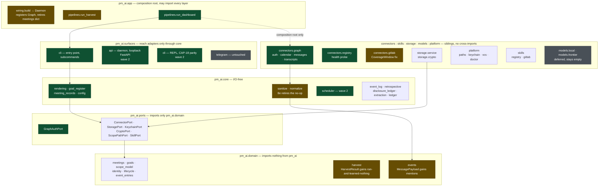
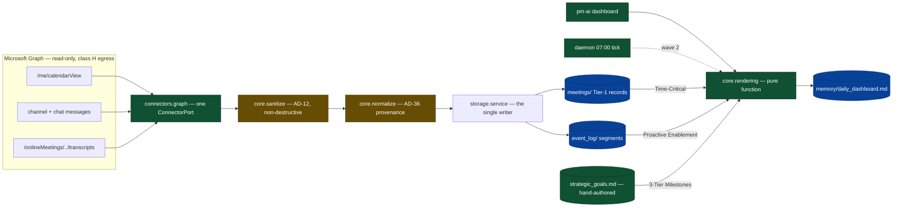
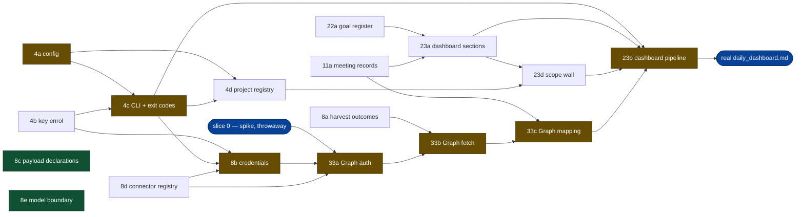

# Prototype path — one Graph connector and the daily dashboard

Written 2026-09-01, after story 2 merged. A re-phasing proposal, not a new
capability: it selects and slices existing `stories.yaml` work into the shortest
sequence that ends with a real `daily_dashboard.md` built from real Teams data,
and names one story the spec never had.

Companion to `roadmap-phasing.md`, which it does not replace. The roadmap says
what Phase 1 contains; this says what order to build a working prototype in and
what is deliberately left out of it.

## Baseline, measured

`uv run pytest` on `7316178`: **638 passed, 27 skipped**, clean tree.

Complete: stories `1a`-`1m` (13 specs) and `2a`-`2l` (12 specs) — scope
resolver, storage contract, keychain custody, envelope cipher, atomic and
durable writes, derived-tier rebuild, segmented event log with typed Markdown
entries, disclosure ledger, retrospective aggregation.

What is real versus scaffold, because the gap is smaller than the story count
suggests:

| Piece | State |
|---|---|
| storage, crypto, event log, disclosure ledger | real, tested, on disk |
| `app/wiring.py` `build()` → `Daemon` | real composition root; in-memory dicts for `meetings`/`transcripts` |
| `connectors/gitlab.py` | adapter shape only, no network, fabricated `CoverageWindow` |
| `connectors/transcripts/graph.py` | 22 lines against a `_fake_api` dict |
| `pm-ai` command | does not exist — no `[project.scripts]`, `surfaces/cli/__init__.py` is a docstring |
| daemon, loopback API | not implemented |
| `core/rendering`, `core/scheduler`, `models/router` | not implemented (9 of the 27 skips are the model router) |
| config loading | `config.toml` declared, read by nothing; no `tomllib` import in the tree |

So the prototype needs three things that do not exist — an entry point, a Graph
connector that reaches the network, and a renderer — on top of a foundation that
is finished.

## The four decisions this path rests on

Taken 2026-09-01. Each one cuts or adds work, and the sequence below is only
correct given all four.

1. **Maximum Teams surface** — one Graph connector covering chat/channel
   messages, meeting transcripts, and calendar. Wider than a minimal prototype,
   and chosen deliberately. It turns out more coherent than a pick-three:
   transcripts are reachable only for meetings tied to a calendar event, so
   calendar is the lookup path to transcripts rather than a third independent
   resource.
2. **Deterministic dashboard, plus a hand-authored goals file** — no model in
   the path. Three of four sections compute from real declared data; Leadership
   Notes stays an honest empty-with-reason. This removes story 7, the model
   router, the frontier adapter, and every disclosure-ledger write the dashboard
   would otherwise make.
3. **Full story 4** — daemon, loopback API, and REPL, split across the two waves
   rather than dropped.
4. **Delegated auth, device-code flow** — the PM signs in interactively; no
   tenant-admin consent, no application access policy.

## What was verified against live Graph docs

Checked 2026-09-01, because the design turns on it and the answer was not
something to assume.

- **Transcripts**: delegated `OnlineMeetingTranscript.Read.All` is sufficient.
  The application access policy that app-only requires does not apply to the
  delegated path.
- **Channel messages**: delegated `ChannelMessage.Read.All`. No protected-API
  approval and no metered licensing on `GET /teams/{id}/channels/{id}/messages`
  — those apply to `getAllMessages`, which this design does not use.

Two caveats that changed the design rather than merely informing it:

- **A tenant admin can disable Graph transcript access entirely**, returning
  `403` with inner code `GraphAccessToTranscriptsDisabled`. The docs state there
  is no request-side workaround. Whether this tenant permits it is unknown until
  probed, which is why slice 0 exists.
- **The channel-messages endpoint supports only `$top` and `$expand`** — no
  `$filter`, no `$orderby`. Incremental harvest cannot use a server-side cursor;
  it must page and cut client-side.

Sources:
`https://learn.microsoft.com/en-us/graph/api/onlinemeeting-list-transcripts?view=graph-rest-1.0`,
`https://learn.microsoft.com/en-us/graph/api/channel-list-messages?view=graph-rest-1.0`

## Structure — existing, changed, new

Three views of the same path. The first is the module map against the enforced
layer stack; the second is what happens when the dashboard is generated; the
third is the order the wave-1 slices can actually be built in.

Legend throughout: **unfilled** is in place and untouched, **amber** is existing
code this path modifies, **green** is new.

### Module map

Layer boundaries are the ones `.importlinter` enforces, not a drawing
convention. Dependencies point inward only; the sibling row may not import
across itself.

The enforced order, from `.importlinter`, is a stack and not a graph:

```
pm_ai.app                                                    outermost
pm_ai.surfaces
pm_ai.connectors : skills : storage : models : platform       siblings
pm_ai.core
pm_ai.ports
pm_ai.domain                                                 innermost
```

Mermaid lays `surfaces` beside the sibling row below rather than above it; the
stack above is the authority on the order.



Two things the map makes visible that the prose does not:

- **The new code concentrates in three places** — `connectors.graph`, four new
  `core` modules, and the CLI surface. Everything below `core` is nearly
  untouched: two field additions in `domain`, one new port. A foundation that
  needs two new fields to carry a whole new provider is a foundation that was
  built right.
- **`models` stays empty.** Decision 2's cut is structural, not a matter of
  degree — no arrow enters that box anywhere in the path.

### Dashboard generation flow

What `pm-ai dashboard` does, and where each of the four sections gets its
content. `core.scheduler` replaces the CLI as the trigger in wave 2; nothing
else in this flow changes.



`san` and `attr` are amber because slice `8e` retires the discarded-return-value
no-op here and moves the guard to the model boundary, before any Graph text
passes through them.

### Wave 1 build order

Edges are hard dependencies, not preferences. Anything unconnected is
independent and can move.



Derived from the dependency table in `deferred-work.md`, not drawn by hand, and
cross-checked both ways: 17 slices, **21 dependency edges** in the table and the
same 21 in the diagram, no edge in one and absent from the other, acyclic. The
count was 22 until 8e's 2026-09-02 renegotiation removed its edge from `8c`.

Amber is the critical path, **seven slices**:
`4a → 4c → 8b → 33a → 33b → 33c → 23b`. It runs through the CLI rather than the
key, because `8b` adds `connector add` to the dispatch table `4c` creates — an
edge the first draft of this graph missed entirely.

Green is two islands, not a chain: `8c` and `8e` have no dependants in wave 1
and, since 8e's 2026-09-02 renegotiation, no dependency on each other. 8e
declares the chokepoint — `ModelPort` accepting only `Sanitized` — and reads no
declaration; a caller gathering text for a prompt reads 8c's. Both are needed
before `33d` in wave 2, where the first genuinely untrusted third-party text
arrives, and before story 7 puts a model behind the port. They sit in wave 1
because the defect is live on the GitLab path today and cheapest to close while
nothing can yet bypass the port.

Eight slices have no dependencies at all and can start immediately: `4a`, `4b`,
`8a`, `8c`, `8d`, `8e`, `11a`, `22a` — `8e` joined them when its edge from `8c`
was removed. `22a` and `11a` in particular run parallel to the entire Graph
chain, since the renderer takes a goal register and a clock and does not care
where meetings came from.

**`4c` precedes `4d`, not the other way round.** `4d` adds `project add` to the
dispatch table `4c` creates, so the reverse would be circular — and it is
survivable only because `4c` requires `doctor` to work on a machine with no
registered project.

## Connector design

### Nothing in the domain has to change

The closed enumerations already cover this connector. `ObservedEventType` holds
`MESSAGE_POSTED` and `CALENDAR_EVENT_HELD`, and `PAYLOAD_FOR`
(`domain/events.py:145`) already binds them to `MessagePayload` and
`MeetingHeldPayload`. The scope model already declares every artifact the path
writes: `memory/daily_dashboard.md` and `strategic_goals.md`
(`domain/scope_model.py:540,544`), `meetings/`, `connectors/`, and the encrypted
`private/config.json`. No closed enumeration opens, and no scope tree changes.

The one exception is stated under "Renderer design" below: `MessagePayload`
needs a `mentions` field.

### Auth

`GraphAuthPort` in `pm_ai/ports/`; MSAL device-code adapter in
`pm_ai/connectors/graph/auth.py`.

**Not in `pm_ai/platform`**, which an earlier draft of this document proposed on
the grounds that AD-26 puts the OS boundary there. That was wrong. The
`http-confined-to-adapters` contract forbids `httpx`, `requests` and `aiohttp`
in `pm_ai.platform`, and states the intent plainly: "Only inbound connectors and
outbound skills may speak HTTP at all." Device-code flow talks to the Microsoft
token endpoint, so it is HTTP and belongs in `connectors`.

The distinction the two layers draw here is worth stating, because it is easy to
collapse: token **custody** is `platform` — the macOS Keychain behind
`KeychainPort`, built by story 1d. Token **acquisition** is `connectors` — an
HTTP conversation with a provider. `connectors/graph/auth.py` obtains, and
stores through the ports it is given.

Note that import-linter would not have caught the mistake: MSAL reaches
`requests` transitively, and the contract lists direct imports. A violation that
passes the gate is worse than one that fails it, which is the reason this is
recorded rather than silently fixed. Whether the contract should name `msal`
directly is left as a question for `33a`.

`msal` is a new runtime dependency and must be pinned in `pyproject.toml`
alongside the existing stack, per the pinning discipline the `anthropic` entry
documents.

`pm-ai connector add --type graph` prints the device code and URL; the PM signs
in in a browser. Scopes: `Calendars.Read`, `Chat.Read`,
`ChannelMessage.Read.All`, `OnlineMeetingTranscript.Read.All`, `offline_access`.

**Write ordering, per story 8's rule.** The refresh token goes to the encrypted
`~/.pm-ai/private/config.json` FIRST, then `connectors/graph.json` at 600. The
key is fetched lazily, so the encrypted write is the one that can refuse; that
order leaves nothing behind on refusal, while the reverse leaves a connector
configured, enabled, and holding no credential — which reads as a working
connector harvesting nothing.

### One connector, three resources

`GraphConnector` satisfies the existing `ConnectorPort` unchanged: `name`,
`system`, `emits()`, `harvest(since) -> HarvestResult`. `emits()` returns
exactly `{CALENDAR_EVENT_HELD, MESSAGE_POSTED}`.

Three resource fetchers behind one connector rather than three connectors: they
share auth, tenant, and cursor, and splitting them would triple the credential
lifecycle for no gain.

### The cursor

Each resource paginates differently, which is precisely why `Cursor.token` is
opaque bytes exposing no `.page` or `.timestamp`:

- `calendarView` — server-side `$filter` on a date range.
- channel and chat messages — no server-side filter available, so page until the
  last-seen watermark is crossed and cut client-side.
- transcripts — per meeting, discovered through calendar.

`Cursor.token` carries an opaque composite, one position per resource.

### Coverage told honestly

`connectors/gitlab.py:62-71` builds its `CoverageWindow` as `now - 4h` to `now`
unconditionally, tied to nothing that proves a fetch happened — so a provider
declining with an empty 200 claims full coverage it never had.

This path fixes that before Graph inherits the pattern. `CoverageWindow.start`
becomes the earliest point actually paged back to and `end` the moment the fetch
finished, both derived from returned pages. `HarvestResult` gains the "ran and
learned nothing" state story 8 asks for.

The transcript 403 makes this load-bearing rather than tidy: a tenant with
transcripts disabled must record *looked-and-refused*, or story 16's three
verdicts later read it as *nothing happened*.

### Sanitization does not currently happen (slice 8e)

Found 2026-09-01 while verifying this document's own claims, and it is a silent
fault rather than a gap.

`app/pipelines.py:26-28` carries the comment "AD-12 — sanitization at the
boundary, uniformly, outside the connector" above:

```python
for event in result.events:
    sanitize(getattr(event.payload, "message", "") or "")
```

Two independent faults:

1. **The return value is discarded.** `sanitize` is a pure function returning a
   `Sanitized(raw, for_model)` pair with no side effects, so the loop computes a
   value and drops it. Nothing downstream ever sees `for_model`. The comment
   describes an invariant the code does not hold.
2. **It reads a field most payloads do not have.** `message` exists on
   `CommitPayload` only. `MessagePayload` — what the Graph connector emits —
   carries `channel` and `excerpt`, so the `getattr` falls back to `""` and
   sanitizes an empty string. Every Teams message body would pass through
   untouched.

Why it is deferrable but not ignorable: under decision 2 no model is in the
path, so nothing harvested reaches a prompt and the injection vector is inert
today. But Teams message bodies are the most injection-prone input in this
design — arbitrary HTML-formatted text from anyone in the tenant — and the AD-12
comment currently asserts a protection that does not exist, which is worse than
having neither.

The fix: sanitize the text field the payload actually declares rather than a
hardcoded name, and persist both halves of the `Sanitized` pair per AD-29 so a
later consumer has `for_model` without re-deriving it. The exact on-disk shape
ties into open question 3, since story 2l put payload content into Tier 1.

Placed in wave 1 rather than beside `33d`: it is a live defect on the existing
GitLab path too, and `8a` is already in the harvest plumbing.

### Transcripts

Chain: `calendarView` event → `onlineMeeting.joinUrl` →
`/me/onlineMeetings?$filter=joinWebUrl eq '<url>'` → meeting id →
`/transcripts` → `/content`. Replaces `graph.py`'s `_fake_api`.

On `GraphAccessToTranscriptsDisabled` the connector degrades to two resources
and reports it through the health probe, rather than failing the harvest.

### Upcoming meetings are not events

`CALENDAR_EVENT_HELD` is past tense, and `MeetingHeldPayload` carries no title
or start time. Upcoming meetings therefore cannot be expressed as events without
opening a closed enum, which a connector may never do.

They are `meetings/` Tier-1 records instead. The `Meeting` entity already
carries `start`, `title`, and `attendees`. Calendar harvest writes Meeting
records for what is coming, and emits `CALENDAR_EVENT_HELD` only once a meeting
has ended. The dashboard's Time-Critical section reads `meetings/`, never
`event_log/`.

This also retires the in-memory `daemon.meetings` dict.

## Renderer design

`pm_ai/core/rendering.py`, which the architecture already anticipated — it is
one of the 27 skipped tests.

**A pure function**: `render_dashboard(meetings, entries, goals, now) -> str`.
No I/O in `core`; `app/` wires it to storage, as the harvest pipeline does.
Injected clock, per story 1b. Golden-file tested.

**Output** through `StorageService.write_artifact` to the personal scope's
`memory/daily_dashboard.md`. Whole-file replace is correct: it is a rendering,
not a ledger, so `write_artifact`'s ledger refusal does not apply.

**Declared inputs**, named now so story 10a's derived job graph can adopt this
later without redesign: `meetings/`, `event_log/` (through story 2h's
`EventLog.read`), `strategic_goals.md`.

### The four sections

| Section | Source |
|---|---|
| Time-Critical Activities | `meetings/` where `start` falls today, ordered by start |
| Proactive Enablement | `MESSAGE_POSTED` entries from the last 24h mentioning the PM, or an unanswered question |
| 3-Tier Strategic Milestones | `strategic_goals.md` grouped by `GoalHorizon` |
| Leadership Notes | honest empty-with-reason in the prototype |

### "3-Tier" resolved

`GoalDomain` (project/team/personal) and `GoalHorizon` (short/medium/long) both
have exactly three values, and CAP-9 says only "3-Tier".

**Read as horizon.** The section is about *milestones* — when things land — and
`GoalHorizon`'s docstring ties it to UJ-9's planning breakdown, while
`GoalDomain` is documented as the `<Tier>` in `[Strategic Alignment: <Tier>]`, a
different job. Recorded here because it is a real ambiguity in the source, and a
reader should be able to see it was decided rather than assumed.

### `MessagePayload` gains one field

It carries only `channel` and `excerpt` (`domain/events.py:110`), but Proactive
Enablement needs Graph's `mentions[]` to know a message is aimed at the PM.

Extending a payload dataclass is legal — AD-27 closes the *type* enumeration,
not the payload shapes — but story 2l put payload content into Tier 1, so a new
field changes the on-disk entry format and takes the same care stories 2c and 2d
took. Small, but not free, and named rather than smuggled in.

### No fabricated content

The renderer never invents. A section with no data states the computed reason —
"No meetings on your calendar today", "No strategic goals declared — author
strategic_goals.md" — never "All clear!", which would be a claim nothing
measured.

## Deviations from the spec, recorded

Both are deliberate, and both are recorded here rather than quietly satisfied,
following the precedent story 2 set when it corrected CAP-10's "JSON line" to
Markdown in `SPEC.md` rather than in the four sources that agreed.

1. **CAP-9's "no empty section" is not met, in two sections rather than one.**
   Leadership Notes will not fill, because filling it needs synthesis and
   decision 2 removed the model from the path. **And Proactive Enablement will
   not fill in wave 1**, because it reads `MESSAGE_POSTED` and `33b`'s `emits()`
   is exactly `{CALENDAR_EVENT_HELD}` — messages arrive with `33d` in wave 2.
   Corrected 2026-09-02 by the spec review; this document originally claimed one
   gap. The renderer states each reason instead of padding.
3. **Time-Critical lists only meetings that have not ended.** This document said
   "`meetings/` where `start` falls today"; `23a` filters ended meetings out, so
   an afternoon run says "all N of today's meetings have ended" rather than
   listing them. Recorded 2026-09-02.
2. **CAP-9's 07:00 deadline is not met in wave 1.** Wave 1 renders on
   `pm-ai dashboard` and has no scheduler. The deadline clause arrives in wave 2
   with slice 9a's scheduled tick.

## Decomposition

Letter slices under the story that owns the capability, following the
convention stories 1 and 2 used. Spec checkpoint and done checkpoint on every
slice; one commit per slice.

### Story 33 — new

The Graph connector has no story in `stories.yaml`. Story 8 is the connector
*framework*; Graph is an *instance* of it, and instances of CAP-35 were left
unenumerated. Story 33: "Microsoft Graph connector — calendar, chat,
transcripts."

### Slice 0 — spike, throwaway

Device-code sign-in against the real tenant; one call each to `calendarView`,
channel messages, and transcripts. Reports what comes back. No code kept.

Answers three unknowns: whether the tenant permits transcripts at all, which
scopes consent cleanly, and what the real payload shapes are. Slice 33e's scope
depends on the first answer.

### Wave 1 — a real dashboard from a real calendar (17 slices)

| Slice | Delivers |
|---|---|
| `4a` | Config loading — `tomllib`, `config.toml`. Explicitly not the encryption toggle. |
| `4b` | `pm-ai key enrol` through KeychainPort; the daemon never mints. Retargets 1g's "key absent" remediation. |
| `4c` | CLI entry point, subcommand dispatch, and the exit-code table. No REPL yet. |
| `4d` | Project registry and `pm-ai project add`. **Added by the spec review** — `build()` resolves the project scope eagerly, so without it nothing runs on a clean machine. |
| `8a` | `HarvestResult`'s three outcomes and the `CoverageWindow` fix in `gitlab.py`. |
| `8d` | Connector registry and the 10s CAP-35 health probes. |
| `8b` | Credential lifecycle — `pm-ai connector add`, encrypted-write-first, 600. |
| `8c` | Each payload class declares its untrusted text fields, guarded at import. |
| `8e` | Sanitization binds where it can be enforced: `ModelPort` accepts only `Sanitized`. See below. |
| `11a` | Meeting records reach Tier 1 through `meetings/`; retires the in-memory dict. |
| `33a` | `GraphAuthPort` and MSAL device-code adapter, refresh, stale-credential health reporting. |
| `33b` | Graph calendar fetch — paging, throttling, `{dateTime, timeZone}` → aware UTC, honest coverage. |
| `33c` | Calendar rows → Meeting records and `CALENDAR_EVENT_HELD`; `ConnectorPort` conformance. |
| `22a` | Goal register parsed from `strategic_goals.md`; hand-edit tolerant, unparseable lines surfaced not dropped. |
| `23a` | `core/rendering.py` — the four sections, honest gaps, golden-file tests. |
| `23d` | `project_scope_datasources` and AD-25's one-directional privacy wall. |
| `23b` | `pm-ai dashboard` wiring in `app/`: meetings + event_log + goals → render → `write_artifact`. |

Wave 1 ends with a real `~/.manager-ai/memory/daily_dashboard.md` built from the
PM's actual calendar and actual goals. **This is the working prototype, and a
legitimate point to stop and reassess.**

Ordering constraints inside the wave, as the build-order graph below derives
them: `4a` and `4b` precede everything, because nothing runs without config and a
key; `4c` precedes `4d` and `8b`, both of which add subcommands to the dispatch
table it creates; `8d` precedes `8b` and `33a`, which register into it; `8a`
precedes `33b` so Graph inherits a `HarvestResult` that can report an honest
outcome; `11a` precedes `33c` because the mapping writes Meeting records, and
precedes `23a` because Time-Critical reads them; `22a` precedes `23a` because the
renderer takes a goal register; `23a` precedes `23d`, which adds the scope wall
to the same module; and `8c` and `8e` are two independent slices with no
dependants in this wave and, after 8e's renegotiation, no edge between them.

### Wave 2 — the full surface (7 slices)

| Slice | Delivers |
|---|---|
| `33d` | Chat and channel messages — client-side cursor, HTML→text, `MessagePayload.mentions`. |
| `33e` | Transcript resource — `joinUrl` → `onlineMeetings` → `/content`; 403 degradation. Replaces `_fake_api`. |
| `23c` | Proactive Enablement fills from real message events. |
| `4e` | Daemon and loopback-only FastAPI binding. |
| `4f` | REPL at CAP-18 parity, under 1.0s startup. |
| `9a` | Scheduled harvest — 240min ±15, exponential backoff, the missing `try/except` story 9 names, and the 07:00 render tick. |
| `11b` | Real transcript path wired into the existing extraction pipeline. |

## Deferred, with reasons

- **Story 3 — MCP execution firewall.** Deferred because the prototype mutates
  nothing external and, under decision 2, puts no model in the path — so no
  harvested text reaches a prompt. It becomes a **hard prerequisite** the moment
  either changes; nothing in wave 1 or 2 does.

  The rationale is *not* that sanitization already works. It does not — see
  slice `8e`. An earlier draft of this document claimed the harvest boundary
  sanitizes; that claim was wrong and the correction is why `8e` exists.
- **Story 7 — Whisper and Ollama.** Decision 2 removed every model from the
  path. Transcript extraction does not need one: `core/extraction.py` is regex,
  not model-backed.
- **Stories 10 and 10a — durable queue, task manager, file watcher.** This is
  the one real debt the path takes on. 10a's rule is "every job is a queue row
  per AD-20, never an in-memory timer", and slice 9a's tick is exactly that
  timer. **9a's story text must label it temporary**, or it becomes the thing
  nobody remembers to replace.
- **Stories 12-21 and 24-32.** Untouched.

## Cost, stated plainly

Stories 1 and 2 were 25 slices and built the storage, crypto, and log
foundation. This path is 24 slices plus a spike — the same order of magnitude
again. "Shortest" means shortest *given the four decisions above*, not small.

The shortest path to something working is wave 1 alone: 17 slices.

## Open questions

1. **Does the tenant permit Graph transcript access?** Slice 0 answers it. A
   `403 GraphAccessToTranscriptsDisabled` removes slice 33e and `11b` from the
   plan entirely and there is no workaround.
2. **Is "3-Tier" horizon or domain?** Decided as horizon above. A one-line
   change now; a re-render later.
3. **Does a payload gaining a field need an operational schema version bump?**
   **Answered 2026-09-02: no, and story 1i is the wrong owner.** `SCHEMA_VERSION`
   (`service.py:133`) describes `operational.db`'s table shape, and a field added
   to a Tier-1 Markdown line changes no column — the only thing the harvest write
   path puts in SQLite is a `seen` dedup key. The version that would govern an
   entry line is AD-27's entry grammar, which does not exist: 2c withdrew
   `GRAMMAR_VERSION` after finding it written nowhere and read nowhere. `8e` no
   longer persists `for_model` at all (see question 6), so what remains live is
   `MessagePayload.mentions` in `33d` — the first slice that genuinely widens the
   entry grammar, and the point at which AD-27's unmade design decision must be
   taken rather than deferred.
4. **How should a payload declare which of its fields is sanitizable text?**
   Decided in `8c` at review: keyed by payload **class**, not event type, since
   `ReviewPayload` serves two types; validated against the dataclass at import;
   refused by a typed error, never an `assert`, which
   `test_guards_survive_o.py:174-181` forbids anywhere in `pm_ai/`.
5. **What display timezone owns "today"?** Raised by the review and still open.
   `Meeting.start` is aware UTC, so a 23:30-local meeting is tomorrow in UTC and
   the answer decides which meetings a 07:00 dashboard shows. `11a`'s
   `for_day(day, *, tz)` takes it and `23a` must agree.
6. **Does persisting `for_model` bump the operational schema version?**
   **Closed 2026-09-02 by removing the premise.** The question was a category
   error (see question 3), and examining it retired the design that raised it:
   AD-12 already requires the guard at the consumer through a `ModelPort`
   accepting only `Sanitized`, no such port existed anywhere in `pm_ai/`, nothing
   in the package referenced `Sanitized` except the module defining it, and
   AD-31's audit record is scope provenance in the disclosure ledger rather than
   the sanitized text. `8e` now declares the port and derives the copy at the
   point of use, persisting nothing and leaving the entry grammar untouched.
