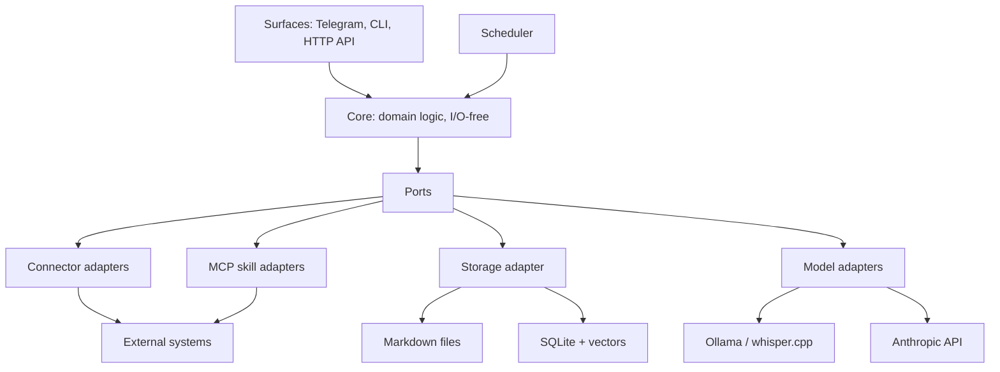
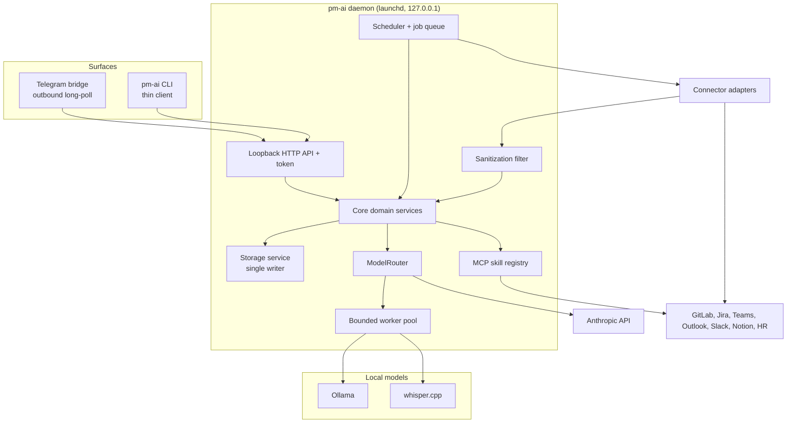
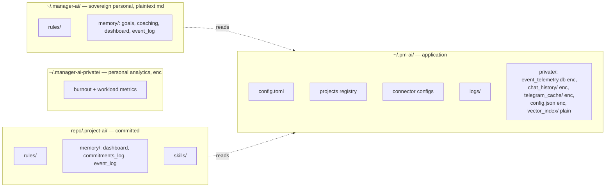
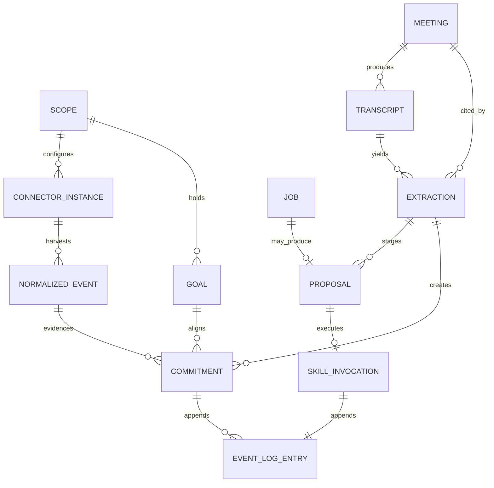

# Architecture Spine — pm-ai

## Design Paradigm

**Hexagonal (ports & adapters) around a plugin kernel.** The core holds all domain logic and is I/O-free; everything that touches the outside world is an adapter behind a port. Ingestion within that shape runs as **pipes-and-filters**: `harvest → sanitize → normalize → index → extract → stage/execute`.

| Layer | Namespace | Contents |
| --- | --- | --- |
| Composition root | `pm_ai.app` | Wiring, dependency injection, pipeline orchestration, daemon lifecycle. The only layer that may import every other (AD-30) |
| Domain | `pm_ai.domain` | Entities, enumerations, state machines, the closed taxonomies (AD-27). Imports nothing from `pm_ai` |
| Core (I/O-free) | `pm_ai.core` | Services: extraction, commitment lifecycle, proposal lifecycle, alignment/planning, scheduling policy, anchor matching |
| Ports | `pm_ai.ports` | `ConnectorPort`, `ModelPort`, `StoragePort`, `TranscriptSourcePort`, `SkillPort`, `KeychainPort`, `SurfacePort` — protocols expressed in domain types |
| Inbound adapters | `pm_ai.connectors` | Per-service harvesters (GitLab, Teams, Outlook, Slack, Jira, Notion, HR) — hot-loadable plugins |
| Outbound adapters | `pm_ai.skills` | Registry-authorized MCP skill modules — the only home of **class M** egress (AD-1) |
| Storage adapter | `pm_ai.storage` | The single writer: markdown, SQLite, vectors, encrypted blobs |
| Model adapters | `pm_ai.models` | `local` (Ollama, whisper.cpp), `frontier` (Anthropic Tool Runner) |
| Surfaces | `pm_ai.surfaces` | Telegram bridge, CLI client, loopback HTTP API |

Two extension points, and only two: **a new connector** (inbound) and **a new MCP skill** (outbound). A feature that needs neither belongs in the core.

## Invariants & Rules



Dependencies point inward only: `app` → `surfaces` → adapters → `core` → `ports` → `domain`. Core services import `ports` and `domain`, never an adapter. Adapters are independent siblings — none imports another. Surfaces reach adapters only through core. `domain` imports nothing from `pm_ai`, which is what lets `ports` express protocols in domain types without a cycle.

`pm_ai.app` is the single exception: as the composition root it may import everything, because something has to know how the pieces fit (AD-30).

### AD-1 — Egress is classified; only class **M** can carry a model-driven effect `[ADOPTED — revised 2026-08-19]`

- **Binds:** all, FR-36, Non-Goals
- **Prevents:** a feature reaching an external system on a path that skips authorization, logging, or sanitization — and equally, a blanket rule the stack contradicts on day one, which gets weakened to nothing the first time someone hits it
- **Rule:** External traffic is classified, and each class has exactly one legal home:

  | Class | What | Where | Constraints |
  | --- | --- | --- | --- |
  | **M** — Mutation | Any change to external state | `pm_ai.skills` (MCP) only | Registry-authorized with declared permissions (AD-18); idempotency-keyed (AD-20); one entry per invocation in the owning scope's `event_log.md` (AD-38) |
  | **H** — Harvest | Read-only fetches from external systems | `pm_ai.connectors` | Read-only by construction — a connector that mutates is a defect, not a shortcut |
  | **F** — Model | Frontier API calls | `pm_ai.models.frontier`, via the router | Prompt data governed by the model data boundary; can cause an external effect **only** by emitting a tool call that re-enters class M |
  | **S** — Surface | Telegram outbound poll | `pm_ai.surfaces.telegram` | Delivers only to the cryptographically paired user (AD-2) |
  | **L** — Local subprocess | whisper.cpp | `pm_ai.models.local` only | Allowlisted absolute binary path, argv list, `shell=False`. **No model output may be interpolated into an argv.** |

  The LLM core holds zero shell capability and no direct network capability. **Its only route to an external effect is class M.** That is the security property; the earlier "100% of reads and writes route through MCP" was a stricter-sounding claim that the connector, frontier, and transcription paths each contradicted.

### AD-2 — Loopback-only binding; Telegram is outbound-only `[ADOPTED]`

- **Binds:** daemon, Telegram bridge, CLI, NFR-14
- **Prevents:** an inbound listener appearing on a public interface as a side effect of a feature
- **Rule:** The daemon binds strictly to `127.0.0.1`. Zero public listening ports, ever. Telegram uses **outbound long-polling only** — webhooks are prohibited, because they require a publicly reachable HTTPS endpoint or tunnel. Access is restricted to cryptographically paired Telegram user IDs; unpaired senders are rejected and logged.

### AD-3 — Three storage tiers; only Tier 3 is disposable `[ADOPTED — revised 2026-08-19]`

- **Binds:** storage, NFR-11, FR-02, FR-37, AD-9, AD-20
- **Prevents:** the earlier version's own contradiction — it called `event_telemetry.db` disposable while the job queue, connector cursors, and idempotency ledger lived inside it, so the documented recovery path would have silently discarded pending external writes and reset every cursor, with the AD-3 test still passing
- **Rule:** Persistent state falls in exactly one tier, and each tier has its own durability promise:

  | Tier | Contents | Promise |
  | --- | --- | --- |
  | **1 — Truth** | `event_log/` segments per scope (incl. harvested telemetry per FR-27), `commitments_log.md`, coaching history, goals, rules, meeting records, and the application-scoped `disclosure.md` ledger (AD-38) | Plaintext markdown, append-only, hand-editable, git-diffable. A backup target. Bounded by FR-37 compaction, which replaces whole sealed segments rather than rewriting lines (AD-5). |
  | **2 — Operational** | Job queue and its `PENDING_RETRY` buffer, connector cursors, executed-idempotency-key ledger, staged proposals, key material | Durable and **not derivable from Tier 1**. Must be backed up. Losing it loses pending external writes and resets harvest position — a real consequence, not a cache miss. |
  | **3 — Derived** | Search and commitment indexes, `vector_index/`, caches | Disposable. Rebuildable from Tier 1 with zero loss. |

  **Tiers are physically separated, not merely labelled.** The earlier version named three tiers while the job queue (Tier 2) and the search indexes (Tier 3) shared one `event_telemetry.db` file — so "rebuild Tier 3 only" was unimplementable, and the natural implementation of a rebuild (delete the file, recreate it) would have destroyed pending external writes and every connector cursor.

  | Tier | Artifact | Rebuild target? | Backup target? |
  | --- | --- | --- | --- |
  | 1 | markdown segments per scope, `~/.pm-ai/disclosure.md`, config | no | **yes** |
  | 2 | `~/.pm-ai/private/operational.db` (SQLCipher) | **never** | **yes** |
  | 3 | `~/.pm-ai/private/derived.db`, `vector_index/` | yes | no |

  `pm-ai reindex` deletes and rebuilds the Tier-3 artifacts and *cannot* reach Tier 2, because Tier 2 is a different file. That is a structural guarantee rather than a careful implementation. Discarding Tier 2 is a separate, explicitly-named operation whose consequences the CLI states first.

  **Two boundaries on the zero-loss guarantee, stated rather than implied:**

  - NFR-11 scopes to **Tier 3**. Tier 3 rebuilds to the fidelity Tier 1 *currently holds* — compaction (AD-5) is a deliberate, recorded reduction, so a rebuild after compaction reproduces the compacted view, not the pre-compaction detail.
  - **Restoring Tier 2 from a backup opens a re-execution window.** Mutations performed after the backup point are absent from the restored executed-key ledger, so a replayed job can act twice. Restore is a recovery event: the CLI must warn, and reconciliation against the external system is the operator's call, not something the idempotency key alone solves.

### AD-4 — Three-scope data ownership

- **Binds:** all storage paths, FR-16, NFR-07
- **Prevents:** project configuration contaminating the sovereign personal scope and breaking its portability across roles and companies
- **Rule:** Exactly three scopes. `~/.pm-ai/` holds application-level state: daemon settings, project registry, per-project connector configuration, credentials. `~/.manager-ai/` holds sovereign personal material only — coaching, career, principles, goals, personal briefings — and contains **no** project-specific information or configuration. `<repo>/.project-ai/` holds committed per-project material. Writing project config into `~/.manager-ai/` is prohibited.

### AD-5 — One writer for all persistent state

- **Binds:** all
- **Prevents:** two components racing on the same file or row; half-written ledger entries
- **Rule:** A single storage service inside the daemon owns every write — markdown, SQLite, vectors, encrypted blobs. No other component opens a file for writing. SQLite runs in WAL mode with the storage service as sole writer.

  **Append-only means no file is ever edited in place.** A status change is a new entry keyed by id, never an edit to an earlier one. To make that compatible with FR-37's compaction — which the earlier wording contradicted outright — logs are **segmented**:

  - Each ledger is a directory of dated segments (`event_log/2026-08.md`). Exactly one segment is *open* and appended to; all earlier segments are **sealed and immutable**.
  - **Compaction never edits a file.** It writes a *new* summary segment, records which sealed segments it supersedes, and only then may the superseded segments be pruned. Boundedness comes from replacing whole segments, not from rewriting lines.
  - A reader folds across segments deterministically by `(occurred_at, entry_id)` (AD-35), so the result does not depend on segment boundaries.

### AD-6 — Scoped encryption, keychain-held key, debug toggle

- **Binds:** storage service, NFR-08
- **Prevents:** a future feature encrypting a markdown file "for consistency" and destroying git-diffability and hand-editability
- **Rule:** Only these are encrypted: `event_telemetry.db` (SQLCipher), `chat_history/`, and `telegram_cache/` (envelope-encrypted files), and `config.json` (credentials). **All `.md` files in every scope stay plaintext by design** — transparency over one's own record is a product principle, not an oversight. `vector_index/` is unencrypted (embeddings only; `0600` perms + FileVault). The master key lives in the macOS Keychain so the daemon starts unattended; raw key export/import is the documented migration path. Encryption is toggleable for local debugging (default **on**); when off the daemon must emit a CLI banner and an `event_log.md` entry, and off is never the default in a fresh install.

### AD-7 — One long-lived daemon; every other process is a thin client

- **Binds:** all runtime
- **Prevents:** two processes independently owning schedules or SQLite writes; CLI and Telegram implementing divergent copies of the same feature
- **Rule:** A single daemon owns all background life — connector scheduling, calendar triggers, the Telegram bridge, the job queue, and the pruning pipeline. The CLI is a thin client that holds no state and performs no scheduling. Telegram and CLI must reach identical functionality through the same core services; no feature may exist on only one surface.

### AD-8 — CLI ↔ daemon over authenticated loopback HTTP

- **Binds:** CLI, daemon API
- **Prevents:** each feature inventing its own IPC; any local process driving the daemon unauthenticated
- **Rule:** One transport: HTTP on `127.0.0.1`, authenticated by a per-user token file at `0600`, with SSE for streamed responses. Requests without a valid token are rejected.

### AD-9 — Connectors are uniform pull adapters; the daemon owns all scheduling

- **Binds:** FR-02, FR-35, every connector
- **Prevents:** per-connector schedulers competing for rate limits; each connector inventing its own event shape or applying sanitization inconsistently
- **Rule:** Every connector implements exactly one method — `harvest(since: Cursor) -> list[NormalizedEvent]` — and does only auth, fetch, and map-to-schema. A connector never runs its own thread, timer, or polling loop. The daemon's scheduler invokes it (4h default per FR-02) and owns cursors, backoff, and rate limiting. Sanitization, dedup, indexing, and persistence happen outside the connector, uniformly. `Cursor` is **opaque to everything but its own connector** — provider-defined bytes the scheduler persists and replays verbatim, never parsed or compared by core; cross-connector ordering uses the envelope's `ingested_at` watermark, never cursor contents.

### AD-10 — Connector instances are per-project

- **Binds:** FR-02, FR-35, UJ-10
- **Prevents:** one builder assuming global connector config while another assumes per-project; shared cursors causing cross-project gaps or duplication
- **Rule:** A connector instance is the tuple `(scope, connector_type, config, cursor)` with its own cadence and cursor. Each registered project gets independently-scheduled harvesting — git/GitLab (work items, wiki, MRs, CI/CD) by default, plus any of Teams, Outlook, Slack, Jira, Notion enabled per project. Personal-scope instances (HR platforms, article sources, personal calendar) are separate instances under the personal scope.

### AD-11 — Projects are registered explicitly

- **Binds:** CLI, Telegram bridge, FR-35
- **Prevents:** filesystem scanning silently opting a repository into telemetry harvesting
- **Rule:** Projects enter the system only via `pm-ai project add`; the registry lives in `~/.pm-ai/`. No auto-discovery. The CLI, when run inside a registered repository, binds to that project scope; Telegram has no working directory and requires explicit project selection or a configured default. Connector configuration is reachable from both surfaces and operates on the one registry through the daemon.

### AD-12 — Sanitization happens at the adapter boundary, for every inbound payload

- **Binds:** FR-36.2, all connectors, transcript sources
- **Prevents:** a new connector or transcript path feeding unsanitized text into an LLM context
- **Rule:** Every payload crossing an inbound adapter boundary — commit messages, MR/PR descriptions, issue comments, calendar invites, email bodies, meeting transcripts, chat messages — passes the sanitization filter before it can reach any model context. The pipeline enforces this centrally; a connector cannot opt out or apply its own.

### AD-13 — One Proposal entity for every staged-then-approved flow

- **Binds:** FR-06, FR-21, FR-31, FR-34, UJ-9
- **Prevents:** five divergent approval mechanisms with five card formats and five answers to "what if he never approves"
- **Rule:** The core defines a single `Proposal`: id, type, summary, payload, target executor, expiry, status (`staged → approved → executed | edited | rejected | expired`). One card renderer serves both surfaces (Telegram inline keyboard, CLI approval queue). Features never build approval flows; they **register a proposal type** with a payload schema and an executor callback. No external mutation derived from implicit extraction may execute without an approved Proposal. **Expiry is owned by the scheduler, not by features**: a registered type may override the default TTL (7 days) but never implements its own expiry sweep, and an expired proposal never executes.

### AD-14 — Commitment lifecycle is a domain state machine, distinct from Proposal

- **Binds:** FR-33, FR-34
- **Prevents:** conflating approval status with real-world fulfillment status in one overloaded field
- **Rule:** `PENDING → FULFILLED | ALTERED | BROKEN` is a domain state machine driven by execution telemetry (commits, MR merges, ticket closures). `STAGED_APPROVAL` is a *Proposal* state; approving it produces a commitment in `PENDING`. The two lifecycles never share a status field.

### AD-15 — All model access flows through one router, keyed by declared task class

- **Binds:** NFR-12, NFR-13, all model use
- **Prevents:** a cheap path silently calling a frontier model; per-feature model clients that escape accounting
- **Rule:** One `ModelPort` with two adapters — local (Ollama, whisper.cpp) and frontier (Anthropic Tool Runner). No feature instantiates a model client. Routing is by **task class declared at the call site**: `transcription | extraction | classification | embedding | fuzzy_match` are **local-only, always**; `coaching | briefing_synthesis | research | draft_generation | inquiry_synthesis` are frontier-eligible. Tier within the frontier class: `coaching` and `research` → `claude-opus-5`; the rest → `claude-sonnet-5`.

### AD-16 — The frontier adapter is a Tool Runner over the MCP skill registry, never a built-in-tool agent

- **Binds:** FR-36, frontier adapter
- **Prevents:** an agent framework's default toolset reintroducing the shell and filesystem access the firewall exists to forbid
- **Rule:** Frontier calls use the Anthropic SDK Tool Runner (`client.beta.messages.tool_runner`), whose tool set is exactly the MCP skills the registry has authorized for that flow. Libraries that ship built-in Bash/Read/Write/Edit tools — including the Claude Agent SDK — are prohibited in this layer.

### AD-17 — Cost accounting is observability, not enforcement

- **Binds:** ModelRouter, NFR-13
- **Prevents:** a builder implementing silent quality degradation or feature cutoff that was never requested
- **Rule:** Every frontier call logs token counts and a cost estimate to the application-scoped disclosure ledger (AD-38); the running monthly total surfaces in briefings and CLI. At threshold breach the system **warns only** — no degradation to local models, no hard stop, no feature blocking. The $20 figure is a monitored target for understanding real efficiency, not a circuit breaker.

### AD-18 — MCP skills are an explicit local allowlist; signing is deferred, the firewall is not

- **Binds:** FR-36, MCP layer
- **Prevents:** "unsigned" being read as "the firewall is optional"
- **Rule:** The skill registry is an allowlist of first-party modules, each declaring the scopes it may exercise; the daemon refuses to invoke an unlisted skill or an out-of-scope call and logs the violation. Cryptographic signature verification is deferred (see Deferred), and the skill load path must stay pluggable so a verification step can be inserted without restructuring. Everything else in AD-1 remains binding.

### AD-19 — Single asyncio loop for I/O; a bounded pool for heavy local models

- **Binds:** all background work, NFR-12
- **Prevents:** a 30-second transcription making the Telegram bridge and CLI unresponsive; unbounded parallel model loads thrashing 16GB unified memory
- **Rule:** One asyncio event loop owns all I/O — connector harvests, Telegram long-poll, the loopback API, MCP calls. No library may seize or replace that loop (see the Telegram lifecycle prerequisite in Stack). CPU/GPU-bound work (whisper.cpp transcription, embedding generation, Ollama inference) runs in a bounded worker pool and never on the loop. Default bound: **one heavy local-model job at a time**, configurable. The bound is only half the guard: because Ollama holds models resident in its own process, the daemon must also constrain the server (`OLLAMA_MAX_LOADED_MODELS=1`, `OLLAMA_NUM_PARALLEL=1`, `keep_alive: 0` before dispatching transcription). A client-side semaphore alone satisfies the letter of this AD while the machine thrashes.

### AD-20 — Every unit of deferred work is a durable row; external mutations are idempotent

- **Binds:** FR-02, FR-04, FR-07, NFR-10
- **Prevents:** in-memory timers losing work on restart; duplicate external writes on replay
- **Rule:** Nothing is scheduled in memory only — every deferred unit of work is a persisted row in the SQLite job queue. FR-04's offline buffer is not a separate mechanism; it is the same queue in `PENDING_RETRY`. Delivery is at-least-once, so every job that mutates an external system carries a mandatory idempotency key. The key is **derived deterministically** from `(job_type, target_ref, payload_hash)` — never randomly generated per attempt, which would silently defeat the guarantee — and the skill layer refuses a mutating invocation that arrives without one.

### AD-21 — Anything slower than 5 seconds acknowledges and delivers asynchronously

- **Binds:** Telegram bridge, CLI, job queue, UJ-5
- **Prevents:** some flows blocking and others acking, so neither users nor builders can predict behavior
- **Rule:** Any request whose expected duration exceeds **5 seconds** returns an acknowledgement token plus a job id immediately, then delivers the result over the same async channel. Requests under 5 seconds may answer inline. One pattern across both surfaces.

### AD-22 — Retrieval and synthesis have separate latency budgets

- **Binds:** FR-23, FR-25, FR-32, FR-33, FR-37, NFR-04
- **Prevents:** a builder targeting 150 ms for an LLM-synthesized answer, which is not achievable
- **Rule:** **Retrieval** — SQLite plus vector lookup with no model in the path — targets 50–150 ms; this is FR-37's real budget. **Synthesis** — retrieval plus a model call — targets ≤60 s and is always asynchronous under AD-21.

### AD-23 — Transcript acquisition sits behind a port with a working fallback

- **Binds:** FR-03, FR-06, FR-07, FR-08, UJ-3, UJ-6, UJ-7, UJ-8
- **Prevents:** the entire meeting pipeline blocking on tenant-admin consent, and being untestable without a live tenant
- **Rule:** All transcript ingestion goes through `TranscriptSourcePort`. The primary adapter is Microsoft Graph. A **manual adapter is built from day one**: a watched folder accepting `.vtt` / `.docx` / `.txt`, plus a local-recording-and-transcribe path. The extraction pipeline must be exercisable end-to-end using only the fallback adapter. **Every ingested transcript binds to a `Meeting`** (AD-33) — to its calendar event where one exists, otherwise the drop supplies title, start, and attendees to mint the record. An unbound transcript is rejected rather than allowed to mint attributed provenance from an unattributed file; the manual path is also never an auto-execute source (AD-32).

### AD-24 — `event_log.md` is domain truth and never carries debug output

- **Binds:** all components
- **Prevents:** debug noise destroying the value of the audit trail
- **Rule:** `event_log.md` records decisions, actions, and telemetry events — append-only, human-readable, never rotated. It exists **per scope**, and an entry belongs to the scope that owns its subject; an entry needing two scopes is two entries (AD-38). Diagnostic logging goes to rotating structured JSON under `~/.pm-ai/logs/`. Disclosure and cost records go to the application ledger, not here. Writing debug output to `event_log.md` is prohibited.

### AD-25 — Personal analytics are physically separated from project scope

- **Binds:** FR-16, NFR-07
- **Prevents:** FR-16's privacy charter being enforced only by a tag someone remembers to check
- **Rule:** Personal-only derived telemetry — burnout metrics, workload and calendar-density dynamics, coaching analytics — lives in its own encrypted store at `~/.manager-ai-private/`, a separate SQLite database. Project-scope rendering never opens it, so personal analytics cannot be joined into any project-scope output. Operational telemetry lives separately in `~/.pm-ai/private/`.

### AD-26 — macOS-only in v1, with OS-touching concerns behind ports

- **Binds:** install, supervision, keychain
- **Prevents:** macOS APIs called from core code, turning the later Linux port into a rewrite
- **Rule:** v1 targets macOS on Apple Silicon only. Keychain access, process supervision, and packaging paths sit behind ports so Linux adapters slot in without restructuring. No `Foundation`/`launchd`/Keychain call appears outside its adapter.

### AD-27 — Core owns closed taxonomies; adapters map into them

- **Binds:** all connectors, every component writing to `event_log.md`, FR-27
- **Prevents:** two connectors describing the same real-world change as different event types, so commitment verification misses evidence from one of them; two features writing incompatible entry shapes into the audit trail
- **Rule:** The set of `NormalizedEvent` types and the set of `event_log.md` entry types are **closed enumerations defined in the core**. A connector maps its provider's vocabulary into an existing type; it may not mint one. Adding a type is a deliberate core change, reviewed against existing types for overlap. Both enumerations are versioned so parsers can read historical entries.

### AD-28 — Commitments belong to project scope; coaching commitments are a separate entity

- **Binds:** FR-16, FR-34, AD-4, AD-25
- **Prevents:** a 1:1 coaching undertaking being written into a git-committed project ledger, leaking personal material into a repository
- **Rule:** A `Commitment` — a team-facing promise verified against execution telemetry — always lives in project scope (`.project-ai/memory/commitments_log.md`). A personal undertaking from a Socratic 1:1 is a **distinct entity**, `CoachingCommitment`, living only in the personal scope. They never share storage, and the project-scope ledger has no code path that accepts a personal entity.

### AD-29 — Sanitization is non-destructive to the stored record

- **Binds:** AD-12, FR-36.2, citation conventions
- **Prevents:** stripping an injection payload from a transcript and thereby corrupting the evidence a `source_ref` points at
- **Rule:** Sanitization produces a *derived* copy used exclusively for model context. The raw payload is stored unmodified (under the retention policy) so citations, drift checks, and audits resolve against the real source. No component may overwrite a raw payload with its sanitized form.

### AD-30 — The composition root is the only place that wires adapters `[NEW]`

- **Binds:** source tree, layering contract, every pipeline
- **Prevents:** the pipeline having no legal home — core may not import adapters and adapters may not import each other, so under the previous layering the named `harvest → sanitize → normalize → index → extract → stage/execute` sequence could not be written anywhere, and connector credentials had no route from encrypted storage to the connector that needs them
- **Rule:** `pm_ai.app` is the composition root: it constructs adapters, injects them into core services through ports, retrieves credentials from storage and hands them to connectors, orchestrates the ingestion pipeline, and owns the daemon lifecycle. It is the **only** module permitted to import from every layer. Core services receive their dependencies; they never construct or locate them. Surfaces reach adapters only through core — a surface importing `storage` or `models` directly is a layering violation even though both sit lower in the tree.

### AD-31 — The model data boundary, and what it must disclose `[NEW]`

- **Binds:** FR-16, AD-15, AD-17, every frontier call
- **Prevents:** each feature deciding independently what may enter a prompt — and a privacy charter whose central claim nothing can check
- **Rule:** FR-16's adversary is **employer-controlled systems** — team channels, shared repositories, enterprise dashboards, HR platforms — not model APIs. Personal-scope material may therefore enter a frontier prompt, and the Socratic coaching flow routes to `claude-opus-5` as AD-15 specifies. Three obligations follow:
  1. **FR-16 must say so.** A charter that means something narrower than its words is worse than no charter, because it invites a reader to assume more protection than exists.
  2. **Every frontier call records scope provenance** to `event_log.md`: which scopes contributed material, the task class, the model, and token counts. The CLI answers *"what has left this machine, and when"* from that record. This converts the charter from an assurance into an audit.
  3. **The boundary is on the destination, not only the source.** Personal-scope material must never enter a prompt whose output is bound for a project-scope artifact or an external system. Burnout signals may shape your briefing; they may not reach a team-facing dashboard by way of a model that read both.

### AD-32 — Spoken commands auto-execute only when source, speaker, and verb all qualify `[NEW]`

- **Binds:** FR-05, FR-07, UJ-7, AD-13, AD-23
- **Prevents:** an untrusted transcript conferring authenticated authority — anyone in the meeting, or anyone able to write a file into the watched folder, obtaining unapproved external write access
- **Rule:** A spoken command executes without approval only when **all three** hold:
  1. the transcript came from a **provider-authenticated source** whose speaker identity is issued by that provider (a tenant account, not a VTT label);
  2. the speaker **resolves to the PM**;
  3. the verb is in the **reversible set** — a closed enumeration in `domain` (comment, note, requirement edit, label, priority).

  Any condition unmet ⇒ the command becomes a Proposal (AD-13). **Irreversible verbs always stage, regardless of source or speaker**: outbound email and DM (FR-26), MR/PR creation (FR-28), closures, deletions, and any external effect a later call cannot undo. The manual transcript adapter (AD-23) is **never** an auto-execute source — it is untrusted by construction — though it remains fully valid for extraction and staging. Every auto-execution emits a card carrying one-tap undo, plus its `event_log.md` entry.

### AD-33 — Cite the event, never the artifact that captured it `[NEW]`

- **Binds:** every surfaced fact, FR-03, FR-25, FR-32, FR-33, FR-34, NFR-09, AD-29
- **Prevents:** provenance pointing at a derived artifact that has its own lifecycle — so a transcript purge silently empties every citation that depended on it, and the drift auditor reports **clean** against sources that no longer exist
- **Rule:** `source_ref` points at the **most upstream durable referent** — the thing that happened — never at a derived capture of it. A transcript is a derivative of a meeting, so meeting-derived facts cite `meeting:<id>` plus speaker, with an optional time offset used only for tracing. Commit SHAs, MR URLs, ticket anchors, and message IDs already satisfy this.

  **`Meeting` is a first-class Tier-1 record**: id, calendar event reference, title, start, duration, attendees, derived-transcript pointer, processing status. It is also where FR-03's Man-Hour Cost inputs live, so FR-03, FR-32, and UJ-8 key off one entity rather than three ad-hoc lookups.

  **Derived records are self-contained.** A ledger or decision entry carries everything needed to act on it and never depends on its source artifact still existing — which is what makes NFR-09's 30-day transcript purge a purely operational matter. Tracing walks *fact → meeting → transcript if present*; nothing may treat the third hop as a dependency.

### AD-34 — Event identity is fixed: reference grammar, actor resolution, natural key `[NEW]`

- **Binds:** every connector, AD-9, AD-27, AD-33, FR-30, FR-33, FR-34
- **Prevents:** AD-27 closed the *type* enumeration and left every other field open, so two connectors could describe the same change compliantly and still fail to join — GitLab writing `source_ref` as a URL and Jira as a ticket key, or one engineer arriving as a commit email and a speaker label and becoming four people in the metrics that feed a performance review
- **Rule:** Three identity elements are fixed in `domain`, not left to each adapter:
  1. **Reference grammar.** `source_ref` is `<system>:<scope>:<kind>:<native_id>` — `gitlab:alpha:commit:9f2a1c`, `jira:alpha:issue:PAY-102`, `meeting:mtg_01HX`. Parseable, joinable, and uniform across sources. Free-form refs are rejected at normalization.
  2. **Actor resolution.** Every event carries an `actor_id` resolved to a single `Actor` in `domain`. Connectors supply their native handle (commit email, tenant account, speaker label); normalization maps it through an alias table. An unresolvable handle becomes an explicit `unresolved` actor — **never** a raw string used silently as identity, because that is what silently splits one person into several.
  3. **Natural key.** Deduplication uses `(source_system, source_ref)`, never the locally-minted id. The `evt_` ULID is a surrogate assigned by the **storage service at persist time**; connectors never mint ids. Re-harvesting the same window must therefore be idempotent rather than doubling every metric.

### AD-35 — Two clocks, never mixed; and absence of telemetry is not evidence `[NEW]`

- **Binds:** AD-9, AD-3, FR-26, FR-33, FR-34
- **Prevents:** a verifier comparing `occurred_at` to a due date while a sweeper reasons in `ingested_at` — so a laptop asleep over a weekend fires irreversible "why isn't this done" messages about work already delivered — and a ledger that folds by file order producing different commitment states after a rebuild
- **Rule:**
  - **`occurred_at`** is when the thing happened in the world. Provider-supplied, possibly skewed, possibly absent. It governs **domain reasoning**: due dates, "did the commit follow the promise", ordering within a meeting.
  - **`ingested_at`** is assigned locally by the storage service at persist time. It governs **operational reasoning**: cursors, watermarks, replay, sweep windows.
  - The two are never substituted for one another. An absent or implausible `occurred_at` (future-dated, or preceding its meeting or repository epoch) is **flagged**, not silently backfilled from `ingested_at`.
  - **Ledger folding is deterministic**: entries fold by `(occurred_at, entry_id)`, a total order stable across rebuilds. Never file order — otherwise `pm-ai reindex` changes commitment states while AD-3's test still passes.
  - **Coverage is recorded.** The scheduler logs harvest coverage windows per connector instance, and the commitment sweeper must not declare `BROKEN` across a window it has no coverage for. Silence from a sleeping laptop is missing data, not evidence of a broken promise — and FR-26's nudges are irreversible, so this must fail closed.

### AD-36 — pm-ai's own writes are never evidence `[NEW]`

- **Binds:** FR-06, FR-28, FR-33, FR-34, AD-1 class M
- **Prevents:** the closed loop closing on itself — FR-06's executor posts a comment to WI-108, FR-34's verifier later reads WI-108 activity as fulfilment evidence, and the system marks a commitment `FULFILLED` on telemetry it manufactured. Nothing crashes; the ledger simply becomes confidently wrong in the direction that looks like success
- **Rule:** Every event carries `authored_by ∈ {pm_ai, external}`. **Commitment verification admits only `external` evidence.** A transition to `FULFILLED` requires evidence authored by someone other than pm-ai; self-authored activity may be displayed for context but never counted.

  Attribution is established at both ends: the skill layer records every class-M mutation it performs (target ref plus the resulting external id) in the Tier-2 executed-key ledger, and normalization marks any harvested event matching one of those as `pm_ai`. Where the connector runs under a distinct bot identity, actor resolution (AD-34) marks it independently. Two mechanisms because one of them will have gaps.

### AD-37 — Every shared-entity transition is a compare-and-swap `[NEW]`

- **Binds:** AD-13, AD-14, AD-20, all surfaces
- **Prevents:** approving the same proposal from Telegram and the CLI and creating two HR goals; and the expiry sweeper racing the job worker so that an eleven-day-old approved change posts after expiry, despite AD-13 stating that expired proposals never execute
- **Rule:** Proposal and Commitment transitions are versioned compare-and-swap: read version → attempt transition with the expected version → on conflict, **reload and re-evaluate**, never blind-retry. Terminal states are terminal, and a worker re-checks state **at execution time**, not only at enqueue time.

  Expiry and execution are mutually exclusive by construction: the sweeper CASes `staged → expired`, the worker CASes `approved → executing`, and whichever loses observes the winner and stops. Mutations targeting the same external entity serialize through a per-target lock keyed by `target_ref`, so two approved changes to one work item cannot interleave.

### AD-38 — The disclosure and cost ledger is application-scoped and never committed `[NEW]`

- **Binds:** AD-17, AD-24, AD-31, AD-4, FR-16, FR-27
- **Prevents:** the audit mechanism becoming the leak. `event_log.md` exists per scope, and `<repo>/.project-ai/` is git-committed — so a disclosure record naming `scopes={personal, project:alpha}` would be pushed to the employer's repository, publishing exactly what AD-31 was built to protect. Two independent reviewers found this; it inverts D1 rather than bending it. It also made AD-31's "what has left this machine" and AD-17's monthly total unanswerable, since both would span N files
- **Rule:** Two record kinds, deliberately separated:

  | Record | Home | Committed? |
  | --- | --- | --- |
  | **Domain events** — decisions, commitments, work-item activity, meeting outcomes | `event_log.md` in the scope that **owns the subject** | Project scope: yes, by design |
  | **Disclosure & cost** — every frontier call's scope provenance, tokens, estimated spend | `~/.pm-ai/disclosure.md`, a **single** append-only Tier-1 ledger | Never. Application scope is outside every repository |

  Both AD-31's audit and AD-17's running total read one file, so both queries are answerable. And the general invariant that makes this safe rather than merely tidy:

  **No record written to a git-committed scope may reference personal-scope material** — not by content, not by `source_ref`, not by scope name. A cross-scope operation writes its project-visible part to the project log and everything else to the application ledger; it never writes one record naming both.

  `event_log.md` routing is therefore unambiguous: an entry belongs to the scope that owns its subject, and an entry that would need two scopes is two entries.

## Consistency Conventions

| Concern | Convention |
| --- | --- |
| Naming — entities | `Commitment`, `Proposal`, `NormalizedEvent`, `ConnectorInstance`, `Cursor`, `Scope`, `Skill`, `Job` |
| Naming — files/modules | `snake_case.py`; connectors as `pm_ai/connectors/<service>.py`; skills as `pm_ai/skills/<verb>_<object>.py` |
| Naming — ports | `<Noun>Port` protocol in `pm_ai/ports/`; adapters named `<Service><Noun>Adapter` |
| Identifiers | Prefixed ULIDs — `cmt_`, `prp_`, `evt_`, `job_`, `skl_`; sortable by creation time; never reused. These are **surrogates**: deduplication and joins use the natural key `(source_system, source_ref)` (AD-34) |
| Dates & times | ISO-8601 with explicit offset, stored UTC, rendered local at the surface only. `occurred_at` governs domain reasoning, `ingested_at` operational reasoning; neither substitutes for the other (AD-35) |
| Event envelope | Every `NormalizedEvent` carries `id` (ULID, minted by storage at persist — AD-34), `scope`, `source_system`, `type` (core enumeration, AD-27), `occurred_at` + `ingested_at` (never interchangeable, AD-35), `actor_id` (resolved, AD-34), `authored_by` ∈ `{pm_ai, external}` (AD-36), `payload`, `source_ref` (`<system>:<scope>:<kind>:<native_id>`, AD-34) |
| Proposal TTL | Default 7 days; overridable per registered type; expiry swept by the scheduler only (AD-13) |
| Idempotency keys | `sha256(job_type + target_ref + canonical_payload)` — deterministic, never random (AD-20) |
| Markdown ledger entries | Append-only blocks with a machine-readable header line (id, timestamp, type) followed by human-readable body; parsers must tolerate hand-edits |
| Errors | Typed exceptions from `pm_ai.core.errors`; adapters translate external failures into domain errors at the boundary; no external SDK exception escapes an adapter |
| Retries | Exponential backoff with jitter, owned by the scheduler and job queue — never hand-rolled inside a connector or skill |
| Concurrency | Proposal and Commitment transitions are versioned CAS; conflict means reload-and-re-evaluate, never blind retry. Mutations on one external entity serialize by `target_ref` (AD-37) |
| Clocks | No component reads the ambient clock. `now` is injected by the composition root (AD-30) — AD-35's coverage windows are a fail-closed guard, and a guard that cannot be tested deterministically cannot be trusted |
| Config | TOML under `~/.pm-ai/`; secrets never in TOML — only in the encrypted `config.json` |
| Logging | Structured JSON to `~/.pm-ai/logs/` (rotating) for diagnostics; `event_log.md` for domain truth (AD-24) |
| Model calls | Always via `ModelPort` with an explicit `task_class` argument; a call without a declared task class is a defect |
| Citations | Every surfaced fact carries a `source_ref` to the most upstream **durable** referent — the event that occurred, never a derived capture of it (AD-33). Meeting-derived facts cite `meeting:<id>` + speaker; a transcript is never a `source_ref` |

## Stack

Every row re-verified against its registry on 2026-08-19 after a currency review
found one fabricated pin. The code owns this once it exists; a row marked
*Phase 1* is a decision the build makes, not one this document has made.

| Name | Version | Notes |
| --- | --- | --- |
| Python | 3.13 (3.14 is the upgrade path) | Must be a **uv-managed** interpreter — see the extension-loading prerequisite below |
| uv | latest | Install with `uv tool install --managed-python` |
| anthropic (Python SDK) | latest, `[mcp]` extra | The extra pulls a second web stack including its own HTTP client; budget for it |
| python-telegram-bot | 22.8 | Install **without** the `[job-queue]` extra — it embeds a second scheduler |
| Ollama | latest | Server-side residency is configured by the daemon, not by AD-19 alone |
| Ollama Python client | `ollama` (pin at build time) | Was previously unstated |
| Local parsing model | **an 8B-class instruct model at `Q4_K_M`, selected in Phase 1** | Verified candidates: `llama3.1:8b` (4.9 GB), `qwen3:8b`. **Not** `llama3.3` — it ships 70B only |
| Embedding model + dimension | Phase 1 | Must be pinned before the first index is written; a change is a reindex event |
| whisper.cpp | v1.9.x, `small.en`, **Metal only** | Core ML deferred — see below |
| SQLCipher via `sqlcipher3` | 0.6.2 | **Not** `sqlcipher3-binary`, which publishes Linux-x86_64 wheels only |
| sqlite-vec | `==0.1.9` (exact) | Pre-1.0; the `vec0` on-disk format is not frozen |
| FastAPI | 0.141.1 | |
| uvicorn | 0.52.3 | |
| keyring (macOS Keychain backend) | 25.7.0 | macOS 11+; needs a `universal2` interpreter |
| Scheduler | in-house asyncio scheduler | APScheduler 3.11.3 is the fallback if the in-house one proves thin |
| Claude models | `claude-opus-5` (coaching, research), `claude-sonnet-5` (briefings, drafts, inquiry) | |

### Integration prerequisites

These are properties of the chosen stack, not preferences. Each was verified;
each fails in Phase 1 if ignored.

- **`sqlite-vec` cannot load into a stock macOS Python.** `enable_load_extension`
  is *absent* on python.org and system CPython builds, not merely disabled. A
  uv-managed interpreter has it. Pin `--managed-python` and assert
  `hasattr(conn, "enable_load_extension")` in `pm-ai doctor`, or the first
  embedding write raises deep inside the single writer and takes all persistence
  down — on a clean install, not on the developer's machine.
- **whisper.cpp Core ML is a build-time feature**, needing `coremltools`, a
  separate Python 3.11 toolchain, a generated `.mlmodelc`, and a first-run ANE
  compile that blocks for minutes. Metal alone is on by default on Apple Silicon
  and is sufficient. Core ML is deferred; revisit only if transcription misses
  NFR-01 with Metal.
- **Ollama manages its own residency.** A client-side pool bound does not unload
  a model. The daemon must set `OLLAMA_MAX_LOADED_MODELS=1`, `OLLAMA_NUM_PARALLEL=1`,
  and `keep_alive: 0` before dispatching a whisper.cpp job; `pm-ai doctor` reports
  the live values. Without this, AD-19 addresses half the thrashing question while
  appearing satisfied.
- **python-telegram-bot's `run_polling()` seizes the event loop.** It is prohibited
  (as is `run_webhook()`, per AD-2). The bridge uses the manual lifecycle —
  `initialize()` → `start()` → `start_polling()`, with matching shutdown — so
  uvicorn and the connector scheduler keep the single loop AD-19 declares.
- **A `sqlite-vec` minor bump is a reindex event**, not a transparent upgrade. Data
  survives via AD-3; an existing index may not open.

### Anthropic API notes binding the frontier adapter

Thinking is **on by default** on Opus 5, and `max_tokens` caps thinking plus
response text together — a route sized tightly around its answer will truncate.
`temperature` / `top_p` / `top_k` are rejected (400). Assistant prefill is
rejected; use `output_config.format` for structured output. `output_config.effort`
controls depth.

Two operational consequences the router must handle:

- **Opus 5 can return `stop_reason: "refusal"`** with a `stop_details` category, as
  a successful HTTP 200 with empty or partial content. Code that reads
  `content[0]` unconditionally breaks. The router checks `stop_reason` before
  reading content, and should opt into server-side `fallbacks` so a decline is
  re-served rather than surfacing as a failed briefing.
- **Prompt-cache minimums differ by model** — 512 tokens on Opus 5, 1024 on
  Sonnet 5. Briefings run on Sonnet 5, so the caching benefit assumed for repeated
  persona and rules prefixes must clear the higher floor.

`client.beta.messages.tool_runner` (AD-16) is a **beta** SDK surface. That is
accepted deliberately — it is the only tool loop with no built-in shell or
filesystem tools — but the beta status is a real dependency risk, not an
oversight.

### Cost-model caveat

The $20/month target (AD-17) is anchored to Claude Sonnet 5 **introductory**
pricing of $2/$10 per Mtok, which expires 2026-08-31; standard pricing is $3/$15.
Any spend measured before that date understates the steady-state figure by roughly
a third on the briefing path. Re-baseline in September.

## Structural Seed

### Container view



### Scopes and storage



### Core entities



### Deployment & operations

- **Supervision:** `launchd` user agent, `KeepAlive`, starts at login. Single daemon instance.
- **Install / update:** isolated install via `uv tool install`.
- **Health:** `pm-ai doctor` — keychain access, Ollama reachability, per-connector probe status, index and disk sizes, encryption-toggle state.
- **Backup:** Tier 1 **and Tier 2** — the markdown scopes (project rides in git; personal may be its own private repository), `~/.pm-ai/disclosure.md`, and `operational.db`, plus an exported keychain key. Tier 3 is explicitly **not** a backup target; `pm-ai reindex` rebuilds it. Backing up markdown alone would lose the job queue, cursors, and executed-key ledger — state AD-3 requires to survive and that no rebuild can reconstruct.
- **Environments:** one — the user's Mac. No staging tier; a debug profile (`~/.pm-ai/config.toml`) toggles encryption and verbose logging.

### Source tree

```text
pm_ai/
  app/           # Composition root: wiring, DI, pipeline orchestration, daemon lifecycle (AD-30)
  domain/        # Entities, enums, state machines, closed taxonomies (AD-27). Imports nothing.
  core/          # I/O-free services: extraction, commitments, proposals, alignment, scheduling policy
  ports/         # Protocol definitions, expressed in domain types
  connectors/    # Inbound adapters, one per service; hot-loadable. Class H egress only.
  skills/        # Outbound MCP skill modules — the sole home of class M egress
  storage/       # Single-writer storage service: markdown, SQLite, vectors, crypto
  models/        # local/ (Ollama, whisper.cpp — class L) and frontier/ (Tool Runner — class F)
  surfaces/      # telegram/, cli/, api/
  platform/      # OS adapters: keychain, supervision, paths (macOS today)
```

## Capability → Architecture Map

| Capability / Area | Lives in | Governed by |
| --- | --- | --- |
| Telemetry radar, connector lifecycle (FR-02, FR-35) | `connectors/` + scheduler | AD-9, AD-10, AD-11, AD-12 |
| Transcript ingestion & meeting pipeline (FR-01, FR-03, FR-05, FR-08) | `core/extraction` + `TranscriptSourcePort` | AD-12, AD-19, AD-23 |
| Dual-authorization extraction & approvals (FR-06, FR-21, FR-31) | `core/proposals` + surfaces | AD-13, AD-1 |
| Commitment ledger & closed-loop verification (FR-33, FR-34) | `core/commitments` + storage | AD-3, AD-5, AD-14, AD-34, AD-35, AD-36, AD-37 |
| Coaching, briefings, alignment, anti-burnout (FR-09..FR-17) | `core/coaching`, `core/alignment` | AD-15, AD-17, AD-25, AD-28 |
| Literature & web ingestion (FR-17) | personal-scope connector instance | AD-10, AD-12 |
| Pre-meeting inquiry proxy & prep dashboard (FR-26, FR-32) | scheduler + `core/meetings` + `skills/` | AD-1, AD-20, AD-21 |
| Custom metric monitoring & career dossiers (FR-30, FR-31) | `core/metrics` + HR skill adapter | AD-13, AD-15, AD-25 |
| Unified telemetry & decision log (FR-10, FR-27) | `storage/` + core enumerations | AD-3, AD-24, AD-27 |
| Deep inquiry, drift audit, knowledge query (FR-23, FR-24, FR-25) | `core/inquiry` + storage retrieval | AD-15, AD-21, AD-22 |
| CLI & Telegram surfaces (FR-18, FR-19, FR-20, FR-22) | `surfaces/` | AD-2, AD-7, AD-8, AD-13, AD-21 |
| External mutation, autonomous WI execution (FR-28, FR-29) | `skills/` | AD-1, AD-18, AD-20 |
| Security enclave & privacy charter (FR-16, FR-36, NFR-07..NFR-09) | `storage/`, `skills/`, sanitization filter | AD-1, AD-4, AD-6, AD-12, AD-25, AD-31 |
| In-meeting command authorization (FR-05, FR-07, UJ-7) | `core/extraction` + `skills/` | AD-1, AD-13, AD-32 |
| Provenance & citation (FR-03, FR-25, FR-33, UJ-8) | `domain/` Meeting + `storage/` | AD-33, AD-3, AD-23 |
| Memory pruning & index lifecycle (FR-37, NFR-09) | `storage/` + pruning job | AD-3, AD-20, AD-22 |
| Resilience & offline buffer (FR-04, NFR-10, NFR-11) | scheduler + job queue | AD-3, AD-20 |

## Deferred

- **MCP skill signing and static verification.** Revisit when a skill not authored by Andrei is installed, or when skills are shared with anyone. Until then the registry is a first-party allowlist (AD-18); the load path stays pluggable.
- **Linux support.** OS concerns are behind ports (AD-26); adapters are a later increment.
- **Enforcing cost caps.** Accounting exists now; whether breach ever degrades or blocks is a product decision to revisit once real spend data exists (AD-17).
- **Local-model selection.** The Stack names a *class* (8B-class instruct at `Q4_K_M`), not a pin. Phase 1 benchmarks the verified candidates — `llama3.1:8b`, `qwen3:8b` — running concurrently with whisper.cpp at the 16 GB baseline, and picks. Anything above 8B-class is out: the smallest `llama3.3` build is 26 GB.
- **Multi-user and shared deployment.** Single-user, single-machine by design; nothing in the scope model assumes otherwise.
- **In-meeting real-time processing.** Explicitly a Non-Goal; all transcript work is post-meeting or on demand.
- **Encryption of the vector index.** Skipped deliberately (AD-6). Revisit only if the index starts holding recoverable raw text rather than embeddings.
- **Retention policy beyond raw transcripts.** NFR-09 covers transcripts; retention for telemetry rows and derived summaries is unspecified and can wait for real disk-growth data.

## Enforcement

The spine is executable, not just readable. A document people must remember is a
document that decays; these checks fail the build instead.

| Mechanism | Location | Catches |
| --- | --- | --- |
| Import contracts | `.importlinter` | Dependency direction; forbidden libraries (AD-1, AD-5, AD-7, AD-15, AD-16, AD-26) |
| AST rules | `tests/architecture/test_static_rules.py` | Calls rather than imports — file writes outside storage, shell execution, connector-owned scheduling, project auto-discovery, debug output in `event_log.md` |
| Behavioural tests | `tests/architecture/test_domain_invariants.py` | Semantics no static check can see — idempotency determinism, closed taxonomies, scope isolation, routing, warn-only budget, rebuildability |

Run both with `uv run pytest tests/architecture`; `uv run lint-imports` gives
faster feedback on layering alone. Full AD→check mapping, and the list of ADs
that remain human judgement calls, in `tests/architecture/README.md`.

**Rule:** do not edit a check without editing its AD, and do not edit an AD
without checking whether a test encodes it. An AD nothing enforces is a
convention, and conventions drift.

**Phase 1 exit criterion:** zero skips in `tests/architecture/`. The suite is
written against the package Phase 1 creates, so the contracts land before the
code they constrain rather than being retrofitted.

## Open Risks

- **Microsoft Graph transcript access depends on tenant-admin cooperation** — application permissions require an admin-created application access policy, personal Microsoft accounts are unsupported, and transcripts exist only where recording was enabled. Outside project control; mitigated by AD-23's fallback adapter.
- **Concurrent whisper.cpp + Ollama at 16GB** remains unbenchmarked (PRD Open Question 1). AD-19's single-heavy-job default plus the Ollama server-side constraints are the guard until Phase 1 measures it.
- **A system Python silently breaks all persistence.** `sqlite-vec` needs `enable_load_extension`, which is absent from python.org and macOS system CPython. If uv resolves a system interpreter, install succeeds, the daemon starts, and the first embedding write fails inside the single writer — passing on the developer's machine and failing on a clean install. Guarded by `--managed-python` and a `pm-ai doctor` probe; unguarded it is a start-up success followed by a total storage failure.
- **The Keychain-across-upgrade path is unverified.** Key retrieval after an OS or interpreter upgrade is the one failure mode here that is silent, unattended, and security-relevant — the 07:00 briefing simply stops. Needs a Phase 1 test.
- **`tool_runner` is a beta SDK surface** (AD-16). Accepted deliberately, since it is the only tool loop without built-in shell and filesystem tools, but a beta API underpinning the execution firewall is a standing dependency risk.
- **The spine has not passed its reviewer gate.** An independent four-lens review on 2026-08-19 returned ~121 findings across 12 root causes, three needing product decisions; see `reviews/TRIAGE.md`. Stack corrections are applied; the remaining clusters are open. **This document is not build-ready until they are closed.**
