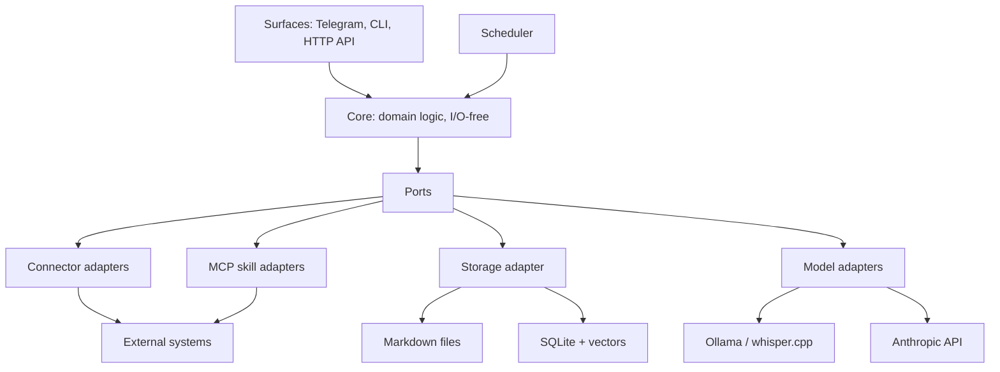
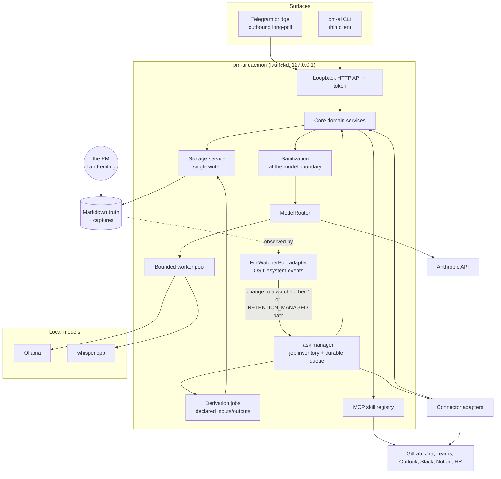
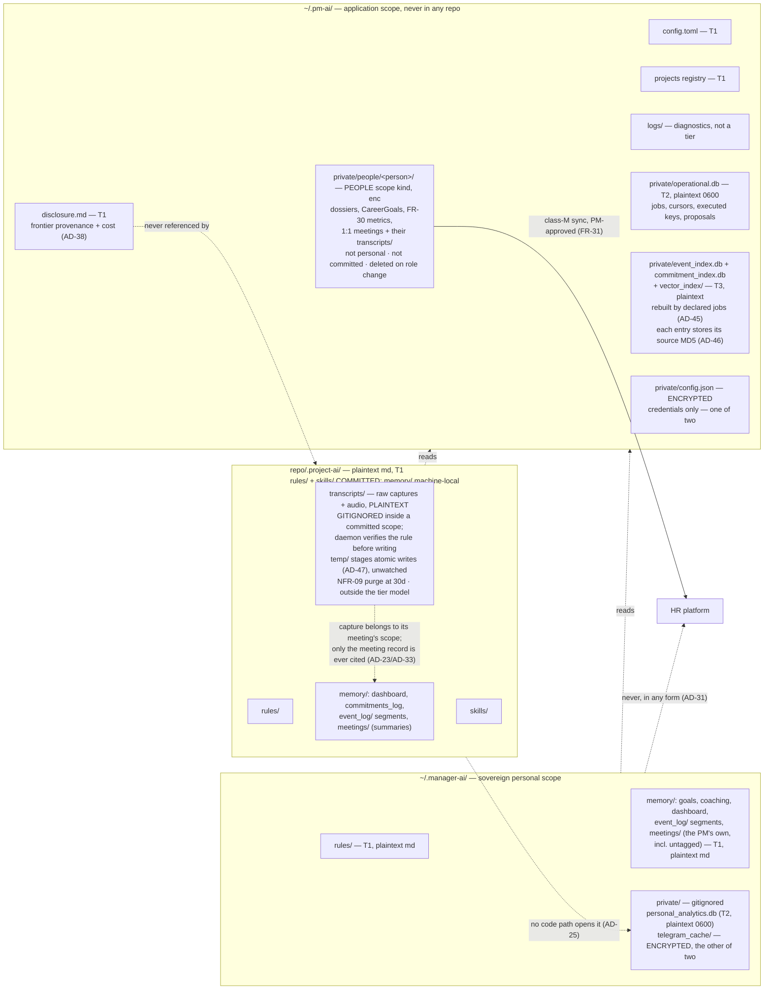
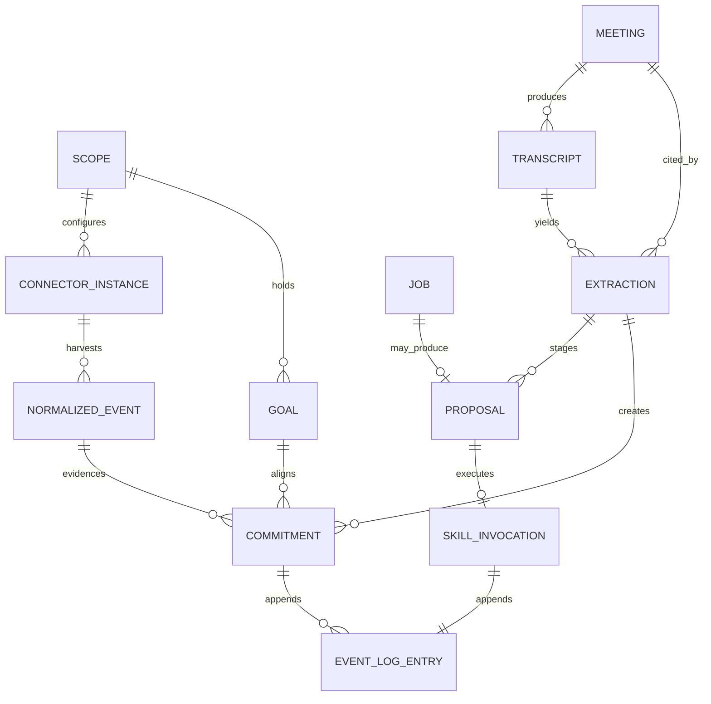

# Architecture Spine — pm-ai

## Design Paradigm

**Hexagonal (ports & adapters) around a plugin kernel.** The core holds all domain logic and is I/O-free; everything that touches the outside world is an adapter behind a port. Ingestion within that shape runs as **pipes-and-filters**: `harvest → attribute → normalize → index → extract → stage/execute` (sanitization is not a stage — it binds at the model boundary, AD-12).

| Layer | Namespace | Contents |
| --- | --- | --- |
| Composition root | `pm_ai.app` | Wiring, dependency injection, pipeline orchestration, daemon lifecycle. The only layer that may import every other (AD-30) |
| Domain | `pm_ai.domain` | Entities, enumerations, state machines, the closed taxonomies (AD-27). Imports nothing from `pm_ai` |
| Core (I/O-free) | `pm_ai.core` | Services: extraction, commitment lifecycle, proposal lifecycle, alignment/planning, scheduling policy, anchor matching |
| Ports | `pm_ai.ports` | `ConnectorPort`, `ModelPort`, `StoragePort`, `ScopePathPort`, `VcsPort`, `KeychainPort`, `CryptoPort`, `SkillPort`, `ConfigPort`, `DaemonPort`, `CredentialProbePort`, `GraphAuthPort` — protocols expressed in domain types, **and the refusals raised on both sides of a layer boundary (AD-49)**. `TranscriptSourcePort` is named by AD-23 and not yet written; `SurfacePort` is named by no AD and does not exist |
| Inbound adapters | `pm_ai.connectors` | Per-service harvesters (GitLab, Teams, Outlook, Slack, Jira, Notion, HR) — hot-loadable plugins |
| Outbound adapters | `pm_ai.skills` | Registry-authorized MCP skill modules — the only home of **class M** egress (AD-1) |
| Storage adapter | `pm_ai.storage` | The single writer: markdown, SQLite, vectors, encrypted blobs |
| Platform | `pm_ai.platform` | OS-facing adapters behind ports: paths, keychain, version control, startup diagnostics. A sibling of the other adapters, and forbidden an HTTP client (AD-1) |
| Model adapters | `pm_ai.models` | `local` (Ollama, whisper.cpp), `frontier` (Anthropic Tool Runner) |
| Surfaces | `pm_ai.surfaces` | Telegram bridge, CLI client, loopback HTTP API |

Two extension points, and only two: **a new connector** (inbound) and **a new MCP skill** (outbound). A feature that needs neither belongs in the core.

## Invariants & Rules



Dependencies point inward only: `app` → `surfaces` → adapters → `core` → `ports` → `domain`. Core services import `ports` and `domain`, never an adapter. Adapters are independent siblings — none imports another. Surfaces reach adapters only through core. `domain` imports nothing from `pm_ai`, which is what lets `ports` express protocols in domain types without a cycle.

`pm_ai.app` is the single exception: as the composition root it may import everything, because something has to know how the pieces fit (AD-30).

### AD-1 — Egress is classified; only class **M** can carry a model-driven effect `[ADOPTED — revised 2026-08-19]`

- **Binds:** all, FR-36, Non-Goals
- **Prevents:** a feature reaching an external system on a path that skips authorization, logging, or sanitization — and equally, a blanket rule the stack contradicts on day one, which gets weakened to nothing the first time someone hits it
- **Rule:** External traffic is classified, and each class has exactly one legal home:

  | Class | What | Where | Constraints |
  | --- | --- | --- | --- |
  | **M** — Mutation | Any change to external state | `pm_ai.skills` (MCP) only | Registry-authorized with declared permissions (AD-18); idempotency-keyed (AD-20); one entry per invocation in the owning scope's `event_log/` (AD-38) |
  | **H** — Harvest | Read-only fetches from external systems | `pm_ai.connectors` | Read-only by construction — a connector that mutates is a defect, not a shortcut |
  | **F** — Model | Frontier API calls | `pm_ai.models.frontier`, via the router | Prompt data governed by the model data boundary; can cause an external effect **only** by emitting a tool call that re-enters class M |
  | **S** — Surface | Telegram outbound poll | `pm_ai.surfaces.telegram` | Delivers only to the cryptographically paired user (AD-2) |
  | **L** — Local subprocess | whisper.cpp; read-only local queries (`git check-ignore`, `git ls-files`) | `pm_ai.models.local` for whisper.cpp, `pm_ai.platform` for local queries — nowhere else | argv list, `shell=False`, bounded timeout, and the load-bearing one: **every argv element is supplied by this codebase, never derived from model output or from external payload text.** That — not read-only-ness — is the property holding the line; a mutating local command would be just as dangerous with a model-supplied argv and just as safe without one, which is why the constraint is on argv provenance. A read-only query additionally is not *egress*: nothing external is contacted or mutated. **Enforcement gap, stated not hidden:** `pm_ai.platform` is absent from the AD-1 AST scan's layer list, so `shell=True`, `os.system`, `eval` and `exec` are unchecked there, and `git` is located by `PATH` lookup rather than an allowlisted absolute path. See Open Risks. |

  The LLM core holds zero shell capability and no direct network capability. **Its only route to an external effect is class M.** That is the security property; the earlier "100% of reads and writes route through MCP" was a stricter-sounding claim that the connector, frontier, and transcription paths each contradicted.

### AD-2 — Loopback-only binding; Telegram is outbound-only `[ADOPTED]`

- **Binds:** daemon, Telegram bridge, CLI, NFR-14
- **Prevents:** an inbound listener appearing on a public interface as a side effect of a feature
- **Rule:** The daemon binds strictly to `127.0.0.1`. Zero public listening ports, ever. Telegram uses **outbound long-polling only** — webhooks are prohibited, because they require a publicly reachable HTTPS endpoint or tunnel. Access is restricted to cryptographically paired Telegram user IDs; unpaired senders are rejected and logged.

### AD-3 — Three storage tiers; only Tier 3 is disposable `[ADOPTED — revised 2026-09-03]`

- **Binds:** storage, NFR-11, FR-02, FR-37, AD-9, AD-20
- **Prevents:** the earlier version's own contradiction — it called `event_telemetry.db` disposable while the job queue, connector cursors, and idempotency ledger lived inside it, so the documented recovery path would have silently discarded pending external writes and reset every cursor, with the AD-3 test still passing
- **Rule:** Persistent state falls in exactly one tier, and each tier has its own durability promise:

  | Tier | Contents | Promise |
  | --- | --- | --- |
  | **1 — Truth** | `event_log/` segments per scope (incl. harvested telemetry per FR-27), `commitments_log.md`, coaching history, goals, rules, meeting records, and the application-scoped `disclosure.md` ledger (AD-38) | Plaintext markdown, append-only, hand-editable. In `BACKUP_TARGETS`. Bounded by FR-37 compaction, which replaces whole sealed segments rather than rewriting lines (AD-5). **Git-diffable only where the artifact's own declaration says so** — see the exclusion note below. |
  | **2 — Operational** | Job queue and its `PENDING_RETRY` buffer, connector cursors, **harvest coverage windows and harvest failures**, executed-idempotency-key ledger, the harvest dedup set, staged proposals, `config.json`, and `personal_analytics.db` | Durable and **not derivable from Tier 1**. In `BACKUP_TARGETS`, and the tier that most needs one. Losing it loses pending external writes and resets harvest position — a real consequence, not a cache miss. |
  | **3 — Derived** | `event_index.db` (search), `commitment_index.db`, `vector_index/` | Disposable. Rebuildable from Tier 1 with zero loss, **by a declared job** (AD-45). |

  **Tiers are physically separated, not merely labelled.** The earlier version named three tiers while the job queue (Tier 2) and the search indexes (Tier 3) shared one `event_telemetry.db` file — so "rebuild Tier 3 only" was unimplementable, and the natural implementation of a rebuild (delete the file, recreate it) would have destroyed pending external writes and every connector cursor.

  | Tier | Artifact | Rebuild target? | In `BACKUP_TARGETS`? |
  | --- | --- | --- | --- |
  | 1 | markdown segments per scope, `~/.pm-ai/disclosure.md`, config | no | **yes** |
  | 2 | `~/.pm-ai/private/operational.db` (plaintext, `0600`) | **never** | **yes** |
  | 2 | `~/.manager-ai/private/personal_analytics.db` (plaintext, `0600`) | **never** | **yes** |
  | 3 | `~/.pm-ai/private/event_index.db`, `commitment_index.db`, `vector_index/` | yes | no |

  `pm-ai reindex` deletes and rebuilds the Tier-3 artifacts and *cannot* reach Tier 2, because Tier 2 is a different file. That is a structural guarantee rather than a careful implementation. Discarding Tier 2 is a separate, explicitly-named operation whose consequences the CLI states first.

  **Raw captures are outside the tier model on purpose.** `transcripts/` and `telegram_cache/` hold transient input the pipeline consumes and NFR-09 purges at 30 days. They are **not Tier 3**: Tier 3 promises *rebuildable from Tier 1 with zero loss*, and no rebuild reconstructs a recording. They are never a backup target and nothing may depend on them surviving (AD-33). The exclusion is asserted in code against the tier table rather than left implicit — an artifact absent from every set is an oversight, which is how `personal_analytics.db` came to be covered by no backup; an artifact named as excluded is a decision.

  **Tier 1 is not uniformly committed, and `[revised 2026-09-03]` it is mostly not.** "Git-diffable" was read as a tier-wide promise; it is per artifact, derived from the `gitignored` declaration on its node (AD-44). `disclosure.md` and `connectors/` were already Tier 1 and excluded. On 2026-09-03 the **project** tree's `memory/` and its four members — `event_log/`, `commitments_log.md`, `daily_dashboard.md`, `meetings/` — joined them, leaving `rules/` and `skills/` as the only committed project artifacts.

  The reason is that a merge falsifies every mechanism that makes Tier 1 trustworthy. Two machines on one repository append to the same `%Y-%m.md`; the whole-file publish clobbers lines pulled in between; the dedup set is per machine, so the next harvest re-appends a teammate's events; sealed segments are declared immutable and a merge rewrites them; and "file order is arrival order, and it is the only exact one" is false after a merge. A shared Tier 1 would need a merge story none of AD-5, AD-35 or FR-37 has.

  **This bears on backup and diffability only, never on the cross-scope wall.** AD-38's invariant is a scope relation with no git term in it `[2026-09-03]`, so nothing here relaxes what a project record may cite. Saying so explicitly, because the fork between these two readings was a live leak path for the few hours between the two amendments.

  The cost is deliberate: a teammate's project events, meetings and commitments do not reach this machine, so every project-level aggregation is per-machine. `rules/` and `skills/` stay shared because they are human-authored and nothing local is derived from them. The `people` tree already had this shape, which is why it is a correction rather than a new design.

  **`[revised 2026-09-03]` `BACKUP_TARGETS` declares what a backup would cover; it does not promise one exists.** Backup is **out of scope** — see Deferred. The tier rows above said "must be backed up", and the only mechanism the spine ever named for project Tier 1 was Deployment's "project rides in git", which Q6 removed. Nothing in the codebase performs a backup either: the set is derived from the tier table and only re-exported, with no consumer. Rather than invent a mechanism nobody asked for, the promise is relaxed to what the set actually is — a declaration of scope for a future capability. Every artifact stays classified, so when a backup is built it has its target list already; what is withdrawn is the assurance that something is doing it.

  **There is a third exclusion set, and finding it proved the rule above.** `logs/` is annotated "diagnostics, not a tier" in the storage diagram, and was in *no* set — precisely the oversight this AD warns about, sitting inside the AD that warns about it. `DIAGNOSTIC_ONLY` now names it, asserted pairwise disjoint from the tier table and from `RETENTION_MANAGED`. It is deliberately **not** folded into `RETENTION_MANAGED`: a rotating diagnostic log is not a raw capture, and putting it there would place it under an NFR-09 purge promise nothing implements. So the complete statement is: every persistent artifact is in exactly one of the three tiers, `RETENTION_MANAGED`, or `DIAGNOSTIC_ONLY` — and the sets are derived from the scope model (AD-44), so an artifact cannot enter one without a declaration to derive it from.

  **`personal_analytics.db` is Tier 2, despite being computed.** AD-25 calls it "derived telemetry" in the ordinary sense of *calculated from something else* — which is not what Tier 3's "Derived" means. Tier 3's test is narrow: **rebuildable from Tier 1 with zero loss**. Burnout and workload trends are longitudinal and outlive their inputs, because FR-37 compaction prunes the telemetry they were computed from — so a rebuild after compaction would silently return a shorter history, not the same history. It fails the Tier-3 test and is therefore durable, backed up, and never a rebuild target.

  It previously had **no tier at all**: it appeared in neither the rebuild set nor the backup set, so the one artifact holding months of personal trend data was the one artifact no backup covered. Two words meaning different things — "derived" as a calculation and "Derived" as a durability class — is the same collision that split `scope` four ways.

  **One index file per rebuilding job, not one file per tier `[2026-08-27]`.** The single `derived.db` split into `event_index.db` and `commitment_index.db` because a job declares its whole `outputs()` (AD-45) and two jobs cannot each own half a file — and because their owners ship at different times, so one file would have to exist before either index did. `event_index.db` is named for its principal input and also covers `rules/` and `meetings/`.

  **"Caches" left the tier on the same date.** No capability asked for one, and an undefined member of the disposable tier is an invitation to put something non-rebuildable there. The entry rule is now explicit: **an artifact is Tier 3 only if a declared job can rebuild it from Tier 1 alone.** Anything that cannot belongs in another tier.

  **Two boundaries on the zero-loss guarantee, stated rather than implied:**

  - NFR-11 scopes to **Tier 3**. Tier 3 rebuilds to the fidelity Tier 1 *currently holds* — compaction (AD-5) is a deliberate, recorded reduction, so a rebuild after compaction reproduces the compacted view, not the pre-compaction detail.
  - **Restoring Tier 2 from a backup opens a re-execution window.** Mutations performed after the backup point are absent from the restored executed-key ledger, so a replayed job can act twice. Restore is a recovery event: the CLI must warn, and reconciliation against the external system is the operator's call, not something the idempotency key alone solves.

### AD-4 — Three top-level scopes, and a fourth kind for other people's data `[revised 2026-09-23]`

- **Binds:** all storage paths, FR-16, FR-30, FR-31, NFR-07, AD-31
- **Prevents:** project configuration contaminating the sovereign personal scope and breaking its portability across roles and companies — and, added after the scope model was found to have no legal home at all for a direct report's career record, that record landing in the one scope that travels to your next employer or the one scope your team can read
- **Rule:** Three top-level scopes. `~/.pm-ai/` holds application-level state: daemon settings, project registry, per-project connector configuration, credentials. `~/.manager-ai/` holds sovereign personal material only — coaching, career, principles, goals, personal briefings — and contains **no** project-specific information or configuration. `<repo>/.project-ai/` holds per-project material, of which `[revised 2026-09-03]` **only `rules/` and `skills/` are committed** — human-authored context and automation, the things a team shares. Everything under `memory/` is machine-local (Q6, AD-3), as are `transcripts/`, the raw captures of its meetings (AD-23). Writing project config into `~/.manager-ai/` is prohibited.

  **A scope is an ownership boundary, not a sharing setting `[2026-09-03]`.** The three scopes were easy to read as "personal is private, project is shared", and Q6 broke that shorthand: most of the project scope is now machine-local. What the boundary decides is unchanged and was never about git — *whose* material this is, therefore which rules govern it, where it is written, and what it may reference (AD-38). Whether any given artifact travels is a separate answer, declared per node and derived into `GITIGNORED` (AD-44).

  **"Personal" is subject ownership, not subject matter `[clarified 2026-09-23]`.** The rule governs *whose* material this is, not the topics the material happens to mention — a personal briefing naturally discusses projects, and always did. The clarification is forced by meeting scoping: a calendar row whose categories map to no project is filed personally rather than refused, so a project meeting the PM forgot to tag lands here. That is correct, because an untagged meeting is the PM's own until they say otherwise, and refusing it would drop a real meeting off the dashboard they read that morning. It is not a leak, and `meetings/` is deliberately outside the personal-subject artifact set that would have made it one.

  Raw meeting transcripts previously sat in the application scope — documented as holding *no personal records*, which a recording of a meeting plainly is. Material now lands in the scope that owns its subject, the same rule AD-38 applies to log entries, and each scope holds its captures at the same relative path rather than in a directory of its own.

  **`people` is a fourth scope *kind*, stored as a sub-scope of the application scope** at `~/.pm-ai/private/people/` — encrypted, gitignored, never committed. It holds material about direct reports: career dossiers, goals agreed in a team 1:1, per-employee monitored metrics (FR-30, FR-31).

  It is a distinct kind and not merely a directory, because two rules turn on telling it apart and neither can be written against a path:

  | | `personal` | `people` |
  | --- | --- | --- |
  | Whose data | the PM's own | a direct report's |
  | Source flow | UJ-1, PM ↔ pm-ai (FR-12/14/15) | UJ-4, PM ↔ team member (FR-30/31) |
  | HR egress | **never** (AD-31) | **yes**, on explicit approval |
  | Survives a company change | yes — that is its purpose | **no** — it is deleted |

  So `people` is `is_personal = false` (AD-31's prohibition does not apply to it) and `is_git_committed = false` (AD-38's prohibition does apply to it). Filing it under the application scope means that scope no longer holds "no personal records", and the compensating obligation is that **`people/` is a single deletable directory**: leaving a role is one removal, not an audit. Retention beyond that is the employer's policy, not this system's to assume.

### AD-5 — One writer for all persistent state `[revised 2026-08-27]`

- **Binds:** all
- **Prevents:** two components racing on the same file or row; half-written ledger entries
- **Rule:** A single storage service inside the daemon owns every write — markdown, SQLite, vectors, encrypted blobs. No other component opens a file for writing. SQLite runs in WAL mode with the storage service as sole writer.

  **Append-only means no file is ever edited in place.** A status change is a new entry keyed by id, never an edit to an earlier one. To make that compatible with FR-37's compaction — which the earlier wording contradicted outright — logs are **segmented**:

  - Each ledger is a directory of dated segments (`event_log/2026-08.md`). Exactly one segment is *open* and appended to; all earlier segments are **sealed and immutable**.
  - **Compaction never edits a file.** It writes a *new* summary segment, records which sealed segments it supersedes, and only then may the superseded segments be pruned. Boundedness comes from replacing whole segments, not from rewriting lines.
  - **Compaction is the only operation that destroys Tier 1, and both halves of that are now bound `[2026-08-27]`.** The ordering above was right and incomplete: a sealed segment is deleted only after its milestone summary is **confirmed present**, because a crash between the delete and the summary loses the segment with nothing replacing it and Tier 1 means there is no source to rebuild from. The asymmetry that exposed the gap: the NFR-09 purge may delete a *raw capture* — outside the tier model, depended on by nothing (AD-33) — only after verified conversion, while compaction had a precondition of age alone for the tier defined as *"it is the source"*.
  - **The record goes in the open segment, and names checksums.** Every compaction appends an entry to the **open** segment of the *same scope's* event log, in the ordinary entry format, naming each replaced segment with the MD5 it had when deleted and the summary that replaced it. The open segment specifically: compaction deletes only *sealed* segments, so a record written into a sealed one is deletable by the next compaction. Checksums rather than filenames alone — a filename says *a file called this was deleted*, a checksum says *this exact content was*, and it makes a restore decidable: a backup copy whose MD5 matches the record is content compaction already replaced. **A milestone summary carries forward the compaction entries of the segments it replaces**, or the audit trail is the first thing compaction erases.
  - A reader folds across segments deterministically by `(occurred_at, entry_id)` (AD-35), so the result does not depend on segment boundaries.

### AD-6 — Scoped encryption, keychain-held key, no persistent off switch `[revised 2026-08-27]`

- **Binds:** storage service, NFR-08
- **Prevents:** a future feature encrypting a markdown file "for consistency" and destroying git-diffability and hand-editability
- **Rule:** **Exactly two artifacts are encrypted:** `~/.pm-ai/private/config.json` (credentials) and `~/.manager-ai/private/telegram_cache/` (the PM's own voice notes and dialogue state). Everything else on disk is plaintext at `0600` inside `0700`, under FileVault.

  **All `.md` files in every scope stay plaintext by design** — transparency over one's own record is a product principle, not an oversight.

  **Dropped from the encrypted set on 2026-08-27**, and SQLCipher with them: `operational.db` (queue state and cursors rather than record content), `personal_analytics.db`, `transcripts/` in every scope that holds them, the derived indexes, `connectors/`, and `private/people/`. Nothing encrypted is a database any more, which is why the dependency left entirely — it had no macOS wheel and would have been a source build for one file. `connectors/` holds connector configuration and implementation; anything confidentiality-critical a connector needs is in `config.json`.

  **Encryption tracks confidentiality; the tier tracks durability, and the two are independent.** `config.json` is Tier 2 and encrypted; `operational.db` is Tier 2 and not.

  The master key lives in the macOS Keychain so the daemon starts unattended, fetched lazily on first use so a fresh install boots without one; raw key export/import is the documented migration path. **The key must be configured before the first run that writes an encrypted artifact** — the invariant is restored by that ordering, not by an eager fetch that would refuse to boot.

  **There is no persistent way to disable encryption.** No `config.toml` key, no stored debug profile, no CLI flag that survives a restart. The whole mechanism is the `PM_AI_DISABLE_ENCRYPTION` environment variable, which dies with the process — so **restarting restores encryption unconditionally**, with no expiry mechanism, no re-announcement schedule, and nothing to audit. A console warning scrolls away within minutes and a startup ledger entry is weeks old by the time anyone wonders why a credential file is readable, which is why a durable switch is not an acceptable substitute. Parsed against an explicit allowlist, never truthiness: `=0` reads to a human as *off* and must not read as *on*. Read in exactly one place, `pm_ai.platform.environment`, because two callers need the same answer — the composition root, which acts on it, and `pm-ai doctor`, which reports it. When off, the daemon emits a CLI banner and an `event_log/` entry, and off is never the state of a fresh install.

### AD-7 — One long-lived daemon; every other process is a thin client

- **Binds:** all runtime
- **Prevents:** two processes independently owning schedules or SQLite writes; CLI and Telegram implementing divergent copies of the same feature
- **Rule:** A single daemon owns all background life — connector scheduling, calendar triggers, the Telegram bridge, the job queue, and the pruning pipeline. The CLI is a thin client that holds no state and performs no scheduling. Telegram and CLI must reach identical functionality through the same core services; no feature may exist on only one surface.

### AD-8 — CLI ↔ daemon over authenticated loopback HTTP

- **Binds:** CLI, daemon API
- **Prevents:** each feature inventing its own IPC; any local process driving the daemon unauthenticated
- **Rule:** One transport: HTTP on `127.0.0.1`, authenticated by a per-user token file at `0600`, with SSE for streamed responses. Requests without a valid token are rejected.

### AD-9 `[revised 2026-09-23]` — Connectors are uniform pull adapters; the daemon owns all scheduling

- **Binds:** FR-02, FR-35, every connector
- **Prevents:** per-connector schedulers competing for rate limits; each connector inventing its own event shape or applying sanitization inconsistently
- **Rule:** A connector's surface is closed and small: `harvest(since: Cursor) -> HarvestResult`, `emits() -> frozenset[ObservedEventType]` naming the subset of AD-27's taxonomy it produces, `sample_events()` for the AD-34 minted-id gate, and `check_health() -> Probe`. Nothing else. A connector does only auth, fetch, and map-to-schema, and never runs its own thread, timer, or polling loop. `HarvestResult` carries the events, the next `Cursor`, the `HarvestOutcome`, any `HarvestFailure`, per-row refusals, and the domain records the harvest earned. **Coverage is `CoverageWindow | None`, and `None` is the honest answer** `[revised 2026-09-23, again 2026-09-24]`: the window was mandatory until story 8a found a connector fabricating one from the clock to satisfy the field, which the fail-closed guard then read as evidence. A window is *refused* from a harvest that could not look, in three cases 8a named and 8i keeps: a `FAILED` fetch; rows that arrived carrying no clock pm-ai can believe, so nothing says *when* it looked; and rows it refused wholesale, which is pm-ai's own mapping defect rather than a quiet provider. **A harvest that reached the provider and was told "nothing here" records its window** `[8i, 2026-09-24]`: `EMPTY` is reachable only after a request completed with nothing refused in it, both bounds are the connector's own clock either side of that request, and no row ever supplied one. 8a's repair conflated the two empties and required that *something came back* as the proof of having looked, which held everywhere except the ordinary case on a quiet project — so coverage was never recorded there and `BROKEN` was unreachable. The daemon's scheduler invokes it (4h default per FR-02) and owns cursors, backoff, and rate limiting. Sanitization, dedup, indexing, and persistence happen outside the connector, uniformly — **indexing specifically belongs to a declared job under a task manager (AD-45)**, which is who "outside the connector" means; before 2026-08-27 this clause named the work without naming an owner. `Cursor` is **opaque to everything but its own connector** — provider-defined bytes the scheduler persists and replays verbatim, never parsed or compared by core; cross-connector ordering uses the envelope's `ingested_at` watermark, never cursor contents.

### AD-10 — Connector instances are per-project

- **Binds:** FR-02, FR-35, UJ-10
- **Prevents:** one builder assuming global connector config while another assumes per-project; shared cursors causing cross-project gaps or duplication
- **Rule:** A connector instance is the tuple `(scope, connector_type, config, cursor)` with its own cadence and cursor. Each registered project gets independently-scheduled harvesting — git/GitLab (work items, wiki, MRs, CI/CD) by default, plus any of Teams, Outlook, Slack, Jira, Notion enabled per project. Personal-scope instances (HR platforms, article sources, personal calendar) are separate instances under the personal scope.

### AD-11 — Projects are registered explicitly

- **Binds:** CLI, Telegram bridge, FR-35
- **Prevents:** filesystem scanning silently opting a repository into telemetry harvesting
- **Rule:** Projects enter the system only via `pm-ai project add`; the registry lives in `~/.pm-ai/`. No auto-discovery. The CLI, when run inside a registered repository, binds to that project scope; Telegram has no working directory and requires explicit project selection or a configured default. Connector configuration is reachable from both surfaces and operates on the one registry through the daemon.
- **The folder rule is implemented** `[2026-09-24, story 4l]`. `entry._acting_project` matches the working directory against each enrolled repository **by containment, innermost first**, and asks git nothing — a project is onboarded at a directory and is not required to be a repository, so `working_tree` would refuse the command from inside a perfectly good project. A single enrolled project binds from any directory at all. Outside every enrolled project with more than one enrolled, the command is **refused** — naming each project and its directory — rather than bound to a guess; naming a project on the command line is a later slice. Three states refuse and each composes its own sentence: outside them all, one directory registered under two ids, and a working directory that cannot be read. None of the three is a fault, so `pm-ai doctor` carries a `project selection` probe that is **always `OK`** — it says which project this invocation binds to, or that the directory names none, without letting the working directory decide an exit code. This is the half of AD-11 that was prose until 4l: `Path.cwd()` appeared once in the package, and only to absolutise a `project add` argument.

### AD-12 — Sanitization binds at the model boundary, for every externally-sourced field `[revised 2026-09-23]`

- **Binds:** FR-36.2, all connectors, transcript sources
- **Prevents:** a new connector or transcript path feeding unsanitized text into an LLM context
- **Rule:** No externally-sourced text — commit messages, MR/PR descriptions, issue comments, calendar invites, email bodies, meeting transcripts, chat messages — reaches a model context unsanitized. **The producer does not enforce this; the consumer does.** A pipeline pass was tried and deleted (story 8e): it computed a sanitized value and discarded it, under a comment asserting the protection, and it read a field name only one payload class had — so seven of eight payload types sanitized the empty string. A producer-side rule is one forgotten call site away from being false, and that line was the proof. The raw is what persists; the derived copy is rebuilt at the point of use.

  **Enforced at the consumer, not only at the producer.** This AD's Prevents names a *consumer* failure — unsanitized text reaching an LLM context — so a rule that only obliges every producer to remember is one forgotten connector away from being false. `ModelPort` (AD-15) is the single chokepoint every model call already passes through, and sanitization already yields a distinct `Sanitized` type. **The port accepts only that type for externally-sourced text**, so the omission becomes a construction error at the boundary that matters rather than a review catch at the boundary that doesn't. `Sanitized` is unforgeable in the two ways that matter: `for_model` must be a fixed point of the sanitizer, and the type is `@final` — the second closes a subclass with a no-op validator, and both are static guarantees rather than runtime ones.

  **Three limits, stated because a guard believed wider than it is, is worse than none.** The port's `instructions` parameter is a plain `str`, so a caller who interpolates provider text into it type-checks — the chokepoint makes the honest call easy and the omission loud, not the dishonest one impossible. The transcript path does not reach the port at all: `Extraction` flattens the pair into two bare `str` fields and builds `detail` from the raw utterance, which story `11b` owns. And nothing in `pm_ai/` implements or calls `ModelPort` yet, so this reads as "enforced for anyone who writes the call", not "every path handling provider text is covered".

### AD-13 — One Proposal entity for every staged-then-approved flow

- **Binds:** FR-06, FR-21, FR-31, FR-34, UJ-9
- **Prevents:** five divergent approval mechanisms with five card formats and five answers to "what if he never approves"
- **Rule:** The core defines a single `Proposal`: id, type, summary, payload, target executor, expiry, version, status (`staged → approved → executing → executed`, or `→ rejected | expired | superseded`). `executing` is a real state, not a transient — it is the CAS latch AD-37 uses to make expiry and execution mutually exclusive. An edit **supersedes** rather than mutating in place, per AD-5. One card renderer serves both surfaces (Telegram inline keyboard, CLI approval queue). Features never build approval flows; they **register a proposal type** with a payload schema and an executor callback. No external mutation derived from implicit extraction may execute without an approved Proposal. **Expiry is owned by the scheduler, not by features**: a registered type may override the default TTL (7 days) but never implements its own expiry sweep, and an expired proposal never executes.

### AD-14 — Commitment lifecycle is a domain state machine, distinct from Proposal

- **Binds:** FR-33, FR-34
- **Prevents:** conflating approval status with real-world fulfillment status in one overloaded field
- **Rule:** `PENDING → FULFILLED | ALTERED | BROKEN | UNKNOWN` is a domain state machine driven by execution telemetry (commits, MR merges, ticket closures). Approving a proposal produces a commitment in `PENDING`; approval status is a *Proposal* state (AD-13) and the two lifecycles never share a status field — their member names are disjoint, asserted at import.

  **`UNKNOWN` is where an overdue commitment lands when the window has no harvest coverage** (AD-35). Only `FULFILLED` and `BROKEN` are terminal. Without this state the machine has no way to say "I cannot see", and a sleeping laptop reads as a broken promise.

### AD-15 — All model access flows through one router, keyed by declared task class `[revised 2026-09-23]`

- **Binds:** NFR-12, NFR-13, all model use
- **Prevents:** a cheap path silently calling a frontier model; per-feature model clients that escape accounting
- **Rule:** One `ModelPort` with two adapters — local (Ollama, whisper.cpp) and frontier (Anthropic Tool Runner). No feature instantiates a model client. Routing is by **task class declared at the call site**, typed rather than stringly (`TaskClass`), required and un-defaulted — a default would answer for the one thing a call site exists to declare. `transcription | extraction | classification | embedding | fuzzy_match` are **local-only, always**; `coaching | briefing_synthesis | research | draft_generation | inquiry_synthesis` are frontier-eligible.

  **The vocabulary is open, and that is a decision** `[2026-09-22]`. Those ten are its current contents, not its limit: a later story that needs a class none of them names adds one, and that is an ordinary act rather than a violation. Closing it was refused on evidence — this architecture's own implementer review had already walked FR-06's summary card, FR-07's fact-check digest and FR-25's drift audit and found "none of those is any of the ten" — so a closed set would have made an already-incomplete vocabulary unforgeable. What is *not* yet decided is how a class added later declares which side of the machine it may run on; the split above is a partition of these ten and nothing else, and the gap is named under Deferred. Tier within the frontier class: `coaching` and `research` → `claude-opus-5`; the rest → `claude-sonnet-5`.

### AD-16 — The frontier adapter is a Tool Runner over the MCP skill registry, never a built-in-tool agent

- **Binds:** FR-36, frontier adapter
- **Prevents:** an agent framework's default toolset reintroducing the shell and filesystem access the firewall exists to forbid
- **Rule:** Frontier calls use the Anthropic SDK Tool Runner (`client.beta.messages.tool_runner`), whose tool set is exactly the MCP skills the registry has authorized for that flow. Libraries that ship built-in Bash/Read/Write/Edit tools — including the Claude Agent SDK — are prohibited in this layer.

### AD-17 — Cost accounting is observability, not enforcement

- **Binds:** ModelRouter, NFR-13
- **Prevents:** a builder implementing silent quality degradation or feature cutoff that was never requested
- **Rule:** Every frontier call logs token counts and a cost estimate to the application-scoped disclosure ledger (AD-38); the running monthly total surfaces in briefings and CLI. At threshold breach the system **warns only** — no degradation to local models, no hard stop, no feature blocking. The $20 figure is a monitored target for understanding real efficiency, not a circuit breaker.

### AD-18 — MCP skills are an explicit local allowlist; signing is deferred, the firewall is not

- **Binds:** FR-36, MCP layer
- **Prevents:** "unsigned" being read as "the firewall is optional"
- **Rule:** The skill registry is an allowlist of first-party modules, each declaring the **`SkillPermission`s** it may exercise (`read`, `comment`, `edit`, `transition`, `create`, `send`); the daemon refuses to invoke an unlisted skill or a call exceeding its declared permissions, and logs the violation. `SkillPermission` is a distinct type from `DataScope` (AD-4) and is never called "scope" — the two were one word in an earlier draft, which is how a project literally named `personal` could have satisfied a privacy check. Cryptographic signature verification is deferred (see Deferred), and the skill load path must stay pluggable so a verification step can be inserted without restructuring. **pm-ai may not add to this allowlist**, and may not author or execute a skill of its own (AD-42): a self-improving system whose improvements include widening its own permissions has no permissions. Everything else in AD-1 remains binding.

### AD-19 — Single asyncio loop for I/O; a bounded pool for heavy local models

- **Binds:** all background work, NFR-12
- **Prevents:** a 30-second transcription making the Telegram bridge and CLI unresponsive; unbounded parallel model loads thrashing 16GB unified memory
- **Rule:** One asyncio event loop owns all I/O — connector harvests, Telegram long-poll, the loopback API, MCP calls. No library may seize or replace that loop (see the Telegram lifecycle prerequisite in Stack). CPU/GPU-bound work (whisper.cpp transcription, embedding generation, Ollama inference) runs in a bounded worker pool and never on the loop. Default bound: **one heavy local-model job at a time**, configurable. The bound is only half the guard: because Ollama holds models resident in its own process, the daemon must also constrain the server (`OLLAMA_MAX_LOADED_MODELS=1`, `OLLAMA_NUM_PARALLEL=1`, `keep_alive: 0` before dispatching transcription). A client-side semaphore alone satisfies the letter of this AD while the machine thrashes.

### AD-20 — Every unit of deferred work is a durable row; external mutations are idempotent

- **Binds:** FR-02, FR-04, FR-07, NFR-10
- **Prevents:** in-memory timers losing work on restart; duplicate external writes on replay
- **Rule:** Nothing is scheduled in memory only — every deferred unit of work is a persisted row in the Tier-2 job queue. FR-04's offline buffer is not a separate mechanism; it is the same queue in `PENDING_RETRY`. Delivery is at-least-once, so every job that mutates an external system carries a mandatory idempotency key. The key is **derived deterministically** from `(job_type, target_ref, payload_hash)` — never randomly generated per attempt, which would silently defeat the guarantee — and the skill layer refuses a mutating invocation that arrives without one.

  **The ledger is written before the call, not after.** A key checked against a ledger that is only appended once the provider responds leaves a window: crash after the external write and before the append, and the retry executes a second time — the duplicate this AD exists to prevent, on the ordinary path rather than the rare one. The sequence is therefore **intent → call → outcome**: record the key as `in_flight` first, invoke, then settle it to `executed` with the returned `external_id`. A key found `in_flight` at retry is **not** a licence to re-execute; it is a reconciliation task, because the previous attempt's outcome is unknown. Where the provider accepts a client-supplied idempotency token, send this key as that token and let the provider deduplicate — the only mechanism that closes the window rather than narrowing it.

### AD-21 — Anything slower than 5 seconds acknowledges and delivers asynchronously

- **Binds:** Telegram bridge, CLI, job queue, UJ-5
- **Prevents:** some flows blocking and others acking, so neither users nor builders can predict behavior
- **Rule:** Any request whose expected duration exceeds **5 seconds** returns an acknowledgement token plus a job id immediately, then delivers the result over the same async channel. Requests under 5 seconds may answer inline. One pattern across both surfaces.

### AD-22 — Retrieval and synthesis have separate latency budgets

- **Binds:** FR-23, FR-25, FR-32, FR-33, FR-37, NFR-04
- **Prevents:** a builder targeting 150 ms for an LLM-synthesized answer, which is not achievable
- **Rule:** **Retrieval** — SQLite plus vector lookup with no model in the path — targets 50–150 ms; this is FR-37's real budget. **Synthesis** — retrieval plus a model call — targets ≤60 s and is always asynchronous under AD-21.

  **These are per-call budgets and they do not compose into a pipeline promise.** The PRD's end-to-end SLAs — voice triage NFR-02, meeting ingestion NFR-03, research NFR-05, missed-meeting recovery NFR-06 — each span several stages plus queue wait, and none is satisfied by summing the two numbers above. A multi-stage flow **declares its own end-to-end budget and the stage allocation that meets it**; a stage with no declared allocation inherits the generic budget and is a defect if the total then exceeds the flow's SLA. Queue wait counts against the flow, not against the stage.

### AD-23 `[revised 2026-09-23]` — Transcript acquisition sits behind a port with a working fallback

- **Binds:** FR-03, FR-06, FR-07, FR-08, UJ-3, UJ-6, UJ-7, UJ-8
- **Prevents:** the entire meeting pipeline blocking on tenant-admin consent, and being untestable without a live tenant
- **Rule:** All transcript ingestion goes through `TranscriptSourcePort`. **The Protocol does not exist yet** `[2026-09-23]` — the shipped Graph transcript adapter implements nothing declared, and the name survives only in a module docstring. The rule stands as a commitment rather than a fact; stories `11b` and `33e` owe it, and until one lands there is no port to conform to. The primary adapter is Microsoft Graph. A **manual adapter is built from day one**: a watched folder accepting `.vtt` / `.docx` / `.txt`, plus a local-recording-and-transcribe path. The extraction pipeline must be exercisable end-to-end using only the fallback adapter. **Every ingested transcript binds to a `Meeting`** (AD-33) — to its calendar event where one exists, otherwise the drop supplies title, start, and attendees to mint the record. **A transcript is stored in its meeting's scope**, never a scope of its own: the capture cannot be more or less shareable than the event it records, so a project meeting's transcript is project-owned and a report 1:1's transcript is `people`-owned. Every scope holds its captures at the same relative path, `transcripts/`, the way each holds its own `event_log/`.

  Captures are encrypted and never committed. For the project scope that means `<repo>/.project-ai/transcripts/` **excluded by a `.gitignore` rule**, because the scope around it *is* committed — so the exclusion rests on a rule rather than on a directory boundary, and a rule can go missing. **The daemon verifies exclusion before writing a capture and refuses if it cannot confirm it** — by asking git, not by matching the rule text, which AD-43 shows gets two of three real configurations wrong. Losing a transcript is recoverable, since it is transient input nothing may depend on (AD-33); publishing verbatim meeting minutes to the team's repository is not. An unbound transcript is rejected rather than allowed to mint attributed provenance from an unattributed file; the manual path is also never an auto-execute source (AD-32).

### AD-24 — The event ledger is domain truth and never carries debug output

- **Binds:** all components
- **Prevents:** debug noise destroying the value of the audit trail
- **Rule:** `event_log/` records decisions, actions, and telemetry events — append-only and human-readable. **The ledger is a directory of dated segments** (`event_log/2026-08.md`), not a single file, per AD-5; "append-only" and FR-37's boundedness are reconciled by sealing and superseding whole segments, never by rotating or rewriting one. It exists **per scope**, and an entry belongs to the scope that owns its subject; an entry needing two scopes is two entries (AD-38). Diagnostic logging goes to rotating structured JSON under `~/.pm-ai/logs/`. Disclosure and cost records go to the application ledger (AD-38), not here. Writing debug output to the event ledger is prohibited.

### AD-25 — Personal analytics are physically separated from project scope `[revised 2026-09-23]`

- **Binds:** FR-16, NFR-07
- **Prevents:** FR-16's privacy charter being enforced only by a tag someone remembers to check
- **Rule:** Personal-only computed telemetry — burnout metrics, workload and calendar-density dynamics, coaching analytics — lives in **`~/.manager-ai/private/personal_analytics.db`**: its own SQLite database, encrypted, `0600`, and gitignored so it never rides along when the personal scope is backed up as a private repository. Project-scope rendering never opens it, so personal analytics cannot be joined into any project-scope output.

  **The wall that ships is a signature, not a discipline** `[revised 2026-09-23]`, and it guards a second personal artifact this rule never named: the goal register. There are two dashboard renderers rather than one with a scope branch, and the project renderer *has no goals parameter* — so passing personal goals into a project render is impossible to express rather than forbidden by review. A shared renderer with a datasource list was the alternative and was rejected: it made the leak one line long and the defence a test somebody had to remember to keep accurate. Operational telemetry lives separately in `~/.pm-ai/private/`.

  **The wall is the scope boundary, not the directory.** This store previously sat in a fifth top-level location, `~/.manager-ai-private/`, which belonged to no scope kind and therefore fell outside AD-4's ownership rules and AD-38's cross-scope invariant — the two mechanisms that actually stop personal material reaching a committed artifact. Inside the personal scope it is governed by both, and the separation that matters — a distinct database project rendering has no code path to open — is unchanged.

  **`people`-scope metrics are a different store again.** FR-30's per-employee monitored metrics describe a direct report, not the PM, and belong in `people` (AD-4) — never in the personal analytics database. The separation runs both ways: your burnout signal must not reach a report's dossier, and a report's performance trend is not personal-scope material that follows you to your next job.

### AD-26 — macOS-only in v1, with OS-touching concerns behind ports

- **Binds:** install, supervision, keychain
- **Prevents:** macOS APIs called from core code, turning the later Linux port into a rewrite
- **Rule:** v1 targets macOS on Apple Silicon only. Keychain access, process supervision, and packaging paths sit behind ports so Linux adapters slot in without restructuring. No `Foundation`/`launchd`/Keychain call appears outside its adapter.

### AD-27 `[revised 2026-09-23]` — Core owns closed taxonomies; adapters map into them

- **Binds:** all connectors, every component writing to the event ledger, FR-27
- **Prevents:** two connectors describing the same real-world change as different event types, so commitment verification misses evidence from one of them; two features writing incompatible entry shapes into the audit trail
- **Rule:** The set of `NormalizedEvent` types and the set of `event_log/` entry types are **closed enumerations defined in `domain`**. A connector maps its provider's vocabulary into an existing type; it may not mint one. Adding a type is a deliberate change there, reviewed against existing types for overlap. **Neither enumeration is versioned yet, and the clause is withdrawn rather than left standing** `[revised 2026-09-23]`. A `GRAMMAR_VERSION` constant stood here until a code review removed it on 2026-08-30: nothing wrote it into a line and nothing read it while parsing, so a segment written under one grammar was byte-indistinguishable from one written under any other. The choice among a per-line token, a segment header and a dated grammar table is unmade; it becomes real the first time the grammar changes after something has written segments. Named under Deferred.

  **A closed type over an open payload is half a contract.** Each *observed* event type binds exactly one payload shape, registered in `domain` and enforced at construction — otherwise two connectors agree on `work_item_closed` and disagree on everything inside it, and the verifier silently misses evidence from one of them.

  **The two vocabularies bind differently, and the difference is enforced** `[2026-09-23]`. A self-action type is *refused* from the payload registry and binds a set of required — not exhaustive — field names instead. A self-action is pm-ai's own record of something it did, so there is no provider payload to pin; the guard exists because one registry serving both vocabularies would let a connector declare a member only pm-ai may write.

### AD-28 — Commitments belong to project scope; coaching commitments are a separate entity

- **Binds:** FR-16, FR-34, AD-4, AD-25
- **Prevents:** a 1:1 coaching undertaking being written into the project ledger, where it belongs to the wrong subject and — while the project scope was committed in full — was published to a repository `[motive restated 2026-09-03]` — and, symmetrically, a report's career goal being filed as either
- **Rule:** Three distinct entities, three scopes, no shared storage and no shared code path:

  | Entity | What it is | Scope |
  | --- | --- | --- |
  | `Commitment` | a team-facing promise, verified against execution telemetry (AD-14, AD-36) | project — `.project-ai/memory/commitments_log.md` |
  | `CoachingCommitment` | the PM's own undertaking from a Socratic 1:1 (UJ-1) | personal |
  | `CareerGoal` | a direct report's goal agreed in a team 1:1 (UJ-4), HR-syncable on approval | people (AD-4) |

  The project-scope ledger has no code path that accepts a personal or people entity. `CareerGoal` is not a `Commitment`: it is not verified against commit telemetry, and treating it as one would file a performance objective in the project's ledger, where it belongs to neither the right subject nor the right sharing rules.

### AD-29 `[revised 2026-09-23]` — Sanitization is non-destructive to the stored record

- **Binds:** AD-12, FR-36.2, citation conventions
- **Prevents:** stripping an injection payload from a transcript and thereby corrupting the evidence a `source_ref` points at
- **Rule:** Sanitization produces a *derived* copy; **the raw is never overwritten**, and that is the whole of the protection. The raw payload is stored unmodified (under the retention policy) so citations, drift checks, and audits resolve against the real source. The derived copy is **not** confined to model context `[revised 2026-09-23]`: a `for_model`-derived slice is what a staged `Proposal` carries as its summary, so it reaches `operational.db` and the card the PM reads. Two consequences are accepted rather than hidden — a stored summary can be one a later, wider rule would redact, and it is left as written because AD-5 supersedes rather than mutates. No component may overwrite a raw payload with its sanitized form.

### AD-30 — The composition root is the only place that wires adapters `[NEW]`

- **Binds:** source tree, layering contract, every pipeline
- **Prevents:** the pipeline having no legal home — core may not import adapters and adapters may not import each other, so under the previous layering the named `harvest → attribute → normalize → index → extract → stage/execute` sequence could not be written anywhere, and connector credentials had no route from encrypted storage to the connector that needs them
- **Rule:** `pm_ai.app` is the composition root: it constructs adapters, injects them into core services through ports, retrieves credentials from storage and hands them to connectors, orchestrates the ingestion pipeline, and owns the daemon lifecycle. It is the **only** module permitted to import from every layer. Core services receive their dependencies; they never construct or locate them. Surfaces reach adapters only through core — a surface importing `storage` or `models` directly is a layering violation even though both sit lower in the tree.

### AD-31 — The model data boundary, and what it must disclose `[NEW]`

- **Binds:** FR-16, AD-15, AD-17, every frontier call
- **Prevents:** each feature deciding independently what may enter a prompt — and a privacy charter whose central claim nothing can check
- **Rule:** FR-16's adversary is **employer-controlled systems** — team channels, shared repositories, enterprise dashboards, HR platforms — not model APIs. Personal-scope material may therefore enter a frontier prompt, and the Socratic coaching flow routes to `claude-opus-5` as AD-15 specifies. Three obligations follow:
  1. **FR-16 must say so.** A charter that means something narrower than its words is worse than no charter, because it invites a reader to assume more protection than exists.
  2. **Every frontier call records scope provenance** to the application-scoped disclosure ledger (AD-38) — never to `event_log/`, which exists per scope, so "what has left this machine" would span N files — and whose project instance was committed in full when this was written. The record carries contributing scopes, task class, model, token counts, and destination. The CLI answers *"what has left this machine, and when"* from that one file. This converts the charter from an assurance into an audit.
  3. **The boundary is on the destination, not only the source.** Personal-scope material must never enter a prompt whose output is bound for a project-scope artifact or an external system. Burnout signals may shape your briefing; they may not reach a team-facing dashboard by way of a model that read both.

  **The HR platform is an adversary to `personal`, and a destination for `people` — because they are two different 1:1s.** The distinction is whose data it is, not which tool holds it:

  | | UJ-1 — PM ↔ pm-ai | UJ-4 — PM ↔ team member |
  | --- | --- | --- |
  | Subject | the PM | a direct report |
  | Produces | `CoachingCommitment`, growth notes, burnout signal | the report's agreed goals and performance objectives |
  | Scope | `personal` | `people` (AD-4) |
  | May sync to HR | **never** — this is FR-16's whole point | **yes**, and FR-31 requires explicit PM approval first |

  A `people`-scope sync to HR is ordinary class-M egress (AD-1): a staged Proposal (AD-13), approved by the PM, executed by the HR skill, recorded in the executed-mutation ledger. **`personal`-scope material may never be a source for it** — not directly, and not by way of a model that read both, which is what obligation 3 above already forbids. The PM's own coaching record and a report's career record never enter the same prompt.

### AD-32 — Spoken commands auto-execute only when source, speaker, and verb all qualify `[NEW]`

- **Binds:** FR-05, FR-07, UJ-7, AD-13, AD-23
- **Prevents:** an untrusted transcript conferring authenticated authority — anyone in the meeting, or anyone able to write a file into the watched folder, obtaining unapproved external write access
- **Rule:** A spoken command executes without approval only when **all three** hold:
  1. the transcript came from a **provider-authenticated source** whose speaker identity is issued by that provider (a tenant account, not a VTT label);
  2. the speaker **resolves to the PM**;
  3. the verb is **auto-executable** — registered in `domain`'s verb registry, keyed on `(provider, verb)`, and both `reversible` **and** not `notifies`.

  **Reversibility is not a property of the verb alone.** `jira:set_priority` is quiet and auto-executes; `gitlab:set_priority` is equally reversible but notifies ~30 people, and one-tap undo cannot recall a notification — so it stages. The registry is keyed on the pair for exactly this reason, and an **unregistered verb never auto-executes**: reversibility is asserted, never inferred.

  Any condition unmet ⇒ the command becomes a Proposal (AD-13). **Irreversible verbs always stage, regardless of source or speaker**: outbound email and DM (FR-26), MR/PR creation (FR-28), closures, deletions, and any external effect a later call cannot undo. The manual transcript adapter (AD-23) is **never** an auto-execute source — it is untrusted by construction — though it remains fully valid for extraction and staging. Every auto-execution emits a card carrying one-tap undo, plus its `event_log/` entry.

### AD-33 `[revised 2026-09-23]` — Cite the event, never the artifact that captured it `[revised 2026-09-03]` `[NEW]`

- **Binds:** every surfaced fact, FR-03, FR-25, FR-32, FR-33, FR-34, NFR-09, AD-29
- **Prevents:** provenance pointing at a derived artifact that has its own lifecycle — so a transcript purge silently empties every citation that depended on it, and the drift auditor reports **clean** against sources that no longer exist
- **Rule:** `source_ref` points at the **most upstream durable referent** — the thing that happened — never at a derived capture of it. A transcript is a derivative of a meeting, so meeting-derived facts cite `meeting:<id>` plus speaker, with an optional time offset used only for tracing. Commit SHAs, MR URLs, ticket anchors, and message IDs already satisfy this.

  **`Meeting` is a first-class Tier-1 record**: id, calendar event reference, title, start, duration, attendees, **scope**, plus the provider's tentative flag and its iCal uid. **It holds no transcript pointer and no processing status** `[revised 2026-09-23]`: the transcript's home is *derived* from the meeting's scope and id, which is the stronger form of this AD's own self-containment rule — there is no pointer to go stale. **Some fields are deliberately non-durable**: the tentative flag and the uid ride in memory and reach no file, and a future meeting is not persisted at all, because a calendar row that has not happened yet is a plan rather than a record. The stored record has two owners — a machine-written region and a human-written `## Notes` that no writer may touch. It is also where FR-03's Man-Hour Cost inputs live, so FR-03, FR-32, and UJ-8 key off one entity rather than three ad-hoc lookups.

  **A Meeting belongs to the scope that owns its subject, and `scope` is required rather than defaulted** — a team meeting to its project, a 1:1 with a direct report to `people` (AD-4), a purely personal session to `personal`. It decides two things no caller may guess: where the transcript is written, and whether a project-scope record may cite this meeting at all — `[revised 2026-09-03]` a **scope** question, not a git one, since AD-38's invariant tests the scope relation and holds for a project sitting in no repository.

  This was wrong until 2026-08-20, and wrong in a way that made AD-38 false on the main path: `meetings/` was filed in the **personal** scope while commitments live in the project ledger — then committed in full — so **every commitment extracted from a meeting referenced personal-scope material by `source_ref`** — the exact phrasing AD-38 prohibits. Nothing detected it, because the write guard checks the scope a record *belongs to* and never the scope it *points at*. Both directions are now checked.

  **Derived records are self-contained.** A ledger or decision entry carries everything needed to act on it and never depends on its source artifact still existing — which is what makes NFR-09's 30-day transcript purge a purely operational matter. Tracing walks *fact → meeting → transcript if present*; nothing may treat the third hop as a dependency.

### AD-34 `[revised 2026-09-23]` — Event identity is fixed: reference grammar, actor resolution, natural key `[NEW]`

- **Binds:** every connector, AD-9, AD-27, AD-33, FR-30, FR-33, FR-34
- **Prevents:** AD-27 closed the *type* enumeration and left every other field open, so two connectors could describe the same change compliantly and still fail to join — GitLab writing `source_ref` as a URL and Jira as a ticket key, or one engineer arriving as a commit email and a speaker label and becoming four people in the metrics that feed a performance review
- **Rule:** Three identity elements are fixed in `domain`, not left to each adapter:
  1. **Reference grammar.** `source_ref` is `<system>:<scope>:<kind>:<native_id>` — `gitlab:alpha:commit:9f2a1c`, `jira:alpha:issue:PAY-102`. A closed set of **global entities** that belong to no project takes the scopeless two-part form `<system>:<native_id>` — `meeting:mtg_01HX`, `goal:g_payments_latency` (AD-41 — a goal id is a PM-authored slug, not a minted surrogate). Closed: adding a member is a deliberate change in `domain`, which is what stopped `goal:` being invented at a call site. Parseable, joinable, uniform across sources; free-form refs and bare URLs are rejected at normalization, as are refs naming a non-durable capture (AD-33). One type, one grammar: `TargetRef` (AD-37) additionally rejects sub-resource fragments, so a lock names one entity rather than one of its fields.
  2. **Actor resolution.** Every event carries an `actor_id` resolved to a single `Actor` in `domain`. Connectors supply their native handle (commit email, tenant account, speaker label); normalization maps it through an alias table. An unresolvable handle becomes an explicit `unresolved` actor — **never** a raw string used silently as identity, because that is what silently splits one person into several.
  3. **Natural key.** Deduplication uses `(scope, source_system, source_ref)`, never the locally-minted id. The `evt_` ULID is a surrogate assigned by the **storage service at persist time**; connectors never mint ids. Re-harvesting the same window must therefore be idempotent rather than doubling every metric.

     **`scope` is part of the key, and the dedup set is durable.** Without the scope component, AD-38's mandated cross-scope split — one operation writing a project entry and a personal entry — has its second entry silently swallowed as a duplicate, so the rule that exists to prevent a leak instead drops the record. And because the set decides whether a re-harvest doubles a metric, it is **Tier-2 state** by AD-3's own test: not derivable from Tier 1, and required to survive a restart. An in-memory set makes idempotency true only within one daemon lifetime.

### AD-35 — Two clocks, never mixed; and absence of telemetry is not evidence `[revised 2026-08-27]`

- **Binds:** AD-9, AD-3, FR-26, FR-33, FR-34
- **Prevents:** a verifier comparing `occurred_at` to a due date while a sweeper reasons in `ingested_at` — so a laptop asleep over a weekend fires irreversible "why isn't this done" messages about work already delivered — and a ledger that folds by file order producing different commitment states after a rebuild
- **Rule:**
  - **`occurred_at`** is when the thing happened in the world. Provider-supplied, possibly skewed, possibly absent. It governs **domain reasoning**: due dates, "did the commit follow the promise", ordering within a meeting.
  - **`ingested_at`** is assigned locally by the storage service at persist time. It governs **operational reasoning**: cursors, watermarks, replay, sweep windows.
  - The two are never substituted for one another. An absent or implausible `occurred_at` (future-dated, or preceding its meeting or repository epoch) is **flagged**, not silently backfilled from `ingested_at`.
  - **Ledger folding is deterministic**: entries fold by `(occurred_at, entry_id)`, a total order stable across rebuilds. Never file order — otherwise `pm-ai reindex` changes commitment states while AD-3's test still passes.
  - **Coverage is recorded whenever pm-ai actually looked** `[revised 2026-09-23, again 2026-09-24]`. A harvest returns a `CoverageWindow` **or `None`**, and `None` is a real answer rather than a gap to paper over — a mandatory field is what drove a connector to fabricate a window from the clock, which this very guard then read as evidence. A window is refused outright from a harvest that **could not** look, and there are three such harvests: one that failed; one that got rows back carrying no timestamp it can believe, which leaves it unable to say *when* it looked; and one that got rows back and refused every one of them, which is pm-ai's own defect and must never read as a quiet provider. It is **recorded** for a harvest that reached the provider and was told there was nothing there `[8i, 2026-09-24]` — the bounds are the connector's own clock either side of the request and were always in hand, so withholding the window threw away the only proof that a quiet project had been checked at all. Either way a harvest that failed is durably recorded as having failed, so "ran and learned nothing" survives the process as something other than silence, and is now distinguishable from it in the coverage table as well as in the failure row. The commitment sweeper must not declare `BROKEN` across a window it has no coverage for. Silence from a sleeping laptop is missing data, not evidence of a broken promise — and FR-26's nudges are irreversible, so this must fail closed.
  - **Two silences are distinguishable, and collapsing them was a defect.** A sleeping laptop made **no harvest attempts at all** — no attempt rows, no failures, genuinely missing data: `UNKNOWN`, fail closed. A connector with a dead token **did attempt**, and the attempts are in the log marked failed. That is not missing data; it is a machine reporting that it is broken. So the verdict set carries **`ERROR`** — harvesting failed for a reason a human must clear: refresh the token, re-authenticate, fix the link or the configuration. `ERROR` is never fail-closed patience and never a coverage gap; it is surfaced. Without it a permanently dead connector read forever as `UNKNOWN`, which looks like waiting.
  - **`ERROR` is a `CommitmentState`, and the input that produces it is required** (`pm_ai/domain/lifecycle.py`, 2026-08-28). It is the sixth member, alongside `UNKNOWN`, and `is_verdict` marks both as *epistemic*: they report that the system cannot answer, and why, rather than making a claim about the promise. Neither is terminal — both clear when the world or the machine changes. `evaluate_commitment` takes `harvest_failed` with **no default**, on AD-9's discipline: a default of `False` would be the *safe* verdict and would silently restore the indefinite waiting `ERROR` exists to end, which is the worst kind of default — correct-looking and self-defeating. **Order is fixed**: `covered` is consulted first, so a window that was harvested yields a real verdict and a connector breaking afterwards does not retract it. `ERROR` competes with `UNKNOWN` alone, never with `BROKEN`.
  - **The coverage question is asked in one clock, and it is `ingested_at`.** A `CoverageWindow` describes what the daemon did, so its operands are local. A commitment's deadline is `occurred_at`, so comparing the two directly re-introduces exactly the mixed-clock bug this AD forbids. The rule: a commitment overdue at `occurred_at = T` is covered only if every connector instance that could evidence it has a window enclosing **the ingestion interval in which a T-dated event would have arrived** — deadline plus the instance's harvest cadence and the provider's own publication lag. Absent a stated lag, the instance is treated as not covering, because `UNKNOWN` is the safe verdict and `BROKEN` is the irreversible one.

### AD-36 — pm-ai's own writes are never evidence `[NEW]`

- **Binds:** FR-06, FR-28, FR-33, FR-34, AD-1 class M
- **Prevents:** the closed loop closing on itself — FR-06's executor posts a comment to WI-108, FR-34's verifier later reads WI-108 activity as fulfilment evidence, and the system marks a commitment `FULFILLED` on telemetry it manufactured. Nothing crashes; the ledger simply becomes confidently wrong in the direction that looks like success
- **Rule:** Every event carries `authored_by ∈ {external, pm_ai, unknown}`. **Only `external` is admissible as evidence.** A transition to `FULFILLED` requires evidence authored by someone other than pm-ai; self-authored activity may be displayed for context but never counted.

  **`unknown` is a required third value, not a convenience.** A two-valued enum has to default, and defaulting to `external` fails *open* — an event nobody could attribute would count as proof a promise was kept. Unattributed events therefore resolve to `unknown`, which is never evidence. `Provenance.UNKNOWN` is the envelope default, so an adapter that forgets to attribute fails closed rather than silently vouching.

  Attribution is established at both ends. **Neither end may be assumed present; each is a required, separately-testable step.**

  1. **Record.** The skill layer writes every class-M mutation to the Tier-2 executed-mutation ledger as `(target_ref, external_id, at)` — `external_id` being the identifier the provider returned for the artifact it created.
  2. **Match.** Normalization looks every harvested event up in that ledger **before** persisting it, and marks a hit `pm_ai`. The join key is `SourceRef.native_id == external_id` within the same `(system, scope)` — stated explicitly because the ledger is keyed by `TargetRef` and events by `SourceRef`, and leaving the mapping to each implementer is the identical defect AD-34 was written to fix. A skill whose provider returns no usable identifier must say so, and its mutations are then attributed by mechanism 3 alone.
  3. **Identify.** Where the connector authenticates as a distinct bot account, actor resolution (AD-34) marks it independently.

  **A connector may never assert `external`.** Provenance is decided during normalization, which is the only layer that can see the ledger; a connector emits `unknown` and normalization resolves it. A connector hard-coding `external` makes the fail-closed default unreachable and re-opens this hole in full — which is what the GitLab adapter does today (see Open Risks).

### AD-37 — Every shared-entity transition is a compare-and-swap `[NEW]`

- **Binds:** AD-13, AD-14, AD-20, all surfaces
- **Prevents:** approving the same proposal from Telegram and the CLI and creating two HR goals; and the expiry sweeper racing the job worker so that an eleven-day-old approved change posts after expiry, despite AD-13 stating that expired proposals never execute
- **Rule:** Proposal and Commitment transitions are versioned compare-and-swap: read version → attempt transition with the expected version → on conflict, **reload and re-evaluate**, never blind-retry. Terminal states are terminal, and a worker re-checks state **at execution time**, not only at enqueue time.

  Expiry and execution are mutually exclusive by construction: the sweeper CASes `staged → expired`, the worker CASes `approved → executing`, and whichever loses observes the winner and stops. Mutations targeting the same external entity serialize through a per-target lock keyed by `target_ref`, so two approved changes to one work item cannot interleave.

### AD-38 — The disclosure and cost ledger is application-scoped and never committed `[revised 2026-09-03]`

- **Binds:** AD-17, AD-24, AD-31, AD-4, FR-16, FR-27
- **Prevents:** the audit mechanism becoming the leak. `event_log/` exists per scope, and `<repo>/.project-ai/` was git-committed in full when this AD was written — so a disclosure record naming `scopes={personal, project:alpha}` would be pushed to the employer's repository, publishing exactly what AD-31 was built to protect. `[2026-09-03]` Q6 closed that route for the project log itself, but **this AD is unchanged in force**: the separation is what makes AD-31's "what has left this machine" and AD-17's monthly total answerable from one file, and `rules/` and `skills/` remain committed, so a repository is still reachable from a project artifact. Two independent reviewers found this; it inverts D1 rather than bending it. It also made AD-31's "what has left this machine" and AD-17's monthly total unanswerable, since both would span N files
- **Rule:** Two record kinds, deliberately separated:

  | Record | Home | Committed? |
  | --- | --- | --- |
  | **Domain events** — decisions, commitments, work-item activity, meeting outcomes | `event_log/` in the scope that **owns the subject** | **Never** `[revised 2026-09-03]`. Project `event_log/` was committed by design until Q6 made it, `commitments_log.md`, `daily_dashboard.md` and `meetings/` machine-local — see AD-3 |
  | **Disclosure & cost** — every frontier call's scope provenance, tokens, estimated spend | `~/.pm-ai/disclosure.md`, a **single** append-only Tier-1 ledger | Never. Application scope is outside every repository |

  Both AD-31's audit and AD-17's running total read one file, so both queries are answerable. And the general invariant that makes this safe rather than merely tidy:

  **No record written to the project scope may reference personal- or people-scope material** — not by content, not by `source_ref`, not by scope name. A cross-scope operation writes its project-visible part to the project log and everything else to the application ledger; it never writes one record naming both.

  **`[revised 2026-09-03]` The invariant does not mention git, and must not.** It read "written to a git-committed scope" and was implemented as `is_git_committed`, a scope-kind predicate (`identity.py:78-80`). That was safe only while every project artifact was committed. Once Q6 made the project log machine-local the two questions came apart, and each answer alone is wrong: keep the git test and a project record may never cite a 1:1 even though nothing leaves the machine; drop it and the only remaining protection is a `.gitignore` staying correct — one `git add -f`, one directory committed before the rule existed, one skill quoting a commitment into an MR description, and a report's 1:1 is published.

  So the subject is the **scope relation**, unconditionally. The material belongs to a different subject with different sharing rules, and that is true of a project sitting in no repository at all. This is AD-25's own principle — *"The wall is the scope boundary, not the directory"* — and the second correction of one conflation: `service.py:704-705` records `is_git_committed` being the wrong gate for the capture guard, in the opposite direction, and the fix was never propagated here.

  **`is_git_committed` is therefore retired in favour of `is_project`.** With both guards testing the scope relation it has no production caller, and a predicate whose docstring asserts "project scope lives in the employer's repository" with nothing consuming it is a claim nobody can check. Its siblings are `is_personal` and `is_people`.

  `people` is included for the same structural reason and a sharper consequence: a direct report's performance objective committed to a repository is readable by that report's peers. The scope is `is_git_committed = false`, and the guard is on the writing boundary rather than on anyone's discretion.

  `event_log/` routing is therefore unambiguous: an entry belongs to the scope that owns its subject, and an entry that would need two scopes is two entries.

### AD-39 `[revised 2026-09-23]` — Credentials have a lifecycle, and its failure is never silent `[revised 2026-08-27]`

- **Binds:** every connector, AD-9, AD-18, AD-26, AD-35, FR-02, FR-35
- **Prevents:** a whole dimension nobody owned. Seven OAuth-bearing services are in scope, AD-9 forbids a connector its own thread or loop, and nothing said how a token gets refreshed or how the user re-consents — so each connector would invent it. Worse, an expired credential and a sleeping laptop are **indistinguishable** under AD-35: both produce no telemetry, both resolve to `UNKNOWN`, and a permanently dead connector reads forever as "no coverage yet" instead of raising its hand
- **Rule:** Credentials are storage-held, daemon-owned, and connector-refreshed:
  - **Custody belongs to the daemon; the HTTP half of acquisition belongs to the connector** `[revised 2026-09-23]`. This resolves a contradiction the spine carried unnoticed: the rule used to say refresh was the daemon's and never a connector's, while AD-1 confines HTTP clients to adapters and forbids `pm_ai.platform` an HTTP client at all — so the layer the rule assigned the work could not perform it. A token endpoint is HTTP, so sign-in, refresh and rotation live in the connector. What stays the daemon's is custody: which secrets exist, where they live, that they are sealed, and that they are injected. **A connector never chooses where a secret lives, never writes one itself, and never reads another connector's.** Admitted limit: the composition root injects an in-memory refresh-token store today, so no rotated token is durably persisted — the sealed-store update path is owed by story `8b`.
  - **The scheduler still owns cadence**, not the connector. The composition root (AD-30) retrieves credentials from encrypted storage and injects them; refresh runs on the scheduler like any other job (AD-20). A connector never persists, refreshes, or prompts for a credential.
  - **Re-consent is a Proposal** (AD-13). Interactive re-authorization cannot happen inside a background harvest, so a connector needing human consent raises it as a staged item on both surfaces rather than blocking, failing silently, or dying.
  - **A connector reports an explicit health state when asked** — `OK | WARNING | ABSENT | FAILING` — distinct from its coverage `[revised 2026-09-23]`. It is not carried: nothing persists it, deliberately, because stale health on a diagnostic screen is worse than none. `ABSENT` means configured with no credential stored — an ordinary first-run state, not a fault. A provider needing re-consent reports `FAILING` with its own remediation. **`doctor` lists registered connectors without contacting anything; `pm-ai connector check` does the live probing** and owns the ten-second bound, which is why the bound is assignable to one command at all. **Absence of telemetry from an unhealthy instance is never reported as a coverage gap**, and never contributes an `UNKNOWN` that looks like patience — it contributes **`ERROR`** (AD-35). This AD already forbade the coverage-gap reading but named no verdict to report instead, which left `UNKNOWN` as the only available answer: the one that looks like waiting. `pm-ai doctor` and the briefing both surface any instance not `healthy`.
  - **Secrets never leave the encrypted store in a durable form**: not into `event_log/`, not into diagnostics, not into a model prompt, not into a `Cursor`.

### AD-40 — The system may interrupt only on a declared occasion `[NEW]`

- **Binds:** FR-13, FR-26, AD-2, AD-7, AD-21, all surfaces, all push paths
- **Prevents:** the product's own stated failure mode. The PRD's Vision rejects a "noisy notification relay" and its Non-Goals forbid unsolicited mid-work interruption, but *when* the system may speak unprompted was never fixed — so each feature decides for itself, every decision is locally defensible, and the sum is the relay. Nothing here is caught by a test about correctness; the system works exactly as specified and becomes unusable
- **Rule:** Every unprompted message to the user is a **push occasion**, and the set of occasions is a closed enumeration in `domain` — the same closure AD-27 applies to events and AD-32 to verbs. A feature registers an occasion; it never invents one at the call site.
  - Each occasion declares its **trigger, surface, and whether it may arrive during declared focus time**. The default is that it may not: deferred to the next boundary, not dropped.
  - **Occasions are budgeted, and the budget is a spine-level number, not a per-feature preference.** The PRD's counter-metrics (draft volume, citation density, coaching cadence) are the budget's units — they exist precisely to stop each feature optimizing its own engagement — and a feature that exhausts its budget defers rather than degrading someone else's.
  - **Approval cards are not interruptions**; they are responses to work the user initiated, and are exempt.
  - Anything irreversible (FR-26 nudges) additionally clears AD-35's coverage guard before it may fire.

### AD-41 `[revised 2026-09-23]` — A recommendation cites a goal, or it is not surfaced as aligned `[NEW]`

- **Binds:** FR-09, FR-11, FR-13, FR-32, UJ-9, SM-1, AD-27, AD-33, AD-34, AD-38, AD-40
- **Prevents:** the system's central purpose degrading into a formatting convention. Continuous alignment of daily micro-decisions across goal horizons is what pm-ai *is*, and it had no invariant at all — it survived in this document only as a directory name and as three characters inside an FR-range in the capability map, which reads as coverage while fixing nothing. Three surfaces building "alignment" independently would each pick a tier vocabulary, one would omit the tag, and every choice would be locally defensible
- **Rule:**

  1. **Two closed enumerations in `domain`, deliberately separate.** `GoalDomain` — `project | team | personal` — is *what a goal is about*, and is the `<Tier>` in `[Strategic Alignment: <Tier>]`. `GoalHorizon` — `short | medium | long` — is *when it lands*, and is what UJ-9's Strategic/Tactical/Operational planning breakdown groups by. The PRD uses "tier" and "horizon" for both axes interchangeably: FR-11 says short/medium/long, §2.1 says Project/Team/Personal, UJ-9 says Strategic/Tactical/Operational. **Conflating them is how one surface tags `Team` and another tags `Long-Term`, both compliant with the requirement as written.** Closed, in `domain`, for the same reason AD-27 closes event types.

  2. **Goals have stable ids, and a recommendation cites one.** The id is **authored by the PM**, not minted `[revised 2026-09-23]` — goals are set in conversation or at a prompt, and a readable slug like `g_payments_latency` is what a human revising the file by hand can work with. It is validated against a charset, refused if duplicated, and referenced as `goal:<id>` under AD-34's grammar. This makes the id *more* rename-prone than a surrogate would be, which is exactly why the unresolved-citation clause below is load-bearing rather than defensive. `strategic_goals.md` is hand-editable Tier-1 markdown (AD-3), so an edit that removes or renames a goal must leave the citation **explicitly unresolved and visible** — never silently dropped. This is AD-34's actor rule applied to goals, and for the same reason: a reference that quietly degrades to nothing corrupts the metric built on it.

  3. **No recommendation is surfaced as aligned without a resolvable goal reference.** A task the engine cannot align is rendered *explicitly unaligned*. **Aligned-by-omission is the failure mode** — a briefing that reads as strategic while the tags mean nothing is worse than one that admits the gap, because it is the claim the product is sold on.

  4. **The Strategic Rationale Snippet is generated prose and never a substitute for the citation.** It explains the link; the `goal:<id>` *is* the link. AD-33's logic, applied one level up: cite the durable referent, not the model's sentence about it.

  5. **`strategic_goals.md` is personal scope**, so the alignment tag belongs on personal-scope surfaces — FR-09's briefing, FR-13's planning. A project-scope artifact may not cite a personal-scope goal (AD-38); project-scope alignment would require project-scope goals, which do not exist yet (see Deferred).

  6. **Alignment ranks, and it ranks everywhere the same way.** On any surface presenting a task list, an aligned task ranks above an unaligned one **at comparable urgency** — a citation to a goal is evidence that the work advances a stated growth path, and that is what makes it worth doing first. Alignment **lifts; it does not override**: an unaligned production incident still outranks a long-term refactor, because a ranking that buries genuine urgency behind strategy is one the PM stops trusting after the first outage. One ordering rule across FR-09, FR-13, and FR-32; a surface that invents its own is a defect.

  7. **Unaligned work is never hidden — it is the drift signal.** Unaligned tasks rank lower and stay individually visible: never collapsed, truncated, or summarized away. The **unaligned set is surfaced as a set**, because a week of unaligned work is precisely what FR-24's drift audit exists to catch, and burying it destroys the only evidence that the PM is drifting. Unaligned does not mean unimportant; it means *this may be pulling in a direction nobody chose*, which is a thing to look at rather than a thing to demote out of sight.

     The corollary is a guard against gaming the rank: **nothing may mark a task aligned in order to promote it.** Alignment comes only from a resolvable citation to a real goal (rule 2), never from a model's judgment that something feels strategic — otherwise the ranking rule creates an incentive to tag everything, and the tag stops carrying information.

### AD-42 — pm-ai adapts itself only by proposal, and never toward agreement `[NEW]`

- **Binds:** FR-10, FR-12, FR-14, FR-15, FR-20, UJ-1, SM-3, SM-C3, AD-1, AD-5, AD-13, AD-16, AD-18, AD-36, AD-38, AD-41
- **Prevents:** two failures that arrive wearing the same clothes. A system that improves itself is a system that **rewrites its own constraints** unless something says which parts are off limits — and the parts most worth rewriting, from the model's point of view, are the ones restricting it. And a coach tuned on *"was that session helpful?"*, rated by the person being coached, converges on **flattery**: scores climb, challenge disappears, and the Socratic premise the product is built on is gone while every metric says it is working
- **Rule:**

  1. **The adaptable surface is a closed set.** pm-ai may adapt its **persona and questioning strategy** (`persona.md`), its **retrieval and recommendation weighting**, and its **memory patterns**. It may not adapt its skill registry, its declared permissions, its egress classes, its scope boundaries, or any rule an AD encodes. Self-improvement operates *inside* the architecture, never on it.

  2. **Every self-modification is a Proposal (AD-13), approved before it applies.** A persona revision is staged with the feedback that motivated it and the diff it would make. `persona.md` is Tier-1 and append-only (AD-5): a revision is a **new version**, never an in-place edit, so the PM can read what changed, when, and why — and revert. A system that silently rewrites how it behaves is one you cannot debug and cannot trust.

  3. **The scorecard measures pm-ai, and only pm-ai.** Three dimensions — **coaching efficiency, dialogue quality, questioning precision**. Domain Distress measures the PM's world, is recorded alongside, and is **never an input to self-tuning**: external firefighting must not be read as pm-ai coaching badly, or the loop learns from noise.

  4. **Any loop tuned on the PM's own approval is bounded by a counter-signal.** This is one rule with two instances, because the failure is structural rather than particular to coaching: optimizing a score the PM assigns converges on giving the PM what they already want.

     - **Coaching** (FR-38): the scorecard is one input and may never be optimized alone. A rise in scores accompanied by a fall in **challenge** — question ratio (FR-12), blind spots surfaced, experiments proposed (FR-15) — is a regression, and the loop must refuse the adaptation.
     - **Retrieval and memory** (FR-40): weighting learned from what the PM engages with must be bounded by **novelty** — the share of surfaced material the PM has not previously engaged with. If engagement rises while novelty falls, the adaptation is refused. A memory tuned purely on what you already click stops showing you the decision you keep avoiding, which is the blind spot FR-15 and FR-24 exist to surface.

     The counter-metrics (SM-C) are the constraint, not decoration. This is the one place in the system where an improving number is evidence of a problem.

  4b. **Memory weighting changes ordering, never the record.** The loop may change what surfaces first; it may never edit, delete, or rewrite what was logged — ledgers are append-only (AD-5), and bounded forgetting is FR-37's recorded compaction, not silent decay. A self-improving system permitted to revise its own history can make any past decision look correct.

  5. **The Performance Index is application-scoped and labels its own confidence.** It describes the assistant's own behaviour, so it lives beside the disclosure ledger (AD-38) rather than in any per-scope log — never team-facing, and answerable from one file. Each component declares whether it is **measured** or **estimated**: predictive accuracy and recommendation resonance are measured against outcomes pm-ai did not author (AD-36), while *saved managerial hours* is an estimate and must be rendered as one. An index that presents an estimate as a measurement is a system marking its own homework.

  6. **pm-ai does not generate skill code.** Not to execute, not to test, and not as a diff for review — producing a diff *is* authoring, and a rule that forbids authoring while permitting a reviewable patch contradicts itself, which is how a builder ends up reading the second clause as permission. The registry stays a first-party allowlist (AD-18). Class L admits nothing model-authored: it was widened on 2026-08-22 to cover read-only local queries in `pm_ai.platform` (AD-1, AD-43), and the bar this clause sets — an explicit AD-1 amendment — is what that was. What stays closed is the part this clause is about: **no argv anywhere in class L is derived from model output.**

     What the loop may do instead is **name the gap in prose**: *"a skill that closed stale MR threads would have saved eleven manual approvals this month"*, citing the telemetry that motivates it. A human decides whether to write it, and writes it. The observation is the useful part; the code was never the part only a model could supply.

     Generating and running code — the "local sandbox" of the original framing — is the exact capability AD-1 and AD-16 exist to deny, and it is not made safe by being called a sandbox: what is admitted either way is a model-authored program on the PM's machine, holding the PM's credentials.

### AD-43 — Ask version control what it tracks; being unable to ask is a refusal `[NEW]`

- **Binds:** AD-23, AD-38, **AD-19**, FR-03, FR-08, NFR-09, every capture write
- **Prevents:** a guard that reports *protected* for a directory git actually tracks — worse than no guard, because it is trusted. AD-23 requires the daemon to verify the `transcripts/` gitignore rule before writing a capture, and the obvious reading of that is to look for the rule in `.gitignore`. Three cases verified against real git show why that cannot work:

  | `.gitignore` | git | a text check |
  | --- | --- | --- |
  | the rule, then `!/.project-ai/transcripts/` | **tracks** | reports protected |
  | `.project-ai/` — a parent exclude | ignores | reports unprotected |
  | the rule, directory committed earlier | **tracks** | reports protected |

  The third is undetectable by *any* text check: a `.gitignore` rule does not untrack a path already in the index. Two of the three publish verbatim meeting minutes into the employer's repository, which AD-23 calls unrecoverable.

- **Rule:** exclusion is answered by **git itself** — `check-ignore` for the rules, `ls-files` for index state — behind `VcsPort`, with the adapter in `pm_ai.platform` per AD-1 class L. Any inability to consult it (not a repository, binary absent, unexpected exit, timeout) **refuses the write**. Unknown is not permission.

  The verdict carries **two independent facts**, `ignored` and `tracked`, never one, because they call for two different repairs — add a rule, versus untrack what is already committed.

  The reason is *not* that collapsing them re-opens the third failure: `check-ignore` consults the index by default, so a one-fact verdict would fail **closed** there. The real hazard is **`--no-index`**, which answers about the rules alone and would report a committed capture directory as protected. It is therefore never passed. `pygit2` is unusable for the same reason: libgit2's ignore check has permanent `--no-index` semantics with no flag to disable them.

  **It is a blocking call inside the single writer.** `git` is spawned synchronously with a bounded timeout on the path that writes a capture, so under AD-19 it is I/O on the one asyncio loop — the carve-out AD-19 grants covers CPU/GPU-bound model work, not this. Acceptable because a capture write is already user-initiated and rare, and because the guard must complete *before* anything is created; unacceptable if a caller ever writes captures in a loop, which is the condition to revisit on.

  A trailing slash is load-bearing. For a path that does not yet exist git answers *not ignored* for `…/transcripts` and *ignored* for `…/transcripts/`, and every first capture write concerns a directory that does not exist yet — so the naive spelling refuses every correctly configured repository until someone creates the directory by hand. Fail-closed, so it presents as the feature not working rather than as a leak, which is why nothing would have caught it in production.

### AD-44 — The scope model is domain data; a path is per-scope, a durability is global `[revised 2026-08-27]`

- **Binds:** AD-3, AD-4, AD-6, AD-23, AD-38, every storage path
- **Prevents:** two units disagreeing on where an artifact lives or what durability it carries — and specifically the collision where one artifact *name* means two different files. `persona.md` exists in `~/.manager-ai/rules/` and in `<repo>/.project-ai/rules/` with different content; `daily_dashboard.md` exists in both `memory/` directories. A layout keyed by name cannot represent either, so this is a correctness ceiling rather than a matter of taste.
- **Rule:** the four per-scope layouts live in `pm_ai.domain.scope_model` as literal trees of three node types:

  | Node | Means | Constraint |
  | --- | --- | --- |
  | `File` | a declared artifact | carries its `Tier` as a **required** field, so a missing tier is a construction error rather than a late assert |
  | `Dir` | structure whose members are declared | may not be empty — an empty one is a `Collection` |
  | `Collection` | structure whose members are named at runtime | declares **no** children |

  `ARTIFACT_TIER`, `BACKUP_TARGETS`, `REBUILD_TARGETS`, `RETENTION_MANAGED` and `DIAGNOSTIC_ONLY` are **derived** from the trees, never maintained beside them.

  **The two halves have different grains, and the difference is a real constraint rather than an oversight.** A *path* is per-scope: `persona.md` resolves differently in the personal and project trees, which is the collision this AD exists to fix. A *durability* is keyed by basename and therefore **global**: one basename carries one tier everywhere, and declaring the same name with two different tiers refuses at import. So a project `daily_dashboard.md` cannot be Tier 3 while the personal one is Tier 1, even though each choice is defensible under AD-3 alone. Both are Tier 1 today so nothing is lost; if a per-scope durability is ever needed, the tier tables have to be re-keyed on `(scope, path)` first, and that is a change to this AD rather than a local workaround. `pm_ai.platform.paths` anchors only: the two factories, subject-id validation, `resolve()` — the scope-root *directory names* moved into `pm_ai.domain.scope_model` on 2026-08-27, so the platform anchors roots it no longer names.

  **A third grain, forced by a real collision: encryption and git-exclusion answers are keyed `(scope, key)`.** `meetings/` and `event_log/` exist in several scopes and disagree on git exclusion, so a single global slot per basename must be wrong for at least one scope. Tier stays global by basename, as above; confidentiality and version-control exclusion are per-scope. Two of the three grains are now per-scope and one is global, which is a distinction to state rather than a symmetry to restore.

  `Collection` is the load-bearing member. It states that the contents of `skills/`, `logs/`, `connectors/`, `event_log/`, `meetings/`, `transcripts/`, `vector_index/`, `telegram_cache/` and `people/` cannot be enumerated — which makes absence **a stated decision rather than an omission**, and is what lets the trees be diffed line-by-line against `scope-model.md`. The layout that preceded this declared 14 artifacts against 34 leaves named in that companion, and nobody could tell.

### AD-45 — Derived state is produced by declared jobs; a task manager owns the inventory `[NEW]`

- **Binds:** AD-3, AD-5, AD-9, AD-19, AD-20, AD-44, AD-46, FR-37, CAP-23, CAP-24, CAP-27, CAP-34
- **Prevents:** a layer the spine assumed and never assigned. AD-9 says "sanitization, dedup, **indexing**, and persistence happen outside the connector, uniformly" without naming what indexes; the pre-written suite already expects a `pm_ai.core.scheduler` no unit builds; and `app/pipelines.py` holds `run_harvest` and `run_transcript_ingestion` with **no production caller** — only the slice tests drive them, which is the definition of a job without a job runner. Left unassigned, three separate stories each build a third of a scheduler, or nobody builds it and the indexes CAP-23, CAP-24, CAP-27 and CAP-34 depend on never exist
- **Rule:** every derived artifact is produced by a declared job, and nothing enters Tier 3 that a job cannot rebuild from Tier 1 alone.

  ```
  inputs()  -> frozenset[ArtifactRef]     what makes this job stale — NOT what it opens
  outputs() -> frozenset[ArtifactRef]     what it creates or updates
  run(ctx)  -> JobResult                  one task, no orchestration
  ```

  **The dependency graph is derived, never configured.** One job's `outputs()` intersecting another's `inputs()` *is* the edge. A job never enqueues its successor: it declares what it produced and the task manager decides what that makes stale. Same principle as this document's AD-44 deriving tier sets from node declarations, and it fails the same way if abandoned — two structures that can disagree.

  **`inputs()` declares staleness, not file access.** A job that opens a file for reference has not thereby acquired a trigger. The commitment lifecycle job reads `commitment_index.db` to list open commitments and must **not** declare it: that edge means *re-run me when the index changes*, which can never fire (Tier 3 is unwatched, AD-46) and is not what makes the job stale — elapsed time is. Blur the two meanings and the derived graph stops describing when things run, which is the one thing it exists to describe.

  **Three trigger kinds.** A change to a watched artifact (AD-46); a schedule, for work no file change can announce — a deadline passing writes nothing; and a **direct request from pm-ai's business logic** into the task manager, which is what `pm-ai reindex` uses. Trigger kind and job identity are independent, and that is what makes a request safe: a requested job whose inputs are unchanged does no work, because staleness is the stored per-entry checksum against the file (AD-46) rather than the word of whoever asked.

  **Every job is a row in the durable queue** (AD-20), never an in-memory timer. **A resource shared by several jobs is reached through one accessor** — `CommitmentLog`, `EventLog`, `MeetingRecords` — each performing its I/O through the single writer (AD-5) rather than touching files, because three jobs parsing one Markdown file three ways is three chances to disagree.

  **The task manager enqueues direct consumers and builds no topological sort.** Derived, not estimated: every job either produces Tier 1 and is woken by a schedule or an external capture, or produces Tier 3 and is a **leaf**, since nothing follows an unwatched index. No chain exceeds one job-to-job edge. **Depth is deliberately not enforced in code**, but a job must not write an artifact that re-triggers it, or it spins forever. Compaction is one predicate from that shape already — it reads ageing `event_log/` segments and writes summary segments back into `event_log/` — and is saved only by being schedule-triggered. Making it event-driven feeds it to itself.

### AD-46 — One change-detection pipeline: OS filesystem events behind a port `[NEW]`

- **Binds:** AD-3, AD-5, AD-19, AD-26, AD-44, AD-45, AD-47
- **Prevents:** two notification pipelines answering one question. They can disagree, each needs its own tests, and a job gets triggered twice or not at all depending on which fired
- **Rule:** derived state is invalidated by **system-wide filesystem notifications and nothing else**. pm-ai publishes no change events from its own write path.

  The argument for write-path events was true and insufficient: pm-ai is the single writer (AD-5), so its own writes are already known — but Markdown is hand-editable **by design** (AD-3, Tier 1), so write-path events cover only some of the writes and would have needed a second mechanism beside them. The OS sees the hand-editing PM and the daemon with one mechanism.

  **Watching is an OS API, so it sits behind `FileWatcherPort`** with its adapter in `pm_ai.platform` (AD-26), beside the keychain, the clock, git and the environment. The task manager consumes the port and never imports the watching library, which is what keeps a macOS FSEvents backend from becoming a fact about the core.

  **What may be watched:** Tier-1 and `RETENTION_MANAGED` artifacts only. Tier 1 alone is too strict — `transcripts/` is `RETENTION_MANAGED` and must be watched. The bound is a **permission, not a selector**: an artifact is watched because a job declares it in `inputs()`; the tier rule says which are eligible. What it excludes is **Tier 3**, which is what stops an indexing job re-triggering itself by writing its own output.

  **One watcher owns each watched artifact; one watcher may cover several.** The map is a partition, never an overlap, so a change cannot arrive twice by two routes or fall between two watchers that each assumed the other had it. A watcher then enqueues **every** job declaring that artifact as an input — `event_log/` and `meetings/` each feed two. **The task manager owns that map and derives it from the union of all jobs' `inputs()`; a job never creates a watcher.** Watchers created per job would give `event_log/` two owners, each unit believing it held the only one, which violates the partition by construction rather than by mistake.

  **A recursive watch carries an explicit exclusion list, and `transcripts/temp/` is its first member.** Nobody declaring it in `inputs()` is not protection: a recursive watch sees subdirectories whether a job asked for them or not, and a watch covering the staging directory (AD-47) would hand transcript processing a file that is still growing — the exact failure staging prevents.

  **Boot reconciliation closes the one gap the pipeline cannot.** A stopped daemon missed every write made while it was down and no notification is coming, so the daemon reconciles **every watched path at boot** — the stored per-entry MD5 against the file, never mtime, which is untrustworthy for exactly the class of writes this scan exists for: a restore from backup, a clock change, or an editor that preserves mtime — and enqueues a job per path that moved. Not periodic: a periodic sweep would be the second pipeline this AD excludes. Replay from a persisted FSEvents id is rejected for the same reason one level down — a backend-specific second code path answering the question the boot scan already answers. **Attach the watcher before scanning**, or a write landing between the scan finishing and the watcher attaching is lost silently; in that order the overlap is duplicate work, which costs nothing because a job rebuilds from its declared inputs.

  **Every index entry stores the MD5 of the source file it derived from, inside the index itself.** Per entry, not per index: group entries by source path, compare stored against current, and the re-index unit is **one source file**. **For an append-only artifact the unit of comparison is the whole file**, and re-indexing replaces that file's entries: an append changes the file's checksum, so every entry derived from that segment is stale together. Storing per-record offsets to append incrementally is an allowed optimisation and must not change what a rebuild produces, or AD-3's zero-loss guarantee means two different things in two indexes. It is also the only way a source **deleted** while the daemon was down is detectable at all — the index holds the set of paths it derived from, so a path with entries and no file gets its entries dropped. Never in `operational.db`: Tier 2 survives the Tier-3 drop `pm-ai reindex` performs, so a rebuilt index would inherit checksums for files it never read and skip them. MD5 here is a **change-detection claim only** and must never be read as integrity or authenticity.

  **One function computes that checksum, over the raw bytes as stored, with no normalisation of any kind.** Three components need the number — the indexing job that writes an entry, the boot reconciler that compares, and the shared accessor that owns reads of the file (AD-45) — and if any of them normalises line endings or whitespace while another does not, they disagree on every file forever: the reconciler finds a mismatch at every boot and re-indexes the whole tree, permanently, while each unit passes its own tests. `pm_ai/core/jobs.py` already states the same discipline for idempotency keys — *"two components computing the key must agree byte-for-byte, so the encoding is pinned here rather than left to whoever calls first."*

  **A coalescing window per watched path is efficiency, not correctness** (AD-47 removes the correctness case). Appends need whole-record parsing; bursts need queue-level deduplication on `(job, artifact)` using the idempotency key AD-20 already requires. A window survives only against external editors that rewrite in place, where the worst case is one wasted indexer pass.

### AD-47 — A write becomes visible only when it is complete `[NEW]`

- **Binds:** AD-5, AD-6, AD-19, AD-23, AD-43, AD-45, AD-46, NFR-08
- **Prevents:** two failures with one cause. A crash mid-rotation truncating `config.json` — which AES-GCM makes *unreadable* rather than partly readable, losing every connector credential — and, once AD-46's watcher exists, a job triggered on a capture that is still growing, appending a meeting summary and its commitments to append-only ledgers and then appending both again when the file completes, with nothing to distinguish the two and no undo, because AD-5 forbids rewriting a ledger
- **Rule:** completeness is **never inferred from elapsed time**. No debounce, delay, or settle-detection is load-bearing anywhere. Three write shapes, three answers:

  | Shape | Artifacts | Rule |
  | --- | --- | --- |
  | **append** | `event_log/` segments, `commitments_log.md` | cannot be atomic — rename means rewriting a ledger (AD-5) — and does not need to be: **a record without its terminating newline is not a record** |
  | **exclusive create** | captures in `transcripts/` | stage in `transcripts/temp/`, `fsync`, **`os.link`** to the final name, unlink the temp, `fsync` the directory |
  | **whole-file replace** | `config.json` | stage in the same directory at `0600`, `fsync`, **`os.replace`** |

  **`link` for captures and `replace` for everything else, and the difference is the point.** Both are atomic; they differ on a taken name. `rename` overwrites silently, which for a capture means splicing two recordings and making AD-23's refusal unreachable. `link` fails with `EEXIST`, so exclusivity stays kernel-enforced exactly as `O_CREAT|O_EXCL` made it. For `config.json` the opposite is wanted: rotating a token *must* overwrite, and refusing a taken name would be the defect.

  **AD-43's guard is asked about the *final* capture directory, before staging, and staging never re-asks.** Asking about `transcripts/temp/` instead is the more literal reading and the wrong one: the two answers can differ, and a `.gitignore` negation line re-including a subdirectory is exactly the case AD-43's rationale calls out. One question, about the directory the capture will live in.

  **`transcripts/temp/` is a declared node, not a path the writer composes** (2026-08-28). A namespace of `transcripts/` in all three capture-holding trees — the `skills/telemetry/` shape — carrying `RETENTION_MANAGED`, plaintext, gitignored. Two packages need the name: `pm_ai.storage` stages there and AD-46's watch excludes it, and a literal shared by two packages with no declaration behind it is the second copy of the layout AD-4 warns about. The plaintext flag is load-bearing rather than tidy: `is_encrypted` fails closed on an undeclared path, so an undeclared staging directory would seal the staged bytes and `link` would publish ciphertext under a name every reader treats as plaintext. **A stale staged file is cleaned by the NFR-09 purge and nothing else** — no startup sweep, since it owns no capture name and blocks no retry.

  **`transcripts/temp/` sits inside the capture directory deliberately.** The AD-43 gitignore rule is a *directory* rule, so the staging area is already excluded from version control with no second rule to forget; it is on the same filesystem, which `link` requires; and it is excludable from AD-46's watcher wholesale rather than by name filter.

  Staging also closes a hole no exception handler can: a partly-written capture is currently unlinked in an `except` block, which does nothing for `SIGKILL` or a power loss — after which a zero-length file owns the name and every retry, *including the one carrying the content*, is refused as a duplicate. Under stage-then-link the final name is never claimed until the content is complete, so there is nothing to clean up and nothing to block the retry.

  **Every raw write loops.** `os.write`'s return value is never discarded; a short write silently truncates, which for a sealed file is total unreadability.

  Where `link` is unsupported — exFAT, some network mounts, reachable only through an enrolled project repository and never through the two home-directory scopes — fall back to **check-then-rename** rather than refusing to record the meeting. Exclusivity then rests on writer serialization (AD-5, AD-19) instead of the kernel, which covers the real case: a duplicate name arrives as a later retry, not a concurrent write. Detect by attempting the link and catching the error, never by inspecting filesystem type.

## Consistency Conventions

| Concern | Convention |
| --- | --- |
| Naming — entities | `Commitment`, `CoachingCommitment`, `CareerGoal`, `Proposal`, `NormalizedEvent`, `Meeting`, `Transcript`, `ConnectorInstance`, `Cursor`, `HarvestResult`, `Actor`, `SourceRef`, `TargetRef`, `Verb`, `DataScope`, `SkillPermission`, `Skill`, `Job`. **No bare `Scope`** — the word meant four things and now names none of them (AD-18) |
| Scope kinds | `application`, `personal`, `project`, `people` (AD-4). `is_personal` is true for `personal` **only**; `is_git_committed` for `project` only. A scope kind is never inferred from a path, and a project named `personal` satisfies neither |
| Naming — files/modules | `snake_case.py`; connectors as `pm_ai/connectors/<service>.py`, or a package of that name once one file stops being honest; skills as `pm_ai/skills/<verb>_<object>.py` |
| Naming — ports | `<Noun>Port` protocol in `pm_ai/ports/`. A **service-backed** adapter is named `<Service><Noun>Adapter`; an adapter with no service behind it is named for what it is (`ScopePaths`, `GitVcs`), because `ScopePathsAdapter` names a service that does not exist |
| Identifiers | Prefixed ULIDs — `cmt_`, `prp_`, `evt_`, `job_`, `skl_`, `goal_`; sortable by creation time; never reused. These are **surrogates**: deduplication and joins use the natural key `(source_system, source_ref)` (AD-34) |
| Dates & times | ISO-8601 with explicit offset, stored UTC, rendered local at the surface only. `occurred_at` governs domain reasoning, `ingested_at` operational reasoning; neither substitutes for the other (AD-35) |
| Event envelope | Every `NormalizedEvent` carries `scope` (`DataScope`), `type` (closed enumeration, AD-27), `source_ref` (AD-34), `actor` (resolved `Actor`, AD-34), `occurred_at` + `ingested_at` (never interchangeable, AD-35), `payload` (the shape registered for its type, AD-27), `authored_by` ∈ `{external, pm_ai, unknown}`, defaulting to `unknown` (AD-36). **No `id` field** — the `evt_` ULID surrogate is minted by storage at persist; a connector that minted one would double-count every re-harvest (AD-34) |
| Proposal TTL | Default 7 days; overridable per registered type; expiry swept by the scheduler only (AD-13) |
| Idempotency keys | `sha256(job_type + target_ref + canonical_payload)` — deterministic, never random (AD-20) |
| Markdown ledger entries | Append-only blocks with a machine-readable header line (id, timestamp, type) followed by human-readable body; parsers must tolerate hand-edits |
| Errors | Typed exceptions from `pm_ai.core.errors`; adapters translate external failures into domain errors at the boundary; no external SDK exception escapes an adapter |
| Retries | Exponential backoff with jitter, owned by the scheduler and job queue — never hand-rolled inside a connector or skill |
| Concurrency | Proposal and Commitment transitions are versioned CAS; conflict means reload-and-re-evaluate, never blind retry. Mutations on one external entity serialize by `target_ref` (AD-37) |
| Clocks | No component reads the ambient clock. `now` is injected by the composition root (AD-30) — AD-35's coverage windows are a fail-closed guard, and a guard that cannot be tested deterministically cannot be trusted. **Held in `pm_ai.storage` as of 2026-08-22**, where the injected clock also selects the monthly segment filename, so segment naming is deterministic too; a non-UTC or naive clock is refused rather than silently producing a wrong-month segment. **One exception outstanding:** `pm_ai/connectors/gitlab.py` still carries an ambient default for `now`, which the composition root always overrides — unreachable in practice, false as a blanket claim. Closing it needs `kw_only` on that dataclass |
| Config | TOML under `~/.pm-ai/`; secrets never in TOML — only in the encrypted `config.json` |
| Logging | Structured JSON to `~/.pm-ai/logs/` (rotating) for diagnostics; `event_log/` segments for domain truth (AD-24); `~/.pm-ai/disclosure.md` for frontier-call provenance and cost (AD-38). Three destinations, no overlap |
| Model calls | Always via `ModelPort` with an explicit `task_class` argument; a call without a declared task class is a defect |
| Citations | Every surfaced fact carries a `source_ref` to the most upstream **durable** referent — the event that occurred, never a derived capture of it (AD-33). Meeting-derived facts cite `meeting:<id>` + speaker; a transcript is never a `source_ref` |

## Stack

Package rows re-verified against PyPI and `ollama.com` on 2026-08-19 after a
currency review found one fabricated pin. **Spot-checked against the repo's own
`uv.lock` on 2026-09-23**, which is the check that should have come first: the
uvicorn row had disagreed with the lockfile since 2026-08-19 and survived two
reviews that compared it against upstream instead. **Where this table and
`pyproject.toml` disagree, the lockfile is right and this table is stale** — it
describes what was chosen, not what is installed. **Pricing and API-behaviour claims are
not registry-backed** and were re-checked against live vendor sources instead —
they carry a shorter half-life than the pins do, and one of them was wrong as
recently as this revision. The code owns this table once it exists; a row marked
*Phase 1* is a decision the build makes, not one this document has made.

| Name | Version | Notes |
| --- | --- | --- |
| Python | 3.13 (3.14 is the upgrade path) | Must be a **uv-managed** interpreter — see the extension-loading prerequisite below |
| uv | latest | Install with `uv tool install --managed-python` |
| anthropic (Python SDK) | **`==1.2.0`**, `[mcp]` extra — pinned 2026-08-28 | Never float: `tool_runner` is a **beta** surface and AD-16 makes it load-bearing for the execution firewall. Verified by introspection at the pin, not assumed: `client.beta.messages.tool_runner` **present** (and still beta-only — absent from `client.messages`), `mcp<3,>=1.0` behind the extra, and `temperature`/`top_p`/`top_k` **removed** from `messages.create`. That removal is why 1.2.0 beats the 0.124.0 the lockfile had resolved: the Claude 5 API already rejects those three with a 400, so the older SDK is the riskier one — it accepts parameters the API refuses. The extra pulls `httpx2>=2`, the second web stack this row has always warned about |
| python-telegram-bot | 22.8 | Install **without** the `[job-queue]` extra — it embeds a second scheduler |
| Ollama | latest | Server-side residency is configured by the daemon, not by AD-19 alone |
| Ollama Python client | `ollama` (pin at build time) | Was previously unstated |
| Local parsing model | **an 8B-class instruct model at `Q4_K_M`, selected in Phase 1** | Verified candidates: `llama3.1:8b` (4.9 GB), `qwen3:8b`. **Not** `llama3.3` — it ships 70B only |
| Embedding model + dimension | Phase 1 | Must be pinned before the first index is written; a change is a reindex event |
| whisper.cpp | v1.9.x, `small.en`, **Metal only** | Core ML deferred — see below |
| ~~SQLCipher via `sqlcipher3`~~ | — | **Removed 2026-08-27.** Nothing encrypted is a database any more (AD-6), so the one artifact keeping it — `personal_analytics.db` — no longer needs it. It had no macOS wheel (`sqlcipher3-binary` publishes Linux-x86_64 only), meaning a source build on the one platform v1 targets, for one file. |
| `watchdog` (FSEvents observer) | **`==6.0.0`**, verified on PyPI 2026-08-27, declared 2026-08-28 | AD-46's `FileWatcherPort` adapter. Latest release is 2024-11-01, so ~21 months without one — a standing currency risk of the same shape as `sqlite-vec` below, though a far smaller surface. macOS FSEvents and kqueue backends; requires Python ≥3.9 against this project's ≥3.13. AD-46 deliberately does not depend on historical replay from a persisted event id, so no backend-specific capability is load-bearing here. |
| sqlite-vec | `==0.1.9` (exact) | Pre-1.0; the `vec0` on-disk format is not frozen. Single-maintainer, last commit 2026-05-18, `0.1.10` alpha since April — a standing supply risk under a load-bearing retrieval path (AD-22) |
| FastAPI | 0.141.1 | |
| uvicorn | 0.52.3 | Matches `pyproject.toml` and `uv.lock`. The table read 0.52.4 from 2026-08-19 until 2026-09-23 — wrong against the repo's own pin, and flagged by two reviews before one checked the lockfile rather than the table |
| keyring (macOS Keychain backend) | 25.7.0 | macOS 11+; needs a `universal2` interpreter |
| Scheduler | in-house asyncio scheduler | APScheduler 3.11.3 is the fallback if the in-house one proves thin |
| Claude models | `claude-opus-5` (coaching, research), `claude-sonnet-5` (briefings, drafts, inquiry) | |
| `git` CLI | any modern version; verified against 2.50.1 (Apple Git-155) | **A hard runtime dependency of the capture write path** (AD-43), not a developer convenience. Located by `PATH`. `pm-ai doctor` must probe it, since its absence refuses every capture with no other symptom. A library binding is *not* substitutable: libgit2/`pygit2` answer the ignore question with permanent `--no-index` semantics, which reports an already-committed capture directory as protected |

### Integration prerequisites

These are properties of the chosen stack, not preferences. Each was verified;
each fails in Phase 1 if ignored.

- **`sqlite-vec` cannot load into a stock macOS Python.** `enable_load_extension`
  is *absent* on python.org and system CPython builds, not merely disabled. A
  uv-managed interpreter has it. Pin `--managed-python` and assert
  `hasattr(conn, "enable_load_extension")` in `pm-ai doctor`, or the first
  embedding write raises deep inside the single writer and takes all persistence
  down — on a clean install, not on the developer's machine.
- **whisper.cpp Core ML is a build-time feature**, needing `coremltools`, a
  separate Python 3.11 toolchain, a generated `.mlmodelc`, and a first-run ANE
  compile that blocks for minutes. Metal alone is on by default on Apple Silicon
  and is sufficient. Core ML is deferred; revisit only if transcription misses
  NFR-01 with Metal.
- **Ollama manages its own residency.** A client-side pool bound does not unload
  a model. The daemon must set `OLLAMA_MAX_LOADED_MODELS=1`, `OLLAMA_NUM_PARALLEL=1`,
  and `keep_alive: 0` before dispatching a whisper.cpp job; `pm-ai doctor` reports
  the live values. Without this, AD-19 addresses half the thrashing question while
  appearing satisfied.
- **python-telegram-bot's `run_polling()` seizes the event loop.** It is prohibited
  (as is `run_webhook()`, per AD-2). The bridge uses the manual lifecycle —
  `initialize()` → `start()` → `start_polling()`, with matching shutdown — so
  uvicorn and the connector scheduler keep the single loop AD-19 declares.
- **A `sqlite-vec` minor bump is a reindex event**, not a transparent upgrade. Data
  survives via AD-3; an existing index may not open.

### Anthropic API notes binding the frontier adapter

Thinking is **on by default across the Claude 5 family — Opus 5 and Sonnet 5
alike**, and `max_tokens` caps thinking plus response text together, so a route
sized tightly around its answer will truncate. `temperature` / `top_p` / `top_k`
are rejected (400) — and since the `==1.2.0` pin the SDK no longer accepts them
either, so the mistake now fails at the call site rather than as a 400 in
production. Assistant prefill is rejected; use `output_config.format` for
structured output. `output_config.effort` controls depth.

**Both hazards below apply to Sonnet 5 as well as Opus 5.** An earlier revision
scoped them to Opus 5, which exempted exactly the highest-volume paths — briefings,
drafts, and inquiry synthesis all run Sonnet 5 under AD-15.

Two operational consequences the router must handle:

- **A call can return `stop_reason: "refusal"`** with a `stop_details` category, as
  a successful HTTP 200 with empty or partial content. Code that reads
  `content[0]` unconditionally breaks. The router checks `stop_reason` before
  reading content, and should opt into server-side `fallbacks` so a decline is
  re-served rather than surfacing as a failed briefing.
- **Prompt-cache minimums differ by model** — 512 tokens on Opus 5, 1024 on
  Sonnet 5. Briefings run on Sonnet 5, so the caching benefit assumed for repeated
  persona and rules prefixes must clear the higher floor.

`client.beta.messages.tool_runner` (AD-16) is a **beta** SDK surface. That is
accepted deliberately — it is the only tool loop with no built-in shell or
filesystem tools — but the beta status is a real dependency risk, not an
oversight.

### Cost-model note

The $20/month target (AD-17) is anchored to Claude Sonnet 5 at **$2/$10 per
Mtok**, and that is the standard rate: Anthropic made the introductory price
permanent on 2026-08-10 and cancelled the increase to $3/$15 previously scheduled
for 2026-09-01. Spend measured now is the steady-state figure and needs no
re-baselining.

An earlier revision of this document said the opposite — that the rate expired on
2026-08-31 and that measurements understated true cost by a third. That was
carried from a stale cached pricing table and is retracted. Opus 5 remains $5/$25.

## Structural Seed

### Container view



### Scopes and storage



### Core entities



### Deployment & operations

- **Supervision:** `launchd` user agent, `KeepAlive`, starts at login. Single daemon instance.
- **Install / update:** isolated install via `uv tool install`.
- **Health:** `pm-ai doctor` — declared-package install status (the first probe: a missing package is why every other probe would fail), SQLite extension support, keychain access, Ollama reachability, git presence, **registry membership only, contacting nothing** — live per-connector probing is `pm-ai connector check` (AD-39), index and disk sizes, encryption-toggle state including a value set but *unrecognised*, which a boolean cannot carry.
- **Backup:** `[revised 2026-09-03]` **out of scope — no mechanism ships, and none is promised** (see Deferred). What follows is the *target list* a future one inherits, not a description of anything running. Tier 1 **and Tier 2** — the markdown scopes (personal may be its own private repository; **project Tier 1 no longer rides in git**, since Q6 made it machine-local), `~/.pm-ai/disclosure.md`, `operational.db`, and `~/.manager-ai/private/personal_analytics.db`, plus an exported keychain key. Tier 3 is explicitly **not** a backup target; `pm-ai reindex` rebuilds it. Backing up markdown alone would lose the job queue, cursors, executed-key ledger, and every burnout and workload trend — state AD-3 requires to survive and that no rebuild can reconstruct. **If the personal scope is kept as a private git repository, `private/` must be gitignored there**: the store is encrypted, but a personal-analytics history does not belong in version control even privately. Raw captures (`transcripts/`, `telegram_cache/`) are **not** a backup target in any scope — they are transient input under NFR-09's purge, outside the tier model, and nothing may depend on them (AD-33).
- **Environments:** one — the user's Mac. No staging tier. A debug profile (`~/.pm-ai/config.toml`) may toggle **verbose logging**; it may **not** toggle encryption. Superseded 2026-08-27: encryption has no persistent off switch at all, only the `PM_AI_DISABLE_ENCRYPTION` environment variable, which dies with the process (AD-6).
- **Boot sequence:** the daemon attaches AD-46's watchers **before** reconciling every watched path, so a write landing between the two is duplicate work rather than a silent miss. Boot reconciliation is unconditional and never periodic.

### Source tree

```text
pm_ai/
  app/           # Composition root: wiring, DI, pipeline orchestration, daemon lifecycle (AD-30)
  domain/        # Entities, enums, state machines, closed taxonomies (AD-27). Imports nothing.
                 #   scope_model.py  — the four scope trees, tier on the node (AD-44)
                 #   sanitize.py     — the filter, its type and its guard (AD-12, AD-29)
                 #   task_classes.py — the open task vocabulary (AD-15)
                 #   health.py       — Probe/Health/Report, reachable by ports
                 #   meetings.py, goals.py, harvest.py, event_entries.py
  core/          # I/O-free services: extraction, commitments, proposals, alignment, scheduling policy
                 #   jobs.py      — deterministic idempotency keys only (AD-20)
                 #   scheduler.py — task manager: job inventory, derived DAG, triggers (AD-45)
                 #   rendering.py — two dashboard renderers; the project one has no goals (AD-25)
                 #   goal_register.py, meeting_records.py, connector_enrolment.py
  ports/         # Protocol definitions in domain types, and the refusals both sides share (AD-49)
  connectors/    # Inbound adapters, one per service; hot-loadable. Class H egress only.
                 #   registry.py — membership, and the live health probe's 10s bound
                 #   graph/      — a package, not a file: auth (device code), calendar, client
    transcripts/ # Transcript adapters. AD-23's port is not written yet.
  skills/        # Outbound MCP skill modules — the sole home of class M egress
  storage/       # Single-writer storage service: markdown, SQLite, vectors, crypto
  models/        # local/ (Ollama, whisper.cpp — class L) and frontier/ (Tool Runner — class F)
  surfaces/      # telegram/, cli/, api/
  platform/      # OS adapters: keychain, supervision, packaging (macOS today)
                 #   paths.py — anchors the AD-44 trees to real roots
                 #   vcs.py   — GitVcs, the AD-43 authority. Class L, read-only.
                 #   watcher.py — FileWatcherPort adapter, OS filesystem events (AD-46)
                 #   environment.py — the ONLY reader of the process environment (AD-6)
                 #   doctor.py  — startup probes, packages first
```

## Capability → Architecture Map

| Capability / Area | Lives in | Governed by |
| --- | --- | --- |
| Telemetry radar, connector lifecycle (FR-02, FR-35) | `connectors/` + scheduler | AD-9, AD-10, AD-11, AD-12 |
| Transcript ingestion & meeting pipeline (FR-01, FR-03, FR-05, FR-08) | `core/extraction` + `TranscriptSourcePort` | AD-12, AD-19, AD-23 |
| Dual-authorization extraction & approvals (FR-06, FR-21, FR-31) | `core/proposals` + surfaces | AD-13, AD-1 |
| Commitment ledger & closed-loop verification (FR-33, FR-34) | `core/commitments` + storage | AD-3, AD-5, AD-14, AD-34, AD-35, AD-36, AD-37 |
| Continuous self-improvement loop (FR-10, FR-14, FR-15, FR-20, UJ-1) | `core/coaching` + `domain/selfimprovement` + application ledger | **AD-42**, AD-13, AD-5, AD-18, AD-36, AD-38 |
| Micro-decision alignment engine (FR-11, FR-09, FR-13, UJ-9) | `core/goal_register` + `core/rendering` + `domain/goals` | **AD-41**, AD-27, AD-34, AD-38, AD-40 |
| Coaching, briefings, anti-burnout (FR-09, FR-12, FR-14..FR-17) | `core/coaching`, `core/alignment` | AD-15, AD-17, AD-25, AD-28, AD-41 |
| Literature & web ingestion (FR-17) | personal-scope connector instance | AD-10, AD-12 |
| Pre-meeting inquiry proxy & prep dashboard (FR-26, FR-32) | scheduler + `core/meeting_records` + `domain/meetings` + `skills/` | AD-1, AD-20, AD-21 |
| Custom metric monitoring & career dossiers (FR-30, FR-31, UJ-4) | `core/metrics` + HR skill adapter, people scope | AD-4, AD-13, AD-15, AD-25, AD-28, AD-31 |
| Credential lifecycle & connector health (FR-02, FR-35, NFR-10) | `core/connector_enrolment` + `connectors/registry` + `connectors/probe` + sealed `storage/` | AD-39, AD-9, AD-18, AD-35 |
| Notification discipline & push budget (FR-13, FR-26, SM-C1..C3) | `domain/` occasions + surfaces | AD-40, AD-2, AD-21, AD-35 |
| Unified telemetry & decision log (FR-10, FR-27) | `storage/` + core enumerations | AD-3, AD-24, AD-27 |
| Deep inquiry, drift audit, knowledge query (FR-23, FR-24, FR-25) | `core/inquiry` + storage retrieval | AD-15, AD-21, AD-22 |
| CLI & Telegram surfaces (FR-18, FR-19, FR-20, FR-22) | `surfaces/` | AD-2, AD-7, AD-8, AD-13, AD-21 |
| External mutation, autonomous WI execution (FR-28, FR-29) | `skills/` | AD-1, AD-18, AD-20 |
| Security enclave & privacy charter (FR-16, FR-36, NFR-07..NFR-09) | `storage/`, `skills/`, sanitization filter | AD-1, AD-4, AD-6, AD-12, AD-25, AD-31, AD-44 |
| In-meeting command authorization (FR-05, FR-07, UJ-7) | `core/extraction` + `skills/` | AD-1, AD-13, AD-32 |
| Provenance & citation (FR-03, FR-25, FR-33, UJ-8) | `domain/` Meeting + `storage/` | AD-33, AD-3, AD-23 |
| Scope layout & capture protection (FR-03, FR-08, NFR-09) | `domain/scope_model` + `platform/paths` + `platform/vcs` | **AD-44**, **AD-43**, AD-3, AD-4, AD-23 |
| Memory pruning & index lifecycle (FR-37, NFR-09) | `storage/` + compaction job | AD-3, **AD-5**, AD-20, AD-22, AD-45 |
| Derived-artifact construction & invalidation (CAP-23, CAP-24, CAP-27, CAP-34) | `core/scheduler` + jobs + `platform/watcher` | **AD-45**, **AD-46**, AD-3, AD-9, AD-20 |
| Write visibility & durability (NFR-08) | `storage/service.py` alone | **AD-47**, AD-5, AD-6, AD-23, AD-43 |
| Resilience & offline buffer (FR-04, NFR-10, NFR-11) | scheduler + job queue | AD-3, AD-20 |

### AD-48 — Every payload field of text declares whether it came from outside `[NEW 2026-09-23]`

- **Binds:** AD-12, AD-27, every connector, every payload class
- **Prevents:** a new payload type adding a text field nobody classified. The producer-side pass this replaced read one hard-coded field name off whatever payload arrived, so seven of eight payload types sanitized the empty string and the miss was invisible — a guess about a field name cannot be reviewed, because nothing states what the right answer would have been.
- **Rule:** Every `str` / `str | None` field of every payload class registered in the type→payload map is declared in one of two records: **untrusted**, meaning some outside party authored it, or **trusted**, and a trusted declaration must carry a stated reason. Declaration is keyed by payload class rather than by event type, because the class is what owns the field. The check runs at **import**, raising rather than asserting, so an optimized interpreter cannot strip it and a mis-declared payload cannot be loaded at all.

  **Named limit:** the rule reaches `str` and `str | None` only. Nested types that carry text and containers of text fall outside both records, untouched and undeclared. That is a hole with a name rather than an oversight, and closing it means deciding how a declaration addresses a field it cannot reach by name.

  **What it does not do:** these declarations have no reader yet. They say which fields are untrusted; nothing yet requires a caller assembling a prompt to sanitize all of them rather than some. That binding arrives with the first real model call.

### AD-49 — A refusal a port's caller must catch is declared with the port `[NEW 2026-09-23]`

- **Binds:** AD-30, AD-5, `pm_ai.ports`, `pm_ai.domain`
- **Prevents:** a caller typed against a protocol having no legal way to name what it catches. If the refusal lives with the implementation, the only `except` that compiles is one that imports the adapter — which is the dependency the port existed to remove, so the caller either reaches around the port or catches nothing and lets a routine refusal escape as a crash.
- **Rule:** A refusal has one home, and which one is decided by what the refusal is *about*, not by who raises it.
  - **About a port's contract → declared in `pm_ai.ports`, beside the protocol.** "This artifact is locked", "the key is not enrolled", "decryption failed", "the probe could not reach the service" — every implementation may raise these and every caller must handle them, so they belong to the protocol rather than to any one adapter.
  - **About domain semantics → declared in `pm_ai.domain`.** A scope leak, a malformed entry, an implausible timestamp: these are violations of a rule the domain owns, and they are raised wherever the rule is checked.

  **`domain` is reachable by every layer, so it is available as a home too** — the discriminator above is what decides between the two, not reachability. A rule keyed on "who raises it" was drafted for this slot and withdrawn the same day: most refusals in `ports` are raised by exactly one adapter and belong there anyway, and a cross-boundary refusal already lives in `domain` and is correct there.

## Deferred

- **MCP skill signing and static verification.** Revisit when a skill not authored by Andrei is installed, or when skills are shared with anyone. Until then the registry is a first-party allowlist (AD-18); the load path stays pluggable.
- **Linux support.** OS concerns are behind ports (AD-26); adapters are a later increment.
- **Enforcing cost caps.** Accounting exists now; whether breach ever degrades or blocks is a product decision to revisit once real spend data exists (AD-17).
- **Local-model selection.** The Stack names a *class* (8B-class instruct at `Q4_K_M`), not a pin. Phase 1 benchmarks the verified candidates — `llama3.1:8b`, `qwen3:8b` — running concurrently with whisper.cpp at the 16 GB baseline, and picks. Anything above 8B-class is out: the smallest `llama3.3` build is 26 GB.
- **Backup.** `[2026-09-03]` Out of scope, and the Tier-1 and Tier-2 "must be backed up" promises are relaxed to `BACKUP_TARGETS` membership — a declared target list, not a running mechanism. The trigger was Q6 removing the only mechanism ever named for project Tier 1 ("project rides in git"), which exposed that no mechanism existed for anything: `BACKUP_TARGETS` is derived and has no consumer. Revisit before any deployment that is not the author's own machine, or the first time a Tier-2 loss actually costs something — Tier 2 is the tier no rebuild can reconstruct, so it is the one to build first, not Tier 1.
- **Multi-user and shared deployment.** Single-user, single-machine by design; nothing in the scope model assumes otherwise.
- **In-meeting real-time processing.** Explicitly a Non-Goal; all transcript work is post-meeting or on demand.
- **Encryption of the derived tier.** Skipped deliberately (AD-6). Revisit only if an index starts holding recoverable raw text rather than embeddings and lookup structures. Widened 2026-08-27 from "the vector index" to the whole tier, since `derived.db` split in two.
- **A coalescing window for AD-46's watcher.** No number is load-bearing once AD-47 makes a capture's appearance atomic; a window survives only against external editors that rewrite in place, worst case one wasted indexer pass. Revisit with a measurement, never a guess.
- **Enforcing AD-45's graph depth.** Deliberately unenforced: the one-hop bound holds by cause rather than by count, and the loopback rule is documented. Revisit if a job is ever added that reads Tier 1 and writes Tier 1 in response to a change — a "regenerate `daily_dashboard.md` whenever `meetings/` changes" job is unremarkable to propose and is a loop if its output is watched upstream.
- **Compaction's threshold against segment granularity.** Segments are monthly and the threshold is "older than 7 days", but the smallest deletable unit is a whole sealed month and the current month is never compactable — so the youngest deletable content is 1 to 31 days old depending on when compaction runs. Either the threshold means something other than what it says, segments need finer granularity, or compaction summarises *within* a sealed segment. Owned by the story that builds compaction.
- **Retention policy beyond raw transcripts.** NFR-09 covers transcripts; retention for telemetry rows and derived summaries is unspecified and can wait for real disk-growth data.
- ~~**Tier-2 schema migration.**~~ **Retired 2026-08-22 — the deferral outlived its own precondition.** It read "deferred only until Tier 2 is durable at all — it is in-memory today", but `operational.db` (SQLite, WAL) replaced the four in-memory dicts on 2026-08-19, three days before anyone noticed the entry had gone stale. Tier 2 is the one tier no rebuild can reconstruct (AD-3), so its schema changes need forward-only migration rather than drop-and-recreate; that is now scoped work, not a deferral.
- **Self-authored skill generation and sandboxed execution — deprioritised.** The original framing had pm-ai writing and testing modular Python/Bash skills in a local sandbox. Deliberately not built, and not queued: pm-ai names capability gaps in prose and a human writes the skill (AD-42.6). The bar for revisiting is recorded so a later reader knows this was a decision rather than an oversight — it requires a **real isolation boundary** (process, filesystem, network), **demonstrated red on a planted escape** before it is trusted, and an explicit **AD-1 amendment**. Never a feature increment.
- **Project-scope goals.** `strategic_goals.md` holds all three domains in the personal scope today (§2.1), which suits FR-11's briefing because that briefing is personal-scope too. If a project-scope dashboard ever needs its own `[Strategic Alignment]` tag, project goals must exist as project-scope records first — a project artifact citing a personal goal is the AD-38 violation that moved meetings. Revisit when a committed surface needs alignment.
- **Which side of the machine a *new* task class runs on.** `[2026-09-23]` AD-15 expresses the local/frontier split as a partition of ten fixed names, and the vocabulary is now open — so a class added later has no declared side, and the code carries none by design. Considered as an AD this run and declined: the first router is what will make the question concrete. **Revisit when story 7 builds it**, before any class beyond the ten is served.
- **The sanitization filter's internals as an invariant.** `[2026-09-23]` The normalising fold whose step order is load-bearing, the fail-closed size cap, and the fingerprinted rule version that pins patterns, carrier sets, decider source and the Unicode version — all real, all shipped, and all deliberately left as seed rather than spine. They live in one module with one owner, so two units built one level down cannot choose them incompatibly, which is the test for belonging here. Revisit if a second implementation of the filter is ever proposed.
- **Whether the disclosure ledger records which sanitization rule cleaned a prompt.** `[2026-09-23]` Closed at "no" by default, because recording it widens the Tier-1 entry grammar — and that grammar has no versioning mechanism, which is the deferral directly below. Revisit together with it.
- **Format and layout evolution, as one dimension rather than three problems.** `[2026-09-23]` The gate found this dimension silent, and it is: a forward-only Tier-2 migration runner ships with no AD behind it; Tier-1's grammar versioning clause was withdrawn this run; and on-disk *layout* change has no owner at all, though artifacts have already moved scope twice. Three mechanisms, three tiers, no shared rule about how any of them changes under a reader that predates the change. Deliberately not answered by inventing an AD in a reconciliation run — the migration runner is the only one with a working mechanism, and a rule written without the other two in front of it would just describe it. **Revisit when the first Tier-1 grammar change lands**, which is what forces all three at once.
- **Versioning the two closed vocabularies.** `[2026-09-23]` AD-27's clause was withdrawn this run rather than left standing as a guarantee nothing implements. The choice is among a per-line token (honest, a permanent cost on a file meant to be grepped by hand), a per-segment header (cheap, but the append rule says every line is a record), and a dated table mapping grammar changes to date ranges (free, correct only if every change is dated). It becomes real the first time the grammar changes after something has written segments.
- **The Socratic voice contract.** FR-12's "≥80% of coaching turns end in a question" and the persona system (FR-14, FR-20) are the product's most falsifiable personality claims, and the spine deliberately does not bind them: they are prompt and product-design decisions, revisited here only if a second surface or a second generated-text flow starts diverging on voice.

## Enforcement

The spine is executable, not just readable. A document people must remember is a
document that decays; these checks fail the build instead.

| Mechanism | Location | Catches |
| --- | --- | --- |
| Import contracts | `.importlinter` | Dependency direction; forbidden libraries (AD-1, AD-5, AD-7, AD-15, AD-16, AD-26) |
| AST rules | `tests/architecture/test_static_rules.py` | Calls rather than imports — file writes outside storage, shell execution, connector-owned scheduling, project auto-discovery, debug output in `event_log/` |
| Behavioural tests | `tests/architecture/test_domain_invariants.py` | Semantics no static check can see — idempotency determinism, closed taxonomies, scope isolation, routing, warn-only budget, rebuildability |
| Layout resolution | `tests/architecture/test_paths.py` | AD-44 — every (scope, artifact) pinned to a literal path, the tier/exclusion sets derived rather than restated, and no Tier-1 artifact inside anything a rebuild deletes |
| Capture protection | `tests/architecture/test_capture_guard.py` | AD-43 — driven against real `git init` repositories, because a faked verdict tests our belief about git rather than git |
| Encryption policy | `tests/architecture/test_encryption_policy.py` | AD-6 — the encrypted set is exactly what the scope model declares, asserted per `(scope, artifact)` (AD-44) |
| Single-writer file I/O | `tests/architecture/test_static_rules.py` | AD-5, AD-47 — every write primitive, `os.write`/`os.open`/`os.truncate` included, confined to `service.py` |
| Startup diagnostics | `tests/architecture/test_doctor.py` | AD-6 — probe outcomes including an unrecognised encryption-toggle value. **Not AD-39's connector half**, which `doctor` deliberately does not reach: that is `tests/connectors/test_registry.py`, behind `pm-ai connector check` |
| Type contracts | `tests/architecture/test_types.py`, `test_sanitize_boundary.py` + `fixtures/` | AD-12, AD-15, AD-30 — omissions no runtime test can reach. mypy runs inside pytest over `pm_ai`, and again as a subprocess over a fixture **built to be wrong**, so "this call does not type-check" is asserted rather than asserted about |
| Guards under optimization | `tests/architecture/test_guards_survive_o.py` | AD-48 and every import-time invariant — an `assert` establishing a rule vanishes under `python -O`, so the package may not use one |
| Durable writes | `tests/architecture/test_atomic_writes.py`, `test_schema_versioning.py` | AD-47, AD-3 — a write is visible only when complete; the unrebuildable store upgrades safely |
| Storage capabilities | `tests/architecture/test_storage_capabilities.py` | AD-3, AD-5 — the port declares the artifact I/O its single implementation provides |
| Skip ratchet | `tests/conftest.py` | A skipped test reading as coverage: the expected skip count is asserted in **both** directions |

Run both with `uv run pytest tests/architecture`; `uv run lint-imports` gives
faster feedback on layering alone. Full AD→check mapping, and the list of ADs
that remain human judgement calls, in `tests/architecture/README.md`.

**Rule:** do not edit a check without editing its AD, and do not edit an AD
without checking whether a test encodes it. An AD nothing enforces is a
convention, and conventions drift.

### What the enforcement layer catches, and what it still doesn't

Measured on 2026-08-19 by planting real violations and observing the suite —
not by reading the checks. Two bypasses were found and closed the same day; the
rest is recorded here rather than in a review file, because a build reading this
section would otherwise trust a guarantee that does not hold.

**Closed on 2026-08-19**, each with its own regression in `test_enforcement_meta.py`:

| Was bypassable | Cause | Now |
| --- | --- | --- |
| AD-5 single-writer | `_write_mode` read the mode from `args[1]`, the builtin `open(path, mode)` position; `Path.open("w")` puts it in `args[0]` and scored as a *read* — the idiomatic form in this codebase was invisible | Both call shapes handled; `Path.open("w")` fails the check |
| AD-1 shell confinement | `pm_ai.app` was in neither the AST scan's layer list nor `.importlinter`'s `subprocess-confined` contract — the composition root, the one layer permitted to import everything, was the one layer unscanned | `app` scanned by both |
| AD-1 alias evasion | Call names were never resolved through imports, so `import subprocess as _sp; _sp.run(...)` matched no forbidden-call entry. Found by the plant, not by either reviewer | Names resolve to their origin before matching |

**Still open:**

| Gap | Evidence | Consequence |
| --- | --- | --- |
| **An untagged meeting is filed personally and may never become citable** `[2026-09-23]` | AD-4 was clarified this run to mean subject ownership, which makes the personal filing of an unmapped calendar row correct. But the filing is permanent: a project-scope record later citing that meeting meets the cross-scope guard and is refused | The ruling is right and this is its cost, recorded rather than discovered. A meeting the PM tags *after* it was harvested has no path to move, so the fix is retagging at the source plus a re-harvest, or a scope-correction path that does not exist. Wave-2 meeting work owns it |
| **There is no daemon, and what actually holds the single-writer rule is undocumented** `[2026-09-24]` | AD-5 puts the single storage service "inside the daemon"; AD-7 gives a daemon "all background life"; AD-8 specifies a loopback HTTP transport with a `0600` token file and SSE. None of it exists — `surfaces/api/` is a one-line docstring, no `asyncio` import appears anywhere in `pm_ai`, and `Daemon` is a plain dataclass with no start or stop. Every `pm-ai` invocation *is* the writer. What actually serializes writes is cross-**process** advisory locking (`fcntl.flock` via `platform/claims.py`), which no AD names | A builder reading AD-5 assumes in-process serialization and writes a new artifact path with no `exclusive()` claim — correct under the spine, a lost-update race in fact. The mechanism is already load-bearing and undocumented, so every new write path re-decides whether it needs one; `ArtifactBusy` is caught in three CLI places for a condition AD-5 says cannot arise. The daemon being unbuilt is ordinary unfinished work; the undocumented substitute is not |
| **Composition is eager, so a diagnostic command mutates Tier 1** `[2026-09-24]` | `_compose` runs before `argv` is inspected, so any invocation builds the whole daemon. With encryption disabled and one project registered, that path appends a `security` entry to the append-only application `event_log/`. **Measured: five invocations of `pm-ai --help` and one invalid command produced five ledger lines** | The one tier whose only bound is a compaction mechanism that does not exist grows one entry per shell command, including `--help` and typos. It lands on exactly the machine where the debug flag is on — a developer's. AD-6's "one entry per daemon start" also needs restating now that there is no daemon start to count |
| **The only shipped connector read bypasses the layer that owns cursors** `[2026-09-24]` | AD-9 gives the scheduler ownership of "cursors, backoff, and rate limiting". `pipelines.py:485` harvests with a throwaway `Cursor()` — never loading, never saving — and it is reached from `pm-ai dashboard`, the CLI's only production path to a connector. Rate limiting instead sits in the connector's HTTP client as a blocking `time.sleep`, which AD-19 forbids on the I/O path | Every render is a full reach-back walk, and the returned cursor, coverage window and failure are all discarded — so a genuine provider fetch records nothing into the evidence guard — the input `BROKEN` depends on, and now that 8i makes an empty fetch record its window, the remaining way a real fetch still proves nothing. Whoever builds the scheduler finds a second, cursorless harvest already shipped |
| **`daily_dashboard.md` is declared Tier 1 and rewritten whole** `[2026-09-24]` | AD-3 calls Tier 1 append-only and hand-editable; AD-5 says "append-only means no file is ever edited in place"; AD-47's write-shape table puts only `config.json` under whole-file replace. The dashboard is declared `Tier.TRUTH` in both trees and written with `os.replace` every render — and `run_dashboard`'s own docstring calls it "fully derivable from Tier 1 plus a clock", which is AD-3's test for Tier **3** | A hand-edited dashboard is silently destroyed by the next render, in the tier whose contract promises hand-editing. Being Tier 1 also makes it *eligible to watch*, which turns the derivation loop the Deferred list calls hypothetical into one reachable the day someone declares the obvious job |
| **`pm-ai connector check` ships a documented 10-second inline wait under a 5-second rule** `[2026-09-24]` | AD-21 binds the CLI as well as Telegram: "any request whose expected duration exceeds **5 seconds** returns an acknowledgement token plus a job id immediately… One pattern across both surfaces." `connector check` is bounded at ten by construction and says so in its own help text; `pm-ai dashboard` performs N live calendar walks inline with no bound at all | Either the ack-token machinery gets built for a CLI that has no queue to hold a job id, or the five-second rule quietly becomes Telegram-only while still claiming one pattern across both surfaces. It will be read as precedent either way |
| ~~**The daemon is one project wide; the architecture says it spans many**~~ `[2026-09-24, struck 2026-09-24]` | AD-10 gives *each registered project* independently-scheduled harvesting and AD-19 puts all I/O on **one** loop — together, one daemon over many project-scoped connector instances. But `wiring.build(root, project: str)` binds a daemon to a single project, so `entry._compose` refuses at `len(projects) > 1` and reports the refusal as a `FAILING` probe | **Closed by story 4l**, and the diagnosis above was right about both halves. One value was answering two questions, so `build` now takes them separately: `watched` is every enrolled project, each with its own connector instance, its own scope and therefore its own cursor; `project` is only which project the *command* acts in, decided by the working directory per AD-11. Selection was indeed the wrong fix for harvesting and is confined to the second question, where refusing beats guessing. Kept struck rather than deleted: "just pick one" is the obvious repair, and it is the one AD-10 forbids |
| ~~**`setup` and `doctor` disagree about the same machine**~~ `[2026-09-24, struck 2026-09-24]` | Both end in a probe report, but `setup` calls `run_all()` alone while `doctor` calls `_diagnose()`, which appends the composition failure. With two projects registered, measured: `setup` reports healthy and exits 0; `doctor` reports `FAILING` and exits 4 | **Closed by story 4l as the symptom it was**, and not by widening `setup`: the composition failure it appended has stopped existing, because two enrolled projects is no longer a failure. What remains of that state — a command run outside every enrolled project — is carried as a refusal at dispatch rather than as a probe, so `doctor` reports the healthy machine it is looking at. Both commands are now run in one test (`tests/slice/test_first_run.py`) and their exit codes compared, rather than one being run and the other reasoned about |
| **A quiet project's commitments can never be verified broken** `[2026-09-23, partially closed 2026-09-24, restated 2026-09-24]` | Coverage was refused from any harvest that returned no rows — but `EMPTY` is documented as "the provider answered and there was nothing there", which is a *completed fetch*, and coverage is exactly what arms the fail-closed reading that makes `BROKEN` reachable. On a quiet project every harvest is `EMPTY`, so the sweeper never saw a covered window | **The evidence half is closed by story 8i**, which separated the two empties the 8a repair had conflated: a window fabricated from the clock, which earns nothing, and a fetch that reached the provider and found nothing, which has earned its window. Both connectors now record it, and `HarvestResult` admits it for `EMPTY` alone — still refusing it from a failed fetch and from one whose every row was unreadable. **The verdict half is not**, and this entry was struck as fully closed on 2026-09-24 in error: 8i's own test says it makes `BROKEN` *representable*, not reachable. Real coverage windows are the milliseconds a request took, hours apart, so a due instant almost always falls in a gap; deciding a whole *period* was watched needs a union with a gap tolerance, which `lifecycle.py` names and **story 16 owns and has not built**. Until then a quiet project's promise still cannot be verified broken — the input exists and the reader does not |
| **One meeting, two records, two citation roots** `[2026-09-23]` | `ical_uid` is the only key stable across a provider boundary and AD-33 makes it non-durable; `meeting_id` is durable and provider-scoped. A manual transcript drop (`11b`) resolving by title+start and a Graph transcript (`33e`) resolving by uid both obey AD-23, AD-33 and AD-34 and can produce two records for one meeting | AD-33's premise — every meeting-derived fact cites one durable meeting — fails, and it fails silently. Latent already: the two shipped transcript adapters share no Protocol, because AD-23's port is unwritten |
| **Two compliant custodians of the sealed credential store** `[2026-09-23]` | Connector enrolment treats `config.json` as a keyed document; the refresh-token store treats it as exactly one string, with its own locking rather than the artifact lock. The single writer replaces whole | A silent loss that surfaces as a stale-credential error, so the operator is told to re-authenticate a credential that was fine. Both units obey AD-5 and AD-39 |
| **AD-15's model-client confinement has three holes** `[2026-09-23]` | `model-clients-confined` names `core`, `surfaces`, `connectors`, `skills`, `storage` and `platform` as sources — **`domain`, `ports` and `app` are absent**, and the two contracts that do constrain `domain` and `ports` forbid only `pm_ai.*` modules, not `anthropic` or `ollama`. So a domain module could import a model client and the layering check stays green | "No feature instantiates a model client" reads as fully enforced and is not. Exactly the shape of the `app`-shaped bypass closed in AD-1 on 2026-08-19; the neighbouring `subprocess-confined` contract already enumerates `domain` and `ports` and handles `app` by explicit exception, so the fix is known |
| **Coverage is overstated** | **24 checks skip, across 16 ADs** — measured 2026-09-23 with `uv run pytest tests/architecture -rs`, which is how to get today's answer rather than trusting this sentence `[revised 2026-09-23]`. **The enumeration that stood here is gone deliberately**: it was hand-maintained, and it was wrong in three consecutive revisions — naming ADs whose checks had started running and omitting ones whose checks never had. A list that must be edited by every story is a list that lies between stories. **AD-15 is the shape to expect**: its declaration clause is enforced today while its routing and tiering clauses skip on the unbuilt router, so an AD is not simply covered or uncovered but covered clause by clause as Phase-1 modules land | Green CI reads as compliance across a large part of the spine. The README now says so at the top of its coverage table |
| **Skips fail open permanently** | The `mod()` helper skips on `ModuleNotFoundError`, so renaming or deleting a module silently retires its AD's enforcement | An AD can lose its check without anything turning red |

Two mis-targeted checks were also repointed at the modules the code actually
uses (`pm_ai.domain.events`, `pm_ai.domain.lifecycle`); they had been skipping
forever while reading as covered, and AD-14's now runs.

**Rule:** a check that cannot be shown to fail on a planted violation is not a
check. Every enforcement mechanism added from here earns its place by being
demonstrated red before it is trusted green.

**Phase 1 exit criterion:** zero skips in `tests/architecture/`, **and** every
active check demonstrated to fail on a planted violation. The suite is written
against the package Phase 1 creates, so the contracts land before the code they
constrain rather than being retrofitted.

## Open Risks

- ~~**`pm_ai.platform` shells out and is scanned for it by nothing.**~~ **Closed 2026-08-28, and this entry outlived the fix by nearly a month `[struck 2026-09-23]`.** `SHELL_ALLOWED` is `{"platform", "models"}`, it is read by a parametrized check, and the closure was measured by planting `os.system`, `exec` and `shell=True` in `pm_ai/platform/vcs.py` rather than by reading the check. The permitted command set this entry asked for also ships, closed in `domain` with a raise. Kept struck rather than deleted, because the original text below is what a reader will otherwise re-derive from scratch: AD-1's class L now admits read-only local queries there, and the AD-1 AST scan's layer list omits `platform` — `SHELL_ALLOWED = {"platform"}` is defined in `test_static_rules.py` and referenced nowhere. So `shell=True`, `os.system`, `eval` and `exec` are unchecked in the one package that legitimately spawns a process, and `git` is found by `PATH` rather than an allowlisted absolute path. This is the same shape as the AD-1 gap this document records as closed for `pm_ai.app` on 2026-08-19: a boundary moved into an unscanned layer. Needs a `platform`-specific check that permits an allowlisted binary and nothing else, and the permitted command set closed in `domain` the way AD-27/32/34/40 close theirs.
- ~~**`people/` is addressable from two scopes and only one of them carries its guards.**~~ **Retired 2026-08-28 — closed by the second option, and neither of the two this entry offered was quite right.** The node has to stay declared in the application tree or its tier and its git exclusion stop deriving; and refusing it "under any scope but PEOPLE" would have left PEOPLE addressing a container that is its own root rather than an artifact of its tree. So it is refused under *every* label, and `governed_by` is declared on the node — AD-44's rule, since a list of such nodes maintained beside the trees is the second structure that can disagree with them. `FOREIGN_ROOTS` derives from it. The container's location, which the Tier-1-inside-Tier-3 assertions need because it shares the `private/` enclave, comes from a separate narrow accessor that cannot be mistaken for addressing.
- ~~**A scopeless `source_ref` reaches `Provenance.EXTERNAL` without the ledger being read.**~~ **Retired 2026-08-28 — closed.** The reasoning was right about `meeting:` and wrong about `goal:`, and the ledger could not settle it either way: that join is keyed `(system, scope, external_id)` and a scopeless ref has no scope, so the answer had to come from a declaration. `PM_AI_MINTED` is now that declaration — closed in `pm_ai.domain.identity` beside the scopeless set it partitions, guarded at import by a `raise` rather than an `assert`, and asserted exhaustive so a third scopeless system cannot acquire a default nobody chose. `goal:` attributes to `PM_AI` and is inadmissible; `meeting:` stays `EXTERNAL`, because attributing calendar evidence to pm-ai would mean nothing ever verifies — the opposite failure and just as silent.
- ~~**Personal-scope captures can be committed and git is never asked.**~~ **Retired 2026-08-28 — closed on 2026-08-22 and the entry outlived it by six days.** `is_git_committed` was the wrong gate, in the direction that leaks: it answers *"is this scope pushed to the employer"*, a question about who may read the material, while the guard needs *"can git reach this directory"*, a question about the filesystem. Which scope owns the capture is no longer a condition; the guard asks git in every scope. `pm_ai/storage/service.py:406-421` carries the reasoning.
- ~~**AD-35 and AD-39 give opposite instructions for the same silence.**~~ **Retired 2026-08-28 — closed by the AD-35 revision of 2026-08-27, which this list should have reflected the same day.** The contradiction was real and its cause was a missing verdict: the two silences are *distinguishable* and the spine had collapsed them. A sleeping laptop made no harvest attempts at all — `UNKNOWN`, fail closed. A dead token made attempts that are in the log marked failed — `ERROR`, surfaced, never patience. AD-39 now names `ERROR` as the replacement verdict it previously removed without providing.
- **Server-side `fallbacks` is prescribed for a path that cannot accept it.** The Anthropic notes correctly widened the refusal and thinking hazards from Opus 5 to Sonnet 5, then widened the *mitigation* by symmetry: `fallbacks` is documented for Fable 5 and Opus 5 only, and briefings, drafts and inquiry synthesis all run Sonnet 5 under AD-15.
- ~~**`anthropic` is the one dependency this document says must never float, and it is the only one unpinned.**~~ **Retired 2026-08-28 — pinned at `==1.2.0`.** The breaking changes were real and verified at the pin: `httpx2>=2` and the three sampling parameters gone from `messages.create`. AD-16's `client.beta.messages.tool_runner` survives, checked by introspection rather than inferred. Pinning *forward* rather than back to the lockfile's `0.124.0` because this document's own Anthropic notes say the API rejects `temperature`/`top_p`/`top_k` with a 400 — the older SDK accepts parameters the API refuses, which makes it the more dangerous pin. **Residual, and it is not small:** nothing in the codebase imports `anthropic` yet, so no test exercises this. A signature check is not an integration test, and the story that builds the frontier adapter must validate against the live API before AD-16 is treated as proven.
- **Two AD-43 configurations are uncovered and both leak:** a nested `.gitignore` inside `.project-ai/` re-including the directory, and `check-ignore -v` returning exit 0 on a *negated* match, which reports "ignored" for AD-43's own first failure row. The implementation does not pass `-v`; the risk is a future reader adding it for better diagnostics.

- **Microsoft Graph transcript access depends on tenant-admin cooperation** — application permissions require an admin-created application access policy, personal Microsoft accounts are unsupported, and transcripts exist only where recording was enabled. Outside project control; mitigated by AD-23's fallback adapter.
- **Concurrent whisper.cpp + Ollama at 16GB** remains unbenchmarked (PRD Open Question 1). AD-19's single-heavy-job default plus the Ollama server-side constraints are the guard until Phase 1 measures it.
- **A system Python silently breaks all persistence.** `sqlite-vec` needs `enable_load_extension`, which is absent from python.org and macOS system CPython. If uv resolves a system interpreter, install succeeds, the daemon starts, and the first embedding write fails inside the single writer — passing on the developer's machine and failing on a clean install. Guarded by `--managed-python` and a `pm-ai doctor` probe — the probe is now real (`pm_ai/platform/doctor.py:211`, `sqlite_extension_support`), where this entry originally named it as a plan. Unguarded it is a start-up success followed by a total storage failure.
- **The Keychain-across-upgrade path is unverified.** Key retrieval after an OS or interpreter upgrade is the one failure mode here that is silent, unattended, and security-relevant — the 07:00 briefing simply stops. Needs a Phase 1 test.
- **`tool_runner` is a beta SDK surface** (AD-16). Accepted deliberately, since it is the only tool loop without built-in shell and filesystem tools, but a beta API underpinning the execution firewall is a standing dependency risk.
- **The ADs above are now true of the code, and that is recent.** On 2026-08-19 three were not, and each read as satisfied with a passing test: AD-36 was **defeated** (the skill layer recorded class-M mutations and nothing read the ledger back, while the GitLab connector hard-coded `authored_by=EXTERNAL`, so pm-ai's own comment harvested back was admissible evidence that pm-ai's own promise was kept); AD-38's write guard was **vacuous** (it inspected a `contributing_scopes` attribute `NormalizedEvent` does not have, a no-op on the only record type persisted); and Tier 2 was **four in-memory dicts** rather than `operational.db`, taking the dedup set with it so re-harvest idempotency held only within one process. All are fixed, each proven red against its own pre-fix code first. The standing lesson is not the bugs: it is that a passing test proved the downstream half of AD-36 while the step that *derives* provenance did not exist. Prefer a test that drives the real path over one that hands the answer in.
- **Green CI is now evidence about more than the checks — but not about all of them.** Two load-bearing rules were bypassable with planted violations against a green suite until 2026-08-19; both are closed and carry their own regressions. 24 checks across 16 ADs are written and do not run, and an AD may have one clause enforced while another skips, waiting on Phase-1 modules. See *What the enforcement layer catches, and what it still doesn't*.
- **Semantics are enforced by types, not by prose — and only where types exist.** Two vertical slices (GitLab harvest→sanitize→persist with a class-M mutation; transcript ingestion through command authorization) prove AD-1, AD-9, AD-20, AD-30, AD-32, AD-33, AD-35, AD-36, and AD-37 against running code. The ADs governing paths not yet built — briefings, coaching, alignment, metrics, pruning — are still prose, and prose is where every contradiction the reviews found originated. Treat an unexercised AD as unproven.
