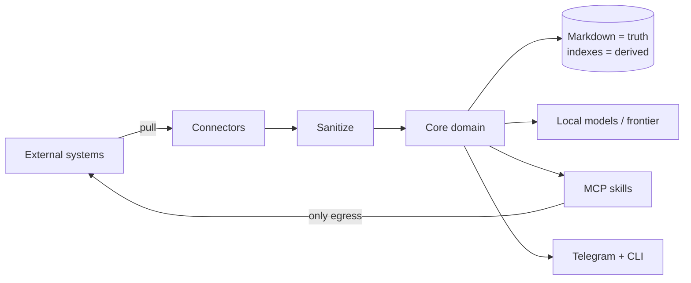
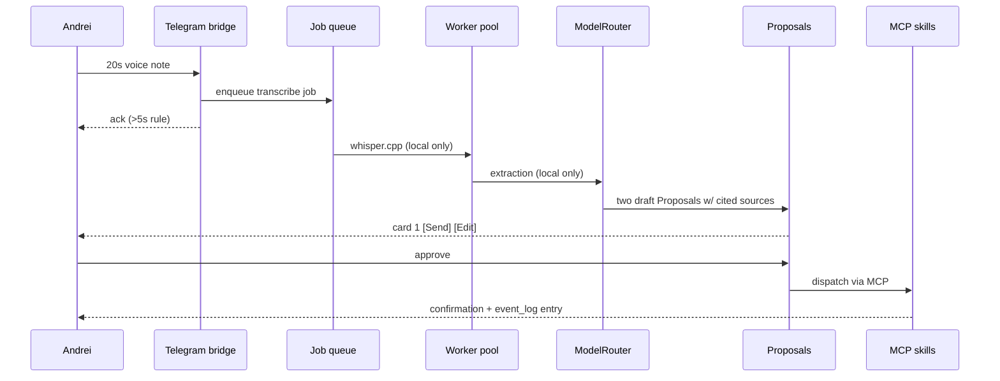

# pm-ai — Solution Design

**Companion to** `ARCHITECTURE-SPINE.md` · **Source** `_bmad-output/planning-artifacts/prds/prd-pm-ai-2026-08-18/prd.md` v0.10.0 · **Date** 2026-08-19

---

## How to read this

The **spine** is the build contract: terse, enforceable, and the thing epics and stories must obey. It records decisions and deliberately omits reasoning.

This document is the other half — **why** those decisions were made, what was rejected, where the design diverges from the PRD, and how the pieces behave in motion. Read the spine to build; read this to understand, to argue with, or to remember in six months why something is the way it is.

---

## 1. The shape in one page

pm-ai is a **single long-lived Python daemon** on your Mac. Everything else — the CLI, the Telegram bridge — is a thin client talking to it over authenticated loopback HTTP. That daemon is organized **hexagonally**: a core of pure domain logic that knows nothing about GitLab, Telegram, or the filesystem, surrounded by adapters that do.

Two things cross the boundary, and only two:

- **Connectors** bring the outside world *in*. Each is a plugin implementing one method, scheduled by the daemon, normalized into a closed event vocabulary, sanitized before anything reaches a model.
- **MCP skills** send changes *out*. They are the single egress point. Nothing else in the system is permitted to mutate an external system.

Underneath, **markdown files are the truth** and every index is disposable. Delete the database and the vector store, run `pm-ai reindex`, and you lose nothing. That single property is what makes the system genuinely sovereign rather than merely self-hosted — your record is a directory of plain text you can read, edit, grep, and carry to another machine.

---

## 2. The load-bearing decisions, and why

### One daemon, not scheduled jobs

The PRD's own topology implies it, and the always-on radar plus calendar triggers plus a long-poll connection make it necessary. The alternative — short-lived cron jobs coordinating through SQLite — was rejected because three of the PRD's requirements (the Telegram bridge, the 15-minute pre-meeting trigger, and the offline replay buffer) all want a process that is *already running* when the moment arrives.

The cost is that the daemon becomes a single point of failure. That is bought back by AD-20: every unit of deferred work is a durable row, so a crash loses nothing but time.

### Telegram long-polling, not webhooks

The PRD says "webhook/polling" as if they were interchangeable. They are not. A webhook needs a publicly reachable HTTPS endpoint pointing at your laptop, which means a tunnel service — a cloud dependency and an inbound path, directly contradicting NFR-14's zero-public-ports promise. Outbound long-polling needs no inbound port at all. This is the rare case where the stricter security requirement is also the simpler implementation.

### The Tool Runner, not the Claude Agent SDK

This one changed during the session, and it matters. The Claude Agent SDK is Claude Code packaged as a library: it ships built-in Bash, Read, Write, Edit, Glob, and Grep tools. Adopting it would mean spending the entire build fighting a library's defaults to preserve FR-36 — the invariant that the LLM core gets no shell and no filesystem.

The Anthropic SDK's **Tool Runner** (`client.beta.messages.tool_runner`) has no built-in tools at all. It loops over exactly the tools you hand it. Point it at the MCP skill registry and the execution firewall stops being a thing you defend and becomes a thing the architecture simply *is*. `anthropic.lib.tools.mcp` supplies the MCP-to-tool conversion.

### Three scopes, not two

The PRD has two: personal (`~/.manager-ai/`) and project (`.project-ai/`). But configuration has to live somewhere, and putting per-project connector settings under the personal scope would destroy that scope's defining property — that it survives a job change intact and carries no employer's fingerprints.

So: `~/.pm-ai/` holds the application (registry, connector config, credentials, logs), `~/.manager-ai/` stays purely personal, `.project-ai/` stays committed to each repo. Three directories, each with one owner and one reason to change.

### Encryption that is deliberately partial

NFR-08 says encrypt everything. Taken literally, that would encrypt `coaching_1on1_history.md` and `commitments_log.md` — and the moment those are ciphertext, they stop being greppable, diffable, hand-editable records and become an opaque blob you happen to own.

The narrowed rule encrypts what genuinely needs it — credentials, raw transcripts and audio, the telemetry database, the Telegram cache — and leaves every `.md` in plaintext. The vector index is also plaintext: it holds embeddings rather than recoverable text, and it is fully rebuildable per NFR-11.

**A correction worth recording.** This decision was originally justified partly by an unverified claim that SQLCipher and `sqlite-vec` could not be combined. A currency review tested the combination and it *works*. The decision stands on its remaining merits — derived data, rebuildable, no plaintext to protect — but the risk cited at the time was not real. The genuine constraint in this area is different: `sqlite-vec` cannot load into a stock macOS Python at all, because `enable_load_extension` is absent from those builds. A uv-managed interpreter is required regardless of encryption.

The key sits in the macOS Keychain because the daemon must produce a 07:00 briefing without anyone typing a passphrase. Key export is the migration path.

### Cost as a gauge, not a governor

NFR-13 states $20/month as a hard cap. Implemented literally, that means the system degrades or stops working near month-end — which is a worse product than one that costs $25 and tells you so.

The router therefore accounts for every frontier call and warns, but never degrades or blocks. The figure becomes an instrument for learning the system's real economics. Frontier work is tiered — Opus 5 where reasoning depth *is* the product (Socratic coaching, deep research), Sonnet 5 for briefings, drafts, and inquiry synthesis — which is a config table in the router, not extra machinery. Prompt caching helps materially here, since persona and rules prefixes repeat across every briefing — though the minimum differs by model (512 tokens on Opus 5, 1024 on Sonnet 5), and briefings run on Sonnet 5, so the prefix must clear the higher floor to benefit at all.

### One Proposal, not five approval flows

Staged-then-approved appears in at least five PRD requirements: implicit work-item updates, message drafts, HR goal sync, commitments, and the weekly plan. Left unfixed, that is five card formats, five expiry behaviours, and five answers to "what happens if he never taps approve."

One `Proposal` entity with one lifecycle and one renderer collapses it. Features register a type and an executor; they never build a flow. Crucially, this is kept *separate* from the commitment lifecycle — approval status and real-world fulfillment status are different questions, and one overloaded field would eventually conflate them.

---

## 3. Where this diverges from the PRD

Six places. Each is a deliberate call made during coaching, and each is worth folding back into the PRD so the two documents do not quietly drift apart.

| # | PRD says | Spine says | Why |
| --- | --- | --- | --- |
| 1 | NFR-08: encrypt all transcripts, indexes, coaching logs, credentials | Only telemetry DB, transcripts/audio, Telegram cache, credentials. All `.md` plaintext; vector index plaintext | Transparency over one's own record is a product principle. (The SQLCipher + `sqlite-vec` risk also cited at the time was later disproved — see §2.) |
| 2 | FR-36 + Non-Goals: "signed, statically verified MCP tools" | Execution boundary fully binding; **signature verification deferred** to a local allowlist | Single-user, first-party skills. Load path stays pluggable; revisit on first third-party or shared skill |
| 3 | §2.1 and §6: two scopes, config under `~/.manager-ai-private/` | Three scopes; app + project config under `~/.pm-ai/` | Keeps the sovereign personal scope free of employer-specific configuration |
| 4 | NFR-13 + SM-5: spend "capped strictly" under $20/month | Monitored target, warn-only | A cap that degrades features month-end is worse than knowing the true number |
| 5 | §6: Claude 3.5 Sonnet; Ollama 7B–13B | Opus 5 / Sonnet 5 tiered by task class | Claude 3.5 Sonnet was retired 2025-10-28 |
| 6 | FR-37: "synthesized responses within 150 ms" vs NFR-04's 60 s | Split: retrieval 50–150 ms, synthesis ≤60 s async | No LLM synthesis completes in 150 ms; the two SLAs were describing different operations |

---

## 4. Three flows in motion

### A voice note becomes two sent messages (UJ-2)

The whole path stays local until draft *generation*, which is the only frontier-eligible step. Transcription, sanitization, and entity extraction never leave the machine.

### A meeting ends (UJ-3, UJ-7)

Transcript arrives via the Graph adapter — or the watched folder, if tenant admin never materializes. Sanitization runs at the adapter boundary, producing a derived copy for model context while the raw is retained so citations still resolve.

Extraction then splits by authorization:

- **Explicit** — "pm-ai, update WI-226" — executes immediately through a signed-registry skill, because addressing the assistant by name *is* the authorization. Logged under `[AUTHORIZATION: EXPLICIT_VERBAL]`.
- **Implicit** — the team discussing a TTL change — becomes a `Proposal`, staged, expiring in 7 days if untouched. Nothing external mutates.

Approved commitments enter the domain state machine at `PENDING` and are thereafter verified against real telemetry: commits, MR merges, ticket closures. `FULFILLED` is asserted only with evidence attached.

### The 07:00 briefing (UJ-9, FR-09)

The scheduler wakes, pulls from the derived indexes (retrieval budget: 50–150 ms), assembles context, and makes exactly one frontier call — Sonnet 5, tiered — to synthesize. It writes `daily_dashboard.md` and pushes a card. Because the personal analytics store is a physically separate database, burnout signals can inform the briefing while remaining structurally incapable of reaching any project-scope output.

---

## 5. Cost model

| Path | Model | Rate (per Mtok in/out) | Frequency |
| --- | --- | --- | --- |
| Transcription, extraction, classification, embedding, fuzzy match | Local (whisper.cpp, Ollama) | electricity only | continuous |
| Daily briefing, prep dashboards, drafts, inquiry synthesis | `claude-sonnet-5` | $3 / $15 | several per day |
| Socratic 1:1 coaching, deep research | `claude-opus-5` | $5 / $25 | weekly / on demand |

The deliberate design property is that **volume lives on the local side**. Frontier calls are bounded by how often you actually hold a 1:1 or read a briefing — a handful per day — not by telemetry throughput, which is where the volume is. Whether that lands under $20 is exactly what the accounting is there to find out.

---

## 6. Risks and Phase 1 spikes

| Risk | Impact | Handling |
| --- | --- | --- |
| **Graph transcript access needs tenant admin.** Application permissions require an admin-created access policy; personal MS accounts unsupported; transcripts exist only where recording was on | Would block the entire meeting pipeline — roughly half the PRD | `TranscriptSourcePort` with a manual/watched-folder adapter built from day one. The pipeline is testable and shippable without a live tenant |
| **Concurrent whisper.cpp + Ollama at 16 GB** (PRD Open Question 1) | Swap thrashing; NFR-01/NFR-03 SLAs missed | Bounded pool defaults to one heavy job at a time. Phase 1 benchmarks and tunes |
| **Local model quality for extraction** — anchor matching needs ≥85% confidence per FR-01 | Fuzzy recovery degrades; more `[UNMATCHED_ANCHOR]` prompts | No model is pinned. Benchmark `llama3.1:8b` and `qwen3:8b` against real transcripts before locking |
| **Telegram as sole mobile transport** | Availability tied to one third party | Accepted. CLI has full text parity, so no capability is Telegram-only |

---

## 7. Mapping to the PRD roadmap

The spine supports the PRD's four phases without reordering them, but two dependencies are worth naming:

- **Phase 1 must include the storage service, the job queue, and the Proposal entity** even though they are not user-visible features. Every later phase assumes them, and retrofitting the single-writer rule after several features already write files would be a rewrite.
- **The transcript-source port belongs in Phase 1**, not Phase 2, because the manual adapter is what makes the Phase 2 meeting pipeline developable while the tenant-permission question is still open.

Everything else follows the PRD's sequencing as written.

---

## 8. What was deliberately not decided

Named in the spine's Deferred section, repeated here with reasoning: MCP skill signing (single-user, first-party — revisit on the first foreign skill), Linux support (behind ports, later increment), cost-cap enforcement (needs real data first), local model selection (needs benchmarks), multi-user (out of scope by design), real-time in-meeting processing (an explicit PRD Non-Goal), vector index encryption (removed a real integration risk), and retention beyond raw transcripts (needs disk-growth data).

The point of naming them is that a builder who hits one of these knows it is an open question rather than an oversight — and knows the condition under which it gets revisited.
