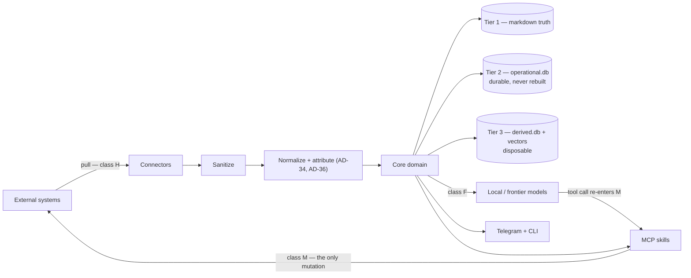
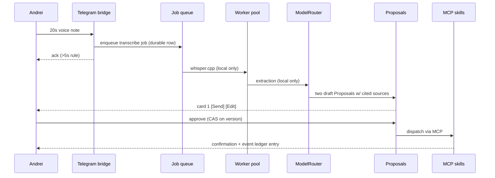

# pm-ai — Solution Design

**Companion to** `ARCHITECTURE-SPINE.md` (40 ADs) · **Source** `_bmad-output/planning-artifacts/prds/prd-pm-ai-2026-08-18/prd.md` v0.12.0 · **Date** 2026-08-20

---

## How to read this

The **spine** is the build contract: terse, enforceable, and the thing epics and stories must obey. It records decisions and deliberately omits reasoning.

This document is the other half — **why** those decisions were made, what was rejected, where the design diverges from the PRD, and how the pieces behave in motion. Read the spine to build; read this to understand, to argue with, or to remember in six months why something is the way it is.

Where an earlier revision of this document was wrong, it says so rather than quietly reading correctly. Three of its claims described the pre-revision architecture and had become dangerous to follow; two others were simply false.

---

## 1. The shape in one page

pm-ai is a **single long-lived Python daemon** on your Mac. Everything else — the CLI, the Telegram bridge — is a thin client talking to it over authenticated loopback HTTP. That daemon is organized **hexagonally**: a core of pure domain logic that knows nothing about GitLab, Telegram, or the filesystem, surrounded by adapters that do.

Traffic across the boundary is **classified**, and each class has exactly one legal home:

- **Connectors** bring the outside world *in* (class H) — read-only by construction, one method each, scheduled by the daemon, normalized into a closed event vocabulary, sanitized before anything reaches a model.
- **MCP skills** send changes *out* (class M). They are the only place an external system is ever mutated, and the **model's only route to an external effect**.
- Two further classes exist and are constrained separately: frontier API calls (class F, which can only cause an effect by emitting a tool call that re-enters M), and the local whisper.cpp subprocess (class L).

That classification replaced an earlier, stricter-sounding claim — "MCP skills are the single egress point; nothing else may reach an external system." That sentence was false the day it was written: connectors read, the frontier adapter calls out, transcription spawns a process. A rule contradicted by three paths on day one is a rule that gets weakened to nothing the first time someone hits it.

Underneath, **markdown files are the truth** — but only one of three tiers is disposable:

| Tier | Holds | If you delete it |
| --- | --- | --- |
| **1 — Truth** | markdown segments, the commitments ledger, coaching history, meeting records, the disclosure ledger | restore from backup; this is the record |
| **2 — Operational** | job queue, connector cursors, executed-idempotency-key ledger, staged proposals, the dedup set | **you lose pending external writes and every harvest position.** Not derivable from Tier 1, and no rebuild reconstructs it |
| **3 — Derived** | search and commitment indexes, `vector_index/` | nothing — `pm-ai reindex` rebuilds it |

An earlier revision of this document said: *"Delete the database and the vector store, run `pm-ai reindex`, and you lose nothing."* That was true only while Tier 2 did not exist. Following it today destroys the job queue and every cursor. The tiers are now physically separate files precisely so the destructive version of that sentence cannot be executed by accident.

---

## 2. The load-bearing decisions, and why

### One daemon, not scheduled jobs

The PRD's own topology implies it, and the always-on radar plus calendar triggers plus a long-poll connection make it necessary. The alternative — short-lived cron jobs coordinating through SQLite — was rejected because three of the PRD's requirements (the Telegram bridge, the 15-minute pre-meeting trigger, and the offline replay buffer) all want a process that is *already running* when the moment arrives.

The cost is that the daemon becomes a single point of failure. That is bought back by AD-20: every unit of deferred work is a durable row, so a crash loses nothing but time.

### Telegram long-polling, not webhooks

The PRD said "webhook/polling" as if they were interchangeable. They are not. A webhook needs a publicly reachable HTTPS endpoint pointing at your laptop, which means a tunnel service — a cloud dependency and an inbound path, directly contradicting NFR-14's zero-public-ports promise, *in the same sentence that made it*. Outbound long-polling needs no inbound port at all. This is the rare case where the stricter security requirement is also the simpler implementation. PRD v0.11.0 now says so in all three places.

### The Tool Runner, not the Claude Agent SDK

The Claude Agent SDK is Claude Code packaged as a library: it ships built-in Bash, Read, Write, Edit, Glob, and Grep tools. Adopting it would mean spending the entire build fighting a library's defaults to preserve the execution firewall.

The Anthropic SDK's **Tool Runner** (`client.beta.messages.tool_runner`) has no built-in tools at all. It loops over exactly the tools you hand it. Point it at the MCP skill registry and the firewall stops being a thing you defend and becomes a thing the architecture simply *is*. The tradeoff is accepted deliberately: `tool_runner` is a beta surface underpinning a security property, so the SDK is pinned exactly rather than floated.

### Four scope kinds, not two

The PRD began with two scopes: personal (`~/.manager-ai/`) and project (`.project-ai/`). Configuration had to live somewhere, and putting per-project connector settings under the personal scope would destroy that scope's defining property — that it survives a job change intact and carries no employer's fingerprints. So `~/.pm-ai/` became the application scope.

The fourth kind arrived only because someone asked a precise question: *where do the results of a 1:1 with a team member go?*

There was no answer. A direct report's career record fits none of the three:

- not `~/.manager-ai/` — that scope travels with you between employers, and its charter is that it never syncs to an HR platform;
- not `<repo>/.project-ai/` — that is git-committed, so a report's performance objectives would be readable by their peers;
- not `~/.pm-ai/` as it was defined — "system-level state, no personal records".

The tell had been sitting in the PRD's own directory tree the whole time: `team_member_career_mcp.py`, the connector whose entire job is syncing to HR, was filed inside `~/.manager-ai/skills/` — the one scope whose charter forbids exactly that. Four independent review lenses missed it, because each checked the spine against itself.

Records about reports now live at `~/.pm-ai/private/people/`: encrypted, never committed, HR-syncable on explicit approval, and **deleted on leaving the role** rather than carried onward. It is stored under the application scope but is its own *kind* in the type system, because two rules turn on telling it apart from personal and neither can be written against a path.

### Storage follows the subject, not the mechanism

The scope model settled into one rule, and it took two passes to see it: **an artifact belongs to the scope that owns its subject.** It already governed log entries; it turned out to govern everything.

Raw meeting transcripts had been filed in the application scope — the one documented as holding *no personal records* — alongside the PM's Telegram voice notes, as though "encrypted blobs the daemon manages" were a category. They aren't. A recording of a team meeting is employer material; a voice note is the PM's own. They now live in different scopes, and a transcript follows its meeting rather than having a home of its own: every scope keeps its captures at `transcripts/`, the way each keeps its own `event_log/`. The old name, `chat_history/`, described neither a chat nor a history.

That reframing exposed a contradiction that had been live in the architecture: **meeting records sat in the sovereign personal scope**, while every extracted fact cites its meeting and commitments live in the git-committed project ledger. Each such commitment referenced personal-scope material by `source_ref` — the precise thing the cross-scope rule forbids. It survived four review lenses because the write guard checked the scope a record *belongs to* and never the scope it *points at*; both are checked now.

### Two 1:1s, two rules

This distinction dissolved an apparent conflict between the privacy charter and the HR integration. The two were never the same data.

| | UJ-1 — PM ↔ pm-ai | UJ-4 — PM ↔ team member |
| --- | --- | --- |
| Subject | you | your report |
| Produces | `CoachingCommitment`, growth notes, burnout signal | `CareerGoal`, performance objectives |
| Scope | `personal` | `people` |
| May sync to HR | **never** | **yes**, on your explicit approval |

Nothing in the charter had to weaken. `CareerGoal` is deliberately *not* a `Commitment`: commitments are verified against execution telemetry and live in the git-committed project ledger, and filing a performance objective there would be the same leak in a different costume.

### Encryption that is deliberately partial

NFR-08 said encrypt everything. Taken literally, that would encrypt `coaching_1on1_history.md` and `commitments_log.md` — and the moment those are ciphertext, they stop being greppable, diffable, hand-editable records and become an opaque blob you happen to own.

The narrowed rule encrypts what genuinely needs it — credentials, raw transcripts and audio, the Tier-2 operational store, the PM's voice-note cache, the team-member records, and the personal analytics store — and leaves every `.md` in plaintext. Tier 3 is plaintext too: it holds embeddings and lookup structures rather than recoverable text, and rebuilds from Tier 1. Encryption and tier are independent axes — one is confidentiality, the other durability — and `personal_analytics.db` is the artifact that proves it: encrypted because burnout figures are recoverable personal facts, and Tier 2 because those trends outlive the telemetry they were computed from.

**A correction worth keeping.** This decision was originally justified partly by an unverified claim that SQLCipher and `sqlite-vec` could not be combined. A currency review tested the combination and it *works*. The decision stands on its remaining merits — derived data, rebuildable, no plaintext to protect — but the reason cited at the time was not real. The genuine constraint in this area is different and sharper: `sqlite-vec` cannot load into a stock macOS Python at all, because `enable_load_extension` is absent from those builds. A uv-managed interpreter is required regardless of encryption.

The key sits in the macOS Keychain because the daemon must produce a 07:00 briefing without anyone typing a passphrase. Key export is the migration path.

### Cost as a gauge, not a governor

NFR-13 stated $20/month as a hard cap. Implemented literally, that means the system degrades or stops working near month-end — which is a worse product than one that costs $25 and tells you so.

The router therefore accounts for every frontier call and warns, but never degrades or blocks. Frontier work is tiered — Opus 5 where reasoning depth *is* the product (Socratic coaching, deep research), Sonnet 5 for briefings, drafts, and inquiry synthesis — which is a config table in the router, not extra machinery. Every call's scope provenance and cost lands in one application-scoped ledger, `~/.pm-ai/disclosure.md`, which is what makes "what has left this machine, and when" an answerable question rather than an assurance.

### One Proposal, not five approval flows

Staged-then-approved appears in at least five PRD requirements: implicit work-item updates, message drafts, HR goal sync, commitments, and the weekly plan. Left unfixed, that is five card formats, five expiry behaviours, and five answers to "what happens if he never taps approve."

One `Proposal` entity with one lifecycle and one renderer collapses it. Features register a type and an executor; they never build a flow. It is kept *separate* from the commitment lifecycle — approval status and real-world fulfilment are different questions, and one overloaded field would eventually conflate them.

---

## 3. Where this diverges from the PRD

All of these are now reconciled in PRD v0.11.0; the table records what changed and why, so neither document drifts back.

| # | PRD originally said | Spine says | Why |
| --- | --- | --- | --- |
| 1 | NFR-08: encrypt all transcripts, indexes, coaching logs, credentials | A defined set; all `.md` plaintext; Tier 3 plaintext | Transparency over one's own record is a product principle |
| 2 | FR-36 + Non-Goals: "signed, statically verified MCP tools" | Execution boundary binding; **signing deferred** to a local allowlist | Single-user, first-party skills. Load path stays pluggable |
| 3 | §2.1: two scopes, config under `~/.manager-ai-private/` | Four scope kinds; app + project config under `~/.pm-ai/` | Keeps the sovereign scope free of employer-specific configuration |
| 4 | NFR-13 + SM-5: spend "capped strictly" | Monitored target, warn-only | A cap that degrades features month-end is worse than knowing the true number |
| 5 | §6: Claude 3.5 Sonnet; Ollama 7B–13B; CUDA baseline | Opus 5 / Sonnet 5 tiered; 8B-class `Q4_K_M`; macOS-only | Claude 3.5 Sonnet retired 2025-10-28; 13B + whisper.cpp will not co-reside at 16GB |
| 6 | FR-37: "synthesized responses within 150 ms" vs NFR-04's 60 s | Retrieval 50–150 ms, synthesis ≤60 s async | No LLM synthesis completes in 150 ms; the two SLAs described different operations |
| 7 | Non-Goal: "all system reads and writes execute via MCP" | Only **model-driven mutations** route through MCP | The blanket version was contradicted by three paths on day one |
| 8 | FR-16: personal data "strictly hardware-bound" | Adversary is employer-controlled systems; frontier APIs are a disclosed, audited exception | The charter promised protection the architecture knowingly does not provide |
| 9 | FR-19 + NFR-14: Telegram "HTTPS webhook/polling" | Outbound long-polling only | A webhook needs the public endpoint NFR-14 forbids in the same sentence |
| 10 | FR-27 + §2.1: one `event_log.md` per scope, holding everything | `event_log/` dated segments; disclosure and cost in a separate application-scoped ledger | Project scope is committed, so a disclosure record naming personal material would be pushed to the employer's repo |
| 11 | `event_telemetry.db` holds telemetry, job queue, and indexes | `operational.db` (Tier 2) and `derived.db` (Tier 3) | One file holding both made the PRD's own tier-scoped NFR-11 unsatisfiable |
| 12 | FR-28: "sandboxed MCP skills" | Registry-authorized with declared permissions | No sandbox is implemented; authorization is not isolation |
| 13 | *(absent)* | Team-member scope for FR-30/FR-31 | A direct report's record had no valid home in any existing scope |

---

## 4. Three flows in motion

### A voice note becomes two sent messages (UJ-2)

The whole path stays local until draft *generation*, the only frontier-eligible step. Transcription, sanitization, and entity extraction never leave the machine.

### A meeting ends (UJ-3, UJ-7)

Transcript arrives via the Graph adapter — or the watched folder, if tenant admin never materializes. Every transcript **binds to a Meeting** or is rejected: an unattributed file must not mint attributed provenance. Sanitization runs at the adapter boundary, producing a derived copy for model context while the raw is retained so citations still resolve.

Extraction then splits by authorization. An earlier revision described that split as *"addressing the assistant by name is the authorization"* — the most dangerous sentence in this document. Anyone in the meeting can say the assistant's name, and anyone who can drop a file into the watched folder can put words in anyone's mouth. Auto-execution now requires **three** independent conditions:

1. the transcript came from a **provider-authenticated source** — a tenant account, not a VTT speaker label;
2. the speaker **resolves to the PM**;
3. the verb is **auto-executable** — registered, reversible, *and* quiet.

Reversibility is not a property of the verb alone: `jira:set_priority` is quiet and auto-executes, while `gitlab:set_priority` is equally reversible but notifies about thirty people, and one-tap undo cannot recall a notification. The registry is keyed on `(provider, verb)` for exactly that reason, and an unregistered verb never auto-executes.

Anything failing any condition becomes a `Proposal`, staged, expiring in 7 days. Irreversible verbs — outbound email, MR creation, closures — always stage regardless.

Approved commitments enter the domain state machine at `PENDING` and are verified against execution telemetry. Two rules govern what counts:

- **pm-ai's own writes are never evidence.** The executor posts a comment to WI-108; the verifier must not later read that comment as proof the promise was kept. Every class-M mutation is recorded with the identifier the provider returned, and normalization marks matching harvested events as self-authored before they reach the ledger.
- **Absence of telemetry is not evidence either.** A laptop asleep over a weekend produces no commits. The sweeper checks harvest coverage first and returns `UNKNOWN` rather than `BROKEN`, because FR-26's nudges are irreversible and "why isn't this done?" about delivered work is not recoverable.

### The 07:00 briefing (UJ-9, FR-09)

The scheduler wakes, pulls from the derived indexes (retrieval budget: 50–150 ms), assembles context, and makes exactly one frontier call — Sonnet 5, tiered — to synthesize. It writes `daily_dashboard.md` and pushes a card. Because the personal analytics store (`~/.manager-ai/private/personal_analytics.db`) is a separate database inside the personal scope, burnout signals can inform the briefing while remaining structurally incapable of reaching any project-scope output. The call's scope provenance and cost land in the disclosure ledger.

---

## 5. Cost model

| Path | Model | Rate (per Mtok in/out) | Frequency |
| --- | --- | --- | --- |
| Transcription, extraction, classification, embedding, fuzzy match | Local (whisper.cpp, Ollama) | electricity only | continuous |
| Daily briefing, prep dashboards, drafts, inquiry synthesis | `claude-sonnet-5` | $2 / $10 | several per day |
| Socratic 1:1 coaching, deep research | `claude-opus-5` | $5 / $25 | weekly / on demand |

Sonnet 5's $2/$10 is the **standard** rate: Anthropic made the introductory price permanent on 2026-08-10 and cancelled the increase to $3/$15 previously scheduled for September. An earlier revision of this document told you to re-baseline in September and warned that measurements understated true cost by a third. Both statements were wrong, carried from a stale cached pricing table — a reminder that pricing has a shorter half-life than a version pin and is not registry-backed.

The deliberate design property is that **volume lives on the local side**. Frontier calls are bounded by how often you actually hold a 1:1 or read a briefing — a handful per day — not by telemetry throughput, which is where the volume is. Whether that lands under $20 is exactly what the accounting is there to find out.

---

## 6. Risks and Phase 1 spikes

| Risk | Impact | Handling |
| --- | --- | --- |
| **Graph transcript access needs tenant admin.** Application permissions require an admin-created access policy; personal MS accounts unsupported; transcripts exist only where recording was on | Would block the entire meeting pipeline — roughly half the PRD | `TranscriptSourcePort` with a manual/watched-folder adapter built from day one. The pipeline is testable and shippable without a live tenant |
| **A system Python silently breaks all persistence.** `sqlite-vec` needs `enable_load_extension`, absent from python.org and macOS system CPython | Install succeeds, daemon starts, first embedding write fails inside the single writer — passing on the developer's machine, failing on a clean install | `--managed-python` pin plus a `pm-ai doctor` probe. Unguarded, it is a start-up success followed by total storage failure |
| **Concurrent whisper.cpp + Ollama at 16 GB** (PRD Open Question 1) | Swap thrashing; NFR-01/NFR-03 SLAs missed | Bounded pool defaults to one heavy job; the daemon must also constrain the Ollama server, since a client-side semaphore does not unload a resident model |
| **Keychain across an OS or interpreter upgrade is unverified** | The one failure mode here that is silent, unattended, and security-relevant — the 07:00 briefing simply stops | Needs a Phase 1 test |
| **`tool_runner` is a beta surface** underpinning the execution firewall | An SDK change could break the security property, not just the build | Accepted deliberately — it is the only tool loop with no built-in shell. The SDK is pinned exactly, never floated |
| **`sqlite-vec` is pre-1.0 and single-maintainer** (last commit 2026-05-18) | Load-bearing under AD-22 retrieval; a minor bump is a reindex event | Pinned `==0.1.9`. Revisit if the project stalls further |
| **Local model quality for extraction** — anchor matching needs ≥85% confidence | Fuzzy recovery degrades; more `[UNMATCHED_ANCHOR]` prompts | No model pinned. Benchmark `llama3.1:8b` and `qwen3:8b` against real transcripts before locking |
| **Telegram as sole mobile transport** | Availability tied to one third party | Accepted. CLI has full text parity, so no capability is Telegram-only |

---

## 7. Mapping to the PRD roadmap

The spine supports the PRD's four phases without reordering them, but three dependencies are worth naming:

- **Phase 1 must include the storage service, the job queue, and the Proposal entity** even though they are not user-visible. Every later phase assumes them, and retrofitting the single-writer rule after several features already write files would be a rewrite.
- **The transcript-source port belongs in Phase 1**, not Phase 2, because the manual adapter is what makes the Phase 2 meeting pipeline developable while the tenant-permission question is still open.
- **The spine's "Phase 1" and the PRD's §9 Phase 1 are not the same scope.** The spine means "before the contracts can be trusted"; the PRD means a delivery milestone. Read the qualifier, not the word.

---

## 8. Four lessons from the reviewer gate

Four independent lenses reviewed the spine on 2026-08-19, and a fifth reviewed the PRD. The findings that mattered were not about wording.

**A passing test is not evidence that a rule holds.** AD-36 — "pm-ai's own writes are never evidence" — had a green test while the rule was *defeated in code*. The test handed `PM_AI` provenance straight to the evaluator and checked the verdict, proving the downstream half; the step that would have *derived* that provenance from the mutation ledger did not exist, and the only connector hard-coded every harvested event as externally authored. Prefer a test that drives the real path over one that hands in the answer.

**A check nobody checks is a comment.** Two of the spine's load-bearing enforcement rules were bypassable. A single-writer violation written the idiomatic way (`Path(p).open("w")`) scored as a *read*, and a `subprocess.run(shell=True)` in the composition root — the one layer permitted to import everything — was scanned by neither the AST rules nor the import contracts. Both were found by planting real violations against a green suite, not by reading the checks. The standing rule now: a check that cannot be shown to fail on a planted violation is not a check.

**Verify the reviewer too.** Two lenses disagreed about Sonnet 5's pricing; the one that agreed with this document was the one that was wrong, because both it and the document had read the same stale cached table. Convergence between reviewers is not evidence when they share a source.

**Ask the question the documents cannot ask themselves.** The missing scope for team-member records surfaced from a human question about how 1:1s actually work. None of the five lenses found it; each was checking documents against each other.

---

---

## 9. What was deliberately not decided

Named in the spine's Deferred section, repeated here with reasoning: MCP skill signing (single-user, first-party — revisit on the first foreign skill), Linux and CUDA support (behind ports, later increment), cost-cap enforcement (needs real data first), local model selection (needs benchmarks), multi-user (out of scope by design), real-time in-meeting processing (an explicit PRD Non-Goal), vector index encryption (derived embeddings, rebuildable), retention beyond raw transcripts (needs disk-growth data), Tier-2 schema migration (settle before the first release that persists it), and the Socratic voice contract (a prompt and product-design decision, not an architectural one).

The point of naming them is that a builder who hits one knows it is an open question rather than an oversight — and knows the condition under which it gets revisited.
